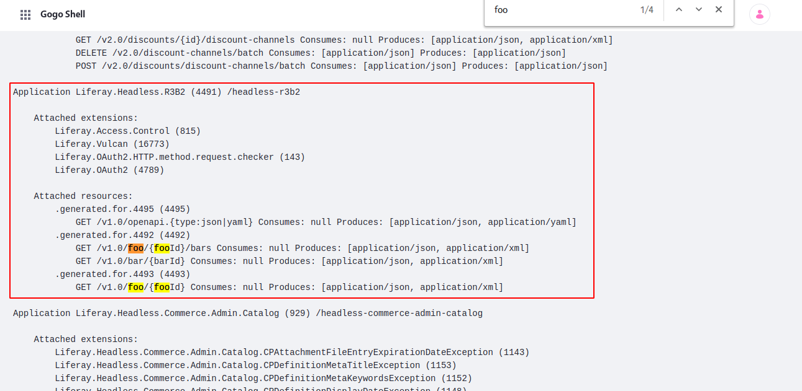

# Implementing a New API with REST Builder

With REST Builder, you can define the API you want to build, and REST Builder provides the framework and endpoints for you. <!-- Add link to the REST Builder overview article once available. -->

## Deploy an Example REST API

To see REST Builder in action, you can deploy an example API that retrieves a dummy product by its ID in a catalog. Once you understand how this simple example works, you can create APIs for your own applications. 

1. Start the Liferay DXP Docker image:

    ```bash
    docker run -it -p 8080:8080 [$LIFERAY_LEARN_DXP_DOCKER_IMAGE$]
    ```

1. Download and unzip the `.zip` archive containing the [Acme Product Catalog API](./implementing-a-new-api-with-rest-builder/liferay-r3b2.zip):

    ```bash
    curl https://learn.liferay.com/dxp/7.x/en/headless-delivery/producing-apis-with-rest-builder/rest-builder/implementing-a-new-api-with-rest-builder/resources/liferay-r3b2.zip -O
    ```

    ```bash
    unzip liferay-r3b2.zip
    ```

1. Build and deploy the example:

    ```bash
    ./gradlew deploy -Ddeploy.docker.container.id=$(docker ps -lq)
    ```

    ```note::
       This command is the same as copying the deployed jars to /opt/liferay/osgi/modules on the Docker container.
    ```

1. Confirm the deployment in the Docker container console for both the `api` and `impl` bundles:

    ```
    STARTED com.acme.r3b2.api_1.0.0
    STARTED com.acme.r3b2.impl_1.0.0
    ```

1. Log into your DXP instance and navigate to the _Global Menu_ (  ) &rarr; _Control Panel_ &rarr; _Gogo Shell._

1. In the Gogo Shell prompt, type the following command:

    ```
    jaxrs:check
    ```

    The page lists all of the installed JAX-RS bundles, including the newly deployed API, `R3B2.Acme.Product.Catalog`. The API is now deployed and ready for you to call.

    

1. Test the API by running the following command from your terminal:

    ```bash
    curl -u 'test@liferay.com:test' "localhost:8080/o/product-catalog/v1.0/entities/{productId}"
    ```

    Substitute a number between 1 and 3 for `{productId}`. The query returns a corresponding product's ID, name, and price wrapped in a JSON object:

    ```json
    {
        "name" : "Folding Chair",
        "price" : 15,
         "productId" : 1
    }
    ```

Congratulations, you've successfully deployed and used a new REST API.

Now that you've seen an API generated with REST Builder, it's time to understand how it works. 

## Initial Setup

Begin by creating `impl` and `api` modules in your Liferay workspace project. Your `impl` module's `build.gradle` file must install and apply REST Builder as a plugin:

```
buildscript {
    dependencies {
        classpath group: "com.liferay", name: "com.liferay.gradle.plugins.rest.builder", version: "1.0.125"
    }

    repositories {
        maven {
            url "https://repository-cdn.liferay.com/nexus/content/groups/public"
        }
    }
}

apply plugin: "com.liferay.portal.tools.rest.builder"
```

Your `build.gradle` files in both modules must also declare dependencies on the portal release and the Vulcan API. 

## YAML configuration

Your first step is to create the REST Builder configuration files. In the `impl` module's root folder, add two files: `rest-config.yaml` and `rest-openapi.yaml`. These files must contain all the information necessary for REST Builder to generate the scaffolding code for your API.

### Add REST Builder Configuration

REST Builder configuration belongs in the `rest-config.yaml` file. It defines the following fields: 

`apiDir`: your Java source code folder 

`apiPackagePath`: the starting Java package path where REST Builder generates code across all modules

`baseURI`: the context URL for all APIs in this project

`className`: the Java class name for the root resource class (used by JAX-RS)

`name`: the JAX-RS name of the API

Define these fields using this structure:

```
apiDir: "../r3b2-api/src/main/java"
apiPackagePath: "com.acme.r3b2.product.catalog"
application:
    baseURI: "/product-catalog"
    className: "ProductCatalogApplication"
    name: "R3B2.Acme.Product.Catalog"
author: "Liferay"
```

### Add an Information Block to the OpenAPI Configuration

Next, open the `rest-openapi.yaml` file to begin configuring your APIs. 

The first section to add is the information block: 

```
info:
  description: "EAPI to return a product from a catalog."
  license:
        name: "Apache 2.0"
        url: "http://www.apache.org/licenses/LICENSE-2.0.html"
  title: "Product Catalog API"
  version: v1.0
openapi: 3.0.1
```

```important::
   The ``version`` field defined here becomes part of the URL when your API paths are exposed within your Liferay instance.
```

### Define the Necessary Schemas

Next, in the `components` block, define schemas for your entities. REST Builder uses what you define here to create corresponding Java beans to represent these entities. <!-- Add reference to overview article elaborating a bit more on how REST Builder represents Java Objects with schemas. -->

Define a `schema` block for each entity you want to represent: 

```
components:
    schemas:
        Product:
            description:
                A product with an ID, name, and price.
            properties:
                name:
                    description:
                        The product's name
                    type: string
                price:
                    description:
                        The product's price, in dollars
                    type: integer
                productId:
                    description:
                        The product's ID
                    type: integer
            type: object
```

In this example, a schema called `Product` represents the important data for the use of this API. The `Product` entity contains one string value and two integers as fields (or `properties`), which this API returns. See the [OpenAPI specification](https://swagger.io/docs/specification/data-models/data-types/) for a list of supported data types for schemas.

Your schema definition determines the names of the classes REST Builder generates, including the scaffolding and templates in the resources files. Because the above schema is called `Product`, the implementation logic belongs in the `ProductResourceImpl` class.

### Define Your APIs

Finally, add the `paths` block. This must include all APIs that you plan to implement with REST Builder. Add each API to a path:

```
paths:
    "/entities/{productId}":
        get:
            operationId: getProduct
            parameters:
                - in: path
                  name: productId
                  required: true
                  schema:
                      type: integer
```

```tip::
   Paths can be added for different kinds of requests, including ``get``, ``post``, ``put``, ``patch``, and ``delete``.
```

The path (`entities/{productId}`) specifies that this API (`getProduct`) can be reached by appending the path string to the end of the URL (which also includes the `baseURI` and `version` values from your `rest-config.yaml` file). For instance, this example API is accessed via the full URL: `localhost:8080/o/product-catalog/v1.0/entities/{productId}`.

The value you substitute in for `productId` is used as the parameter with the matching name.

Beneath the `parameters` block (and within the `get` block), add in a `responses` block to define at least the response for a successful call (indicated by a `200` response):

```
responses:
    200:
        content:
            application/json:
                schema:
                    $ref: "#/components/schemas/Product"
            application/xml:
                schema:
                    $ref: "#/components/schemas/Product"
        description: "Returns the product matching the given product ID."
```

This `responses` block specifies that a successful call returns a `Product`. The string `#/components/schemas/Product` references the schema defined earlier in the same file, allowing REST Builder to use the `Product` schema as the return type for this API.

Lastly, add a `tags` definition for this path, beneath the `responses` block:

```
tags: ["Product"]
```

The tag specifies information that is added to the generated documentation when REST Builder annotates your scaffolding code. The tag name should reflect the name of your schema.

See the `rest-openapi.yaml` file you downloaded earlier for a complete reference.

## Run REST Builder

Now that you have added all of the configuration necessary for REST Builder to do most of the work, run the following command from within your `impl` module to run the `buildREST` Gradle task:

```bash
../gradlew buildREST
```

REST Builder uses your configuration and populates both your `api` and `impl` classes with scaffolding code, as well as the Java classes where you can add your implementation logic.

## Add Your Implementation Logic

The last step is to define the logic for each API you have defined. Within your `impl` module, find the Java resource class where your implementation goes, based on the schema name you defined in `rest-openapi.yaml` (in this example, `ProductResourceImpl.java`).

```tip::
   The location of the class for your implementation depends on the value you defined for ``apiPackagePath`` within your ``rest-config.yaml`` file. Follow that path and then navigate into ``internal/resource/<version>/`` within it. If you used the same path as this example, then the file is located within ``src/main/java/com/acme/r3b2/product/catalog/internal/resource/v1_0/``.
```

The implementation class (`[SchemaName]ResourceImpl`) is located beside the base class (`Base[SchemaName]ResourceImpl`). Open the implementation class and add the implementation of your API as an overridden method:

```java
@Override
    public Product getProduct(Integer productId) {

    return null;
}
```

This method overrides the base method defined in the base class (`Base[SchemaName]ResourceImpl`), which is defined using special JAX-RS annotations. The method returns `null` if a `Product` is not found (see below).

Finally, add the business logic to complete the request. REST Builder only creates a default constructor for the object you defined in your schema, so you must create an empty object and then add your values to it (based on how you defined its `parameters` in `rest-openapi.yaml`):

```java
Product chair = new Product();

chair.setProductId(Integer.valueOf(1));
chair.setName("Folding Chair");
chair.setPrice(Integer.valueOf(15));
```

In this example, a simple `LinkedHashMap` is populated with a few products, and the `getProduct` method returns the product from the `LinkedHashMap` with the matching `productId`. See [`ProductResourceImpl.java`](https://github.com/liferay/liferay-learn/tree/master/docs/dxp/7.x/en/headless-delivery/producting-apis-with-rest-builder/implementing-a-new-api-with-rest-builder/resources/liferay-r3b2.zip/r3b2-impl/src/main/java/com/acme/r3b2/product/catalog/internal/resource/v1_0/ProductResourceImpl.java) for the full implementation.

## Conclusion

Congratulations! You now know the basics of implementing a new API with REST Builder and have added a new API to DXP.

<!-- Add links to the overview and other articles as additional information when available. -->
