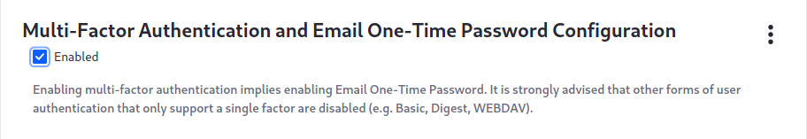
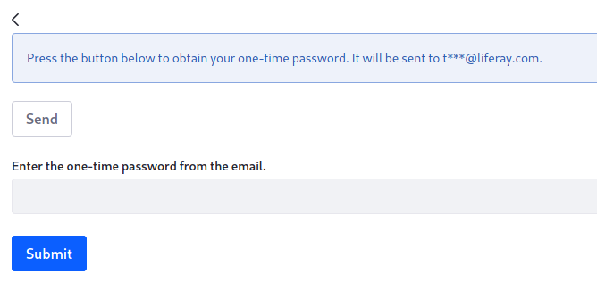

# Using Multi-Factor Authentication

> Availability: Liferay DXP 7.3+.

Multi-Factor Authentication (MFA) provides better security by requiring users to prove their identity in multiple ways, or _factors_. The basic user name/password combination is augmented with one or more further, configurable factors. These include the default One Time Password (OTP) and configurable IP address, time-based OTP, and because the system is extensible, any factor you wish to write. 

To enhance your installation's security, you should disable less secure, one-factor forms of authentication, such as Basic Auth, Digest Auth, and WebDAV. You can do this by configuring their [Authentication Verifiers](../securing-web-services/using-authentication-verifiers.md). Note that if you disable WebDAV, this also disables features you might be using: 

* Accessing Documents and Media via desktop computers
* Accessing Web Content via desktop computers

Ready to get started configuring Multi-Factor Authentication? There are some prerequisites to handle first. 

## Prerequisites

Enabling Multi-Factor Authentication implies enabling the default one-time password factor. The OTP factor requires a working mail configuration on your server, as it sends the one-time password to users via email. *If your server can't send email and you enable MFA, you will lock yourself and everybody else out of the system.* 

Another prerequisite is to communicate with your users before enabling MFA, to remind them to make sure the email addresses in their profiles are correct and up to date. With MFA enabled, they must be able to receive the one-time passwords to access the system. 

With those prerequisites out of the way, you're ready to enable multi-factor authentication. 

## Enabling Multi-Factor Authentication

By default, Multi-Factor Authentication is _available_ to be enabled at the system level. If you go to the Control Panel &rarr; System Settings &rarr; Security &rarr; Multi-Factor Authentication, you'll see that you can disable it system-wide. The easiest way to prevent MFA from being used is to disable it here. 

The default state has it enabled system-wide, but _disabled_ on the default instance. In effect, this means MFA is disabled on default Liferay DXP installations. Enabling it takes only two steps: 

1. Go to *Control Panel* &rarr; *Instance Settings* &rarr; *Security* &rarr; *Multi-Factor Authentication* &rarr; *Multi-Factor Authentication and Email One-Time Password Configuration*. 

1. Check the *Enabled* box, scroll to the bottom, and click the *Update* button. 

The options on this screen configure the email one-time password factor: 

**Order:** If you enable multiple factors, you must decide which one executes first, second, and so on. Set the order for the email one-time password checker; higher numbers run first. 

**One-Time Password Length:** Set the number of characters for the one-time password. 

**Resend Email Timeout:** Set the number of seconds that must elapse before users can request another one-time password. 

**Template for Email "From" Field:** Set how the *from:* field in the email containing the OTP is calculated. By default, it grabs the omni-admin user's email address, but you can place any valid email address here. 

**Email From Name:** Set the name of the email sender. By default, the omni-admin's name is used. 

**Template for Email "Body" Field:** Customize the body of the email message containing the OTP here. 

**Set the number of allowed failed attempts:** Set the number of attempts users may make to verify one-time passwords. The default value of `-1` allows unlimited attempts with no timeout. 

**Retry Timeout:** Delay further attempts to verify one-time passwords by this time period in seconds. The default value of `-1` disables the retry timeout. 

## Logging In Using MFA

Enabling Multi-Factor Authentication causes the Sign-In widget to behave differently. After users supply their passwords, they're asked to generate a one-time password. 

Once they click the button, a countdown begins (the Resend Email Timeout described above). Users must retrieve the one-time password from their email, enter it into the field, and click *Submit* before the time runs out. Once they do this, they're authenticated. 

## Further Configuration

Out-of-the-box, two other authentication factors are included, and there are extension points for developing your own. 

## Related Information

[Multi-Factor Authentication Checkers](./multi-factor-authentication-checkers.md)
