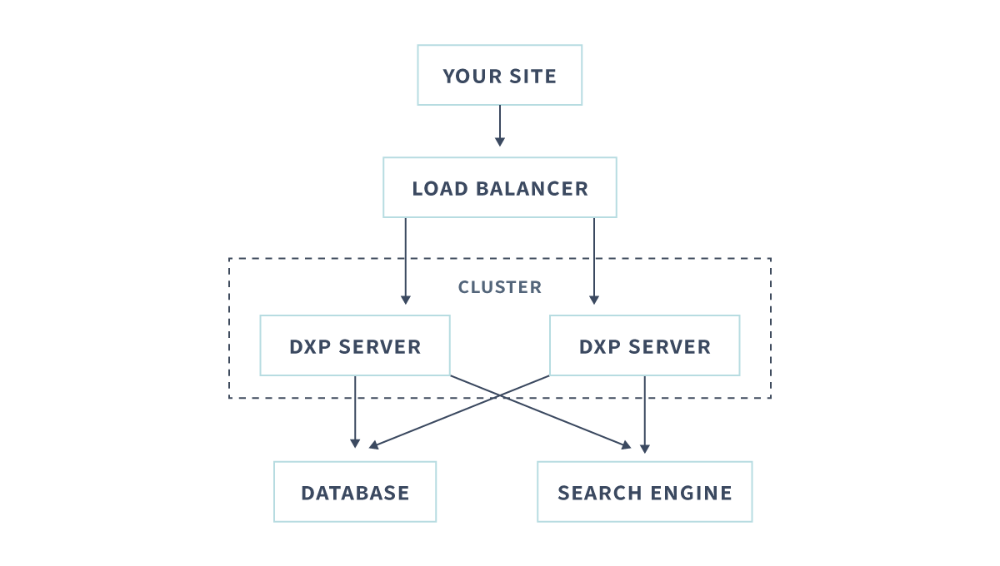
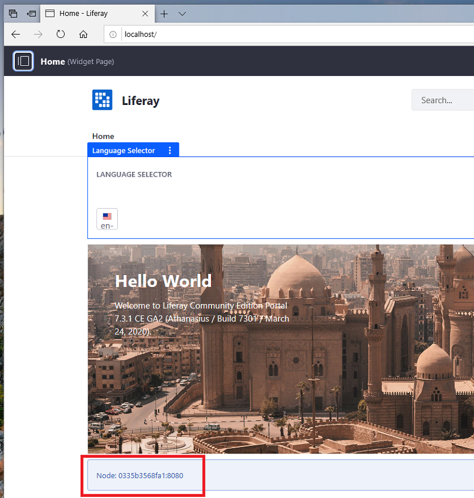

# Example: Creating a Simple DXP Cluster

A fast, easy way to learn DXP clustering is to set up a two node DXP cluster development environment on one machine using [Docker containers](https://docs.docker.com/get-started/overview/). Here you'll create two DXP server nodes and create supporting servers that provide a database, search engine, and file store.

Here are the servers you'll create:

| Server Type | Implementation | Server Container |
| :---------- | :------- | :---------- |
| Database | MariaDB  | `some-mariadb` |
| File Store | DBStore | `some-mariadb` |
| Search Engine | Elasticsearch | `elasticsearch` |
| DXP Server | Tomcat | `dxp-1` |
| DXP Server | Tomcat | `dxp-2` |

```important::
   This example is intended for learning purposes only. Although it can serve as a starting point for developing a clustered environment, it does not demonstrate a production environment. Please read all of the `Clustering for High Availability <./clustering-for-high-availability.md>`_ articles to develop an environment for production.
```

<!--

Should we remove this diagram since it includes a load balancer? -->

Here are the main steps:

1. [Start a Database Server](#prepare-a-database-server)
1. [Start a File Store Server](#prepare-a-file-store-server)
1. [Start a Search Engine](#prepare-a-search-engine)
1. [Configure the DXP Cluster Nodes](#configure-the-dxp-cluster-nodes)
1. [Start the DXP Cluster](#start-the-dxp-cluster)
1. [Test the DXP Cluster](#test-the-dxp-cluster)

## Start a Database Server

A DXP cluster requires a data source that's accessible to all of the DXP cluster nodes. The data source can be a JNDI data source, a database server, or a database server cluster. See the [compatibility matrix](https://www.liferay.com/compatibility-matrix) for the database servers your DXP version supports.

1. Start a Maria DB Docker container.

    ```bash
    docker run --name some-mariadb -e MYSQL_ROOT_PASSWORD=my-secret-pw -d mariadb:10.2
    ```

1. In a shell on the container, [create the DXP database](../../reference/database-configurations.md).

    Sign in to the database server.

    ```bash
    docker exec -it some-mariadb bash -c "/usr/bin/mysql -uroot -pmy-secret-pw"
    ```

    Create a database for DXP.

    ```sql
    create database dxp_db character set utf8;
    ```

    End your database session.

    ```bash
    quit
    ```

    End your bash session.

    ```bash
    exit
    ```

See [Database Configuration for Cluster Nodes](./database-configuration-for-cluster-nodes.md) for more information.

Your database server is ready for DXP.

## Start a File Store Server

A DXP cluster requires a File Store that's accessible to all of the DXP cluster nodes. For convenience, this example uses a [DBStore File Store](../../../system-administration/file-storage/other-file-store-types/dbstore.md) configured on the DXP database. The database server already started in this example includes the File Store. Please see [File Store](../../../system-administration/file-storage/configuring-file-storage.md) for other file store types.

## Start a Search Engine Server

A DXP cluster requires a search engine (running as a separate process) that's accessible to all of the DXP cluster nodes. See [Installing a Search Engine](../../../using-search/installing-and-upgrading-a-search-engine/introduction-to-installing-a-search-engine.md) for more information.

1. Set a local folder for storing an Elasticsearch server's data volume.  For example,

    ```bash
    mkdir -p elasticsearch/es_data_volume
    ```

1. Start the Elastisearch container.

    ```bash
    docker run -it --name elasticsearch -p 9200:9200 -p 9300:9300 -e cluster.name=LiferayElasticsearchCluster -e ES_JAVA_OPTS="-Xms512m -Xmx512m" -v $(pwd)/elasticsearch/es_data_volume:/usr/share/elasticsearch/data elasticsearch:6.8.7
    ```

    ```note::
       If the container reports ``max virtual memory areas vm.max_map_count [xxxxx] is too low, increase to at least [xxxxxx]``, then set ``vm.max_map_count`` to a sufficient value using a command like this one: ``sudo sysctl -w vm.max_map_count=[xxxxxx]``. Then start the container.
    ```

1. Install the required Elasticsearch plugins.

    ```bash
    docker exec -it elasticsearch bash -c '/usr/share/elasticsearch/bin/elasticsearch-plugin install analysis-icu && /usr/share/elasticsearch/bin/elasticsearch-plugin install analysis-kuromoji && /usr/share/elasticsearch/bin/elasticsearch-plugin install analysis-smartcn && /usr/share/elasticsearch/bin/elasticsearch-plugin install analysis-stempel'
    ```

Your search engine is ready to manage search indexes.

## Configure the DXP Cluster Nodes

Each DXP server that you add as a cluster node must be configured for the cluster and configured to connect to the supporting servers you created.

Here's a summary of the items to configure:

| Item | Configuration Method |
| :--- | :---------- |
| Search engine connection | [Configuration file](../../../system-administration/system-settings/using-configuration-files.md) |
| Data source connection | `portal-ext.properties` file | See [Database Templates](../../reference/database-templates.md) |
| File Store connection | `portal-ext.properties` file. Some File Store types require a configuration file too. | See [Configuring a File Store](../../..//system-administration/file-storage/configuring-file-storage.md) |
| Cluster Link | `portal-ext.properties` file | See [Configuring Cluster Link](./configuring-cluster-link.md) |

### Configure the Search Engine Server on Each Node

Configure Elasticsearch on both DXP nodes, using [Configuration Files](../../../system-administration/system-settings/using-configuration-files.md).

1. Create the Configuration Files locations.

    ```bash
    mkdir -p dxp-1/files/osgi/configs dxp-2/files/osgi/configs
    ```

1. Configure Elasticsearch for the `dxp-1` server node.

    ```bash
    cat <<EOT >> dxp-1/files/osgi/configs/com.liferay.portal.search.elasticsearch6.configuration.ElasticsearchConfiguration.config
    operationMode="REMOTE"
    transportAddresses="elasticsearch:9300"
    clusterName="LiferayElasticsearchCluster"
    EOT
    ```

1. Configure Elasticsearch for the `dxp-2` server node.

    ```bash
    cat <<EOT >> dxp-2/files/osgi/configs/com.liferay.portal.search.elasticsearch6.configuration.ElasticsearchConfiguration.config
    operationMode="REMOTE"
    transportAddresses="elasticsearch:9300"
    clusterName="LiferayElasticsearchCluster"
    EOT
    ```

```note::
   The ``docker run --add-host elasticsearch:[ip] ...`` commands that start the DXP servers later add ``/etc/hosts/`` entries that map the name _elasticsearch_ to the Elasticsearch server host IP address.
```

### Configure the Cluster, Database, and File Store on Each Node

Configure the database, File Store, and cluster using a [Portal Properties](../../reference/portal-properties.md) file for each node:

1. Set `dxp-1`'s' properties:

    ```bash
    cat <<EOT >> dxp-1/files/portal-ext.properties
    jdbc.default.jndi.name=

    jdbc.default.driverClassName=org.mariadb.jdbc.Driver
    jdbc.default.url=jdbc:mariadb://some-mariadb:3306/dxp_db?useUnicode=true&characterEncoding=UTF-8&useFastDateParsing=false
    jdbc.default.username=root
    jdbc.default.password=my-secret-pw

    dl.store.impl=com.liferay.portal.store.db.DBStore

    cluster.link.enabled=true

    cluster.link.autodetect.address=some-mariadb:3306

    cluster.link.channel.logic.name.control=control-channel-logic-name-1
    cluster.link.channel.logic.name.transport.0=transport-channel-logic-name-1

    web.server.display.node=true
    EOT
    ```

2. Set `dxp-2`'s properties using `dxp-1`'s properties, but specify new logic names for the control channel and transport channel:

    ```bash
    sed 's/control-channel-logic-name-1/control-channel-logic-name-2/g;s/transport-channel-logic-name-1/transport-channel-logic-name-2/g' dxp-1/files/portal-ext.properties >> dxp-2/files/portal-ext.properties
    ```
The tables below describe the common and distinguishing property settings.

#### Common Properties

The following property settings are common to each node.

| Property Setting | Description |
| :--------------- | :---------- |
| `cluster.link.autodetect.address=some-mariadb:3306` | Known address to ping to get cluster node addresses |
| `cluster.link.enabled=true` | Enables Cluster Link |
| `dl.store.impl=com.liferay.portal.store.db.DBStore` | File Store (Document Library Store) class |
| `jdbc.default.jndi.name=` | Data source JNDI name |
| `jdbc.default.driverClassName=org.mariadb.jdbc.Driver` | Database driver class |
| `jdbc.default.url=jdbc:mariadb://some-mariadb:3306/dxp_db?useUnicode=true&characterEncoding=UTF-8&useFastDateParsing=false` | Data source URL |
| `jdbc.default.username=root` | Database admin user name |
| `jdbc.default.password=my-secret-pw` | Database admin user password |
| `web.server.display.node=true` | Displays the server address and web server port |

#### Distinguishing Properties

The following cluster logic name properties distinguish each node.

| Property | dxp-1 | dxp-2 |
| :------- | :---- | :---- |
| `cluster.link.channel.logic.name.control` | control-channel-logic-name-1 | control-channel-logic-name-2 |
| `cluster.link.channel.logic.name.transport.0` | transport-channel-logic-name-1 | transport-channel-logic-name-2 |

```note::
   The ``docker run --add-host some-mariadb:[ip] ...`` commands that start the DXP servers later, add ``/etc/hosts/`` entries that map the name _some-mariadb_ to the database server host IP address.
```

You've configured the properties required to configure the server connections, to enable and configure Cluster Link. Cluster Link enables communication between the nodes and replicates cache between them.

The DXP servers are ready to start.

## Start the DXP Cluster

Start the DXP server containers.

1. Start `dxp-1`:

    ```bash
    docker run -it --name dxp-1 --add-host some-mariadb:172.17.0.3 --add-host elasticsearch:172.17.0.2 -p 8009:8009 -p 8080:8080 -p 11311:11311 -v ${PWD}/dxp-1:/mnt/liferay liferay/portal:7.3.2-ga3
    ```

1. Start `dxp-2`:

    ```bash
    docker run -it --name dxp-2 --add-host some-mariadb:172.17.0.3 --add-host elasticsearch:172.17.0.2  -p 9009:8009 -p 9080:8080 -p 11312:11311 -v ${PWD}/dxp-2:/mnt/liferay liferay/portal:7.3.2-ga3
    ```

The nodes have these configurations

| Configuration | dxp-1 | dxp-2 |
| :------------ | :---- | :---- |
| AJP port mapping | `8009:8009` | `9009:8009` |
| HTTP port mapping | `8080:8080` | `9080:8080` |
| OSGi container port mapping | ``11311:11311`` | `11312:11311` |
| Volume bind mount | `$(pwd)/dxp-1:/mnt/liferay` | `$(pwd)/dxp-2:/mnt/liferay` |

| Volume bind mount | `${PWD}/dxp-1/files:/mnt/liferay` | `${PWD}/dxp-2/files:/mnt/liferay` |

The `--add-host [domain]:[IP address]` options [add `/etc/hosts` file entries](https://docs.docker.com/engine/reference/run/#managing-etchosts) that map the domain names to the IP addresses. Descriptors, such as this example's Elasticsearch `.config` files and `portal-ext.properties` files, can then refer to the servers by domain name or IP address. Note, the [`docker network inspect bridge`](https://docs.docker.com/engine/reference/commandline/network_inspect/) command reports the IP addresses of the servers on the `bridge` network (the default network).

## Test the DXP Cluster

The DXP cluster nodes are available at the following URLs:

* DXP-1: http://localhost:8080
* DXP-2: http://localhost:9080

The figure below shows their home pages.



Each node's container ID and port (`Node: [id]:[port]`) show on the home pages because of the Portal Property setting `web.server.display.node=true`. You can find a container's using the [`docker container ls`](https://docs.docker.com/engine/reference/commandline/container_ls/) command.

Test data synchronization between the nodes:

1. Add content to one of the cluster nodes.

    For example, add a new Widget Page called _New Stuff_ and add the Language Selector widget to it.

1. Refresh the UI on the other cluster node.

Both nodes show the same new content.


Congratulations on creating a working DXP cluster!

## What's Next

Tune your [database](./database-configuration-for-cluster-nodes.md) for your DXP cluster.

## Additional Information

* [Database Configuration for Cluster Nodes](./database-configuration-for-cluster-nodes.md)
* [Configuring Cluster Link](./configuring-cluster-link.md)
