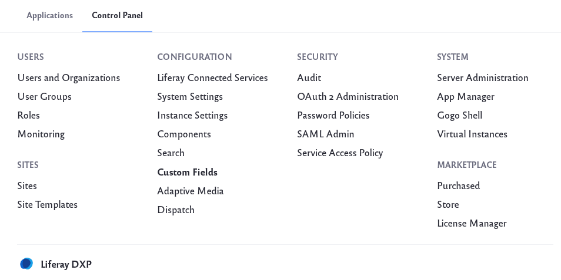
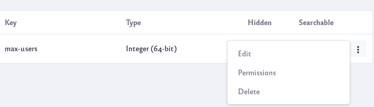

# Custom Fields

Many of Liferay DXP’s assets and resources let you add new fields to their edit forms. The different places custom fields can be added are,

* Blogs Entry
* Calendar Event
* Document
* Documents Folder
* Knowledge Base Article
* Knowledge Base Folder
* Message Boards Category
* Message Boards Message
* Organization
* Page
* Role
* Site
* Site Navigation Menu Item
* User
* User Group
* Web Content Article
* Web Content Folder
* Wiki Page

There are many use cases for adding a custom field.
For example, an administrator might want to [add a custom field for Users](../../users-and-permissions/devops/adding-custom-fields-to-users.md).

Custom fields are also useful for developers. For example, you might want to create a Role that has a set limit of number of users. A custom field called *max-users* could be added for an administrator to input a value. Then the developer can set some logic where Users cannot be assigned this Role once the value is reached.

## Custom Field Types

There are different custom field types that can be added to a resource,


### Text and Numbers:

**Text Area:** Collect longer lines of text.

**Input Field:** Collect a string of text, a decimal number, or an integer.

### Selection:

**Dropdown:** Provide a dropdown list to select a single option. The list can be text, decimal numbers, or integers.

**Checkbox:** Provide a list of checkboxes to select one or more options.

**Radio:** Provide a list of radio buttons to toggle a single option.

### Other Field Types

**Geolocation:** Collect the User’s geolocation information.

**Date:** Collect date and time information.

**True/False:** Provide a choice of True or False.

## Adding Custom Fields

To add a custom field,

1. Navigate to Control Panel &rarr; Configuration &rarr; Custom Fields.

    

1. Select the resource to add a custom field. For example, *Roles*.

    

1. Click Add () to add a new custom field. 

    

1. Select a field type for this custom field. For the *max-users* example, select *Input Field*. Give the custom field a name and select the Data Type as Integer.

    

1. Click Save and the custom field is added to the resource. For example, the *max-users* custom field is now visible in the Roles resource UI.

    

```Note::
The Key you enter here is the name of the new field. It’s stored in the database and used by developers to access the custom field with the <liferay-ui:custom-attribute /> tag. It is also used to label the field in the UI.
```

## Editing Custom Fields

You can’t change the key or field type of a custom field, but you can delete it and create a new one if necessary.

1. Click on the Options icon () next to a custom field.

    

1. Click *Edit* to make changes to the custom field. Click *Permissions* to modify permissions of the custom field. Or click *Delete* to delete the custom field.

