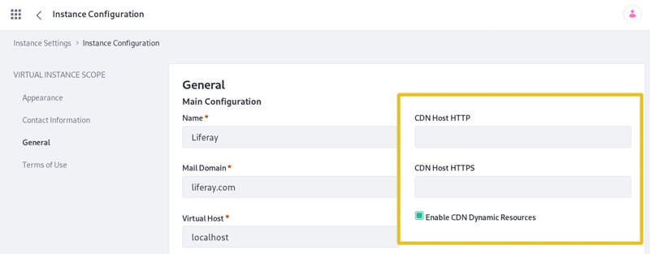

# Using a CDN

A Content Delivery Network (CDN) stores your static content on distributed infrastructure in multiple data centers. When visitors hit your site, your static content is loaded from the server closest to them, speeding up requests.

Here, you'll first discover the perks of using a CDN and learn about general guidelines for using a CDN with Liferay. Then you'll configure a CDN. It's time to distribute your content around the world!

## Using CDN for Performance Enhancements

The CDN functions as a caching proxy. This means that once static content is copied to a local server, it's stored in a cache for quick and easy retrieval. This improves latency time, because browsers can download static resources from a local server down the street instead of halfway around the world. An algorithm finds the server closest to the request. The figure below shows a visual representation of using geographical proximity to minimize latency.

The red lines on the map represent the required distances traveled by requests from a server to the user.

Because of the reduced wait time for requests and reduced load on your application server, a CDN is a great option to improve performance. Using a CDN with Liferay, however, has some requirements.

## Liferay CDN Requirements

Liferay only works with CDNs that can dynamically retrieve requested resources. Dynamic resources change over time or via interaction with users and thus cannot be cached. Check with your CDN provider to make sure you don't have to upload anything manually for the CDN to work. The CDN must automatically fetch the content.

The CDN must work like a transparent proxy. A request first goes to the CDN. If the CDN doesn't have the requested resource, the CDN makes an identical request back to the origin (Liferay), caches the resource, then serves the resource.

Once you're using a CDN (see below), it serves both core resources and plugin resources (e.g., theme resources or JavaScript files referenced from a plugin's `liferay-portlet.xml` file). The CDN only serves resources that are included in a plugin. It does not serve resources that are dynamically loaded from external sources.

To get the CDN URL for a resource, developers should replace the portal host in the resource path with `themeDisplay.getCDNDynamicResourcesHost()`. Prefix resources with the CDN host name. Don't manually upload any resources to the CDN or put anything on the CDN which requires permission checking or complex policy access.

There are several portal properties for configuring your CDN to suit your needs. You'll learn how to do this next.

## Configuring Liferay to Use a CDN

Now that you understand what a CDN accomplishes and how it's used, it's time to set one up. You can set your CDN using two different methods:

1. By editing your portal properties file

1. By using the Control Panel

To configure your CDN via a [portal properties](../reference/portal-properties.md) file, create a `portal-ext.properties` file in your [Liferay Home](../reference/liferay-home.md) folder and set the appropriate [Content Delivery Network properties](https://docs.liferay.com/dxp/portal/7.3-latest/propertiesdoc/portal.properties.html#Content%20Delivery%20Network).

Once you configure your CDN host, Liferay generates static asset URLs that replace the old host with your new CDN host so they are automatically cached and served afterwards by the CDN.

Here's how to configure your CDN in the Control Panel:

1. Navigate to *Control Panel* &rarr; *Configuration* &rarr; *Instance Settings*. The Instance Settings page appears.

1. In the *Platform* category, click *Instance Configuration* icon . The Instance Configuration page appears.

1. In the *Virtual Instance Scope* navigation, click *General*. The General Main Configuration page appears and includes these three CDN-related fields:

    * *CDN Host HTTP*
    * *CDN Host HTTPS*
    * *Enable CDN Dynamic Resources*

These fields correspond to the Content Delivery Network portal properties. Refer to the [portal.properties](https://docs.liferay.com/dxp/portal/7.3-latest/propertiesdoc/portal.properties.html#Content%20Delivery%20Network) document for information on how to set values for these fields.

Make sure to include the protocol and domain when specifying your CDN host(s) URLs:

*CDN Host HTTP:* `http://cdnhost1.liferay.com`  
*CDN Host HTTP:* `https://cdnhost2.liferay.com`

Once you're finished, click *Save* and your new CDN host now serves your static content.

Congratulations! Your new CDN can drastically reduce latency time and improve performance.
