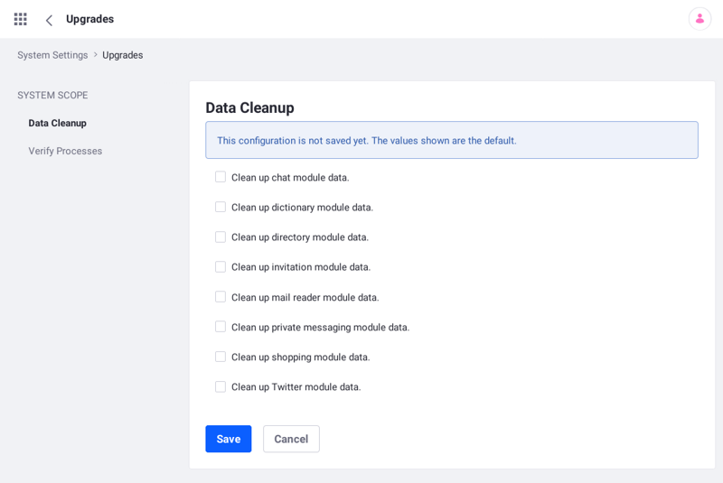

# Data Cleanup

When you're done using an obsolete Liferay app or capability, you can remove its data. Data cleanup is done using the Control Panel or a [configuration file](../../../system-administration/system-settings/using-configuration-files.md).

Here's how to clean up obsolete data:

1. In the *Control Panel*, navigate to *System Settings* &rarr; *Upgrades* (in the *Platform* category) &rarr; *Data Cleanup*. The Data Cleanup screen appears.

    

1. Check the modules you want to clean up and click *Save*.

    ```note::
       To save the cleanup settings to a `configuration file <../../../system-administration/system-settings/using-configuration-files.md>`_, click the *Actions* menu and select *Export*.
    ```

   Module data cleanup executes.

1. Disable data cleanup by unchecking every module in the Data Cleanup screen or by setting the module cleanup keys `false` in a `com.liferay.data.cleanup.internal.configuration.DataCleanupConfiguration.config` [configuration file](../../../system-administration/system-settings/using-configuration-files.md).

Your server is unburdened of obsolete module data.

```note::
   You can also clean up module data on server startup (on premises or `Liferay Docker container <../upgrade-basics/upgrading-via-docker.md>`_) using a ``com.liferay.data.cleanup.internal.configuration.DataCleanupConfiguration.config`` `configuration file <../../../system-administration/system-settings/using-configuration-files.md>`_. After cleanup completes, delete the configuration file from the `osgi` folder.
```

## Additional Information

* [Using Configuration Files](../../../system-administration/system-settings/using-configuration-files.md)
* [Upgrading Via Docker](../upgrade-basics/upgrading-via-docker.md)
* [Providing Files to the Container](../../installing-liferay/using-liferay-dxp-docker-images/providing-files-to-the-container.md)
* [Using the Upgrade Tool](../upgrade-basics/using-the-database-upgrade-tool.md)