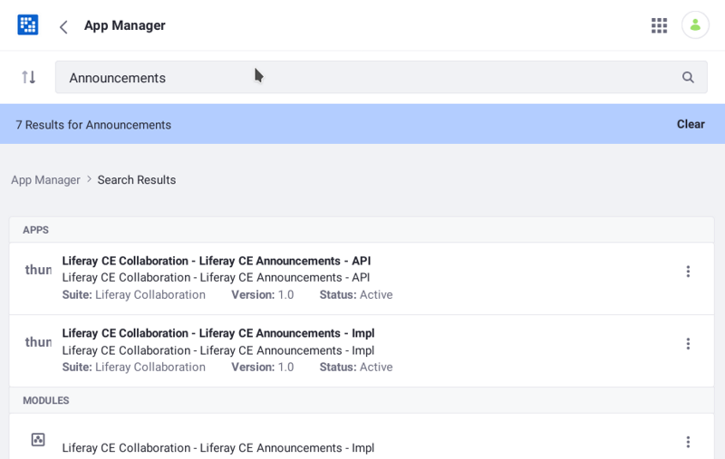
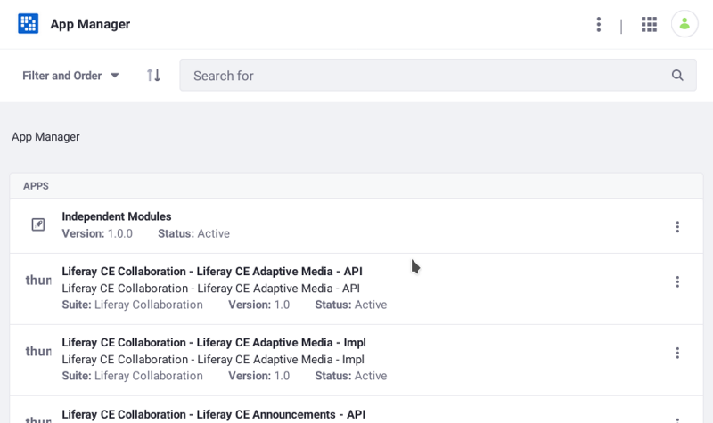

# Finding Artifacts

Using external artifacts in your project requires configuring their dependencies. To do this, look up the artifact's attributes and plug them into dependency entries for your `build.gradle` [Gradle](https://gradle.org/) build file. Gradle downloads the dependency artifacts to use in compiling your project.

Before specifying an artifact as a dependency, you must first find its attributes. Artifacts have these attributes:

* *Group ID*: Authoring organization
* *Artifact ID*: Name/identifier
* *Version*: Release number

Here you'll learn how to find artifact attributes to specify dependencies.

## Finding Core Artifact Attributes

Each Liferay artifact is a JAR file whose `META-INF/MANIFEST.MF` file specifies OSGi bundle metadata includes the artifact's attributes. For example, these two OSGi headers specify the artifact ID and version:

```
Bundle-SymbolicName:  [artifact ID]
Bundle-Version: [version]
```

```important::
   Artifacts in Liferay DXP fix packs override Liferay DXP installation artifacts. Subfolders of a fix pack ZIP file's ``binaries`` folder hold the artifacts. If an installed fix pack provides an artifact your project depend on, specify the version of that fix pack artifact in a dependency.
```

This table lists each core Liferay artifact's group ID and artifact ID and where to find the artifact's manifest, which lists the artifact version:

*Core Liferay Artifacts*:

| File          | Group ID | Artifact ID | Version | Origin |
| :------------ | :--------------- | :-------- | :--------- | :------ |
| `portal-kernel.jar` | `com.liferay.portal` | `com.liferay.portal.kernel` | (see JAR's `MANIFEST.MF`) | fix pack ZIP, Liferay installation, or Liferay dependencies ZIP |
| `portal-impl.jar` | `com.liferay.portal` | `com.liferay.portal.impl` | (see JAR's `MANIFEST.MF`) | fix pack ZIP or Liferay `.war` |
| `util-bridges.jar` | `com.liferay.portal` | `com.liferay.util.bridges` | (see JAR's `MANIFEST.MF`) | fix pack ZIP or Liferay `.war` |
| `util-java.jar` | `com.liferay.portal` | `com.liferay.util.java` | (see JAR's `MANIFEST.MF`) | fix pack ZIP or Liferay `.war` |
| `util-slf4j.jar` | `com.liferay.portal` | `com.liferay.util.slf4j` | (see JAR's `MANIFEST.MF`) | fix pack ZIP or Liferay `.war` |
| `util-taglibs.jar` | `com.liferay.portal` | `com.liferay.util.taglib` | (see JAR's `MANIFEST.MF`) | fix pack ZIP or Liferay `.war` |
| `com.liferay.*` JAR files | `com.liferay` | (see JAR's `MANIFEST.MF`) | (see JAR's `MANIFEST.MF`) | fix pack ZIP, Liferay installation, Liferay dependencies ZIP, or the OSGi ZIP |

Next, you'll learn how to find Liferay app and independent module artifact attributes.

## Finding Liferay App and Independent Artifacts

Independent modules and Liferay app modules aren't part of the Core. You must still, however, specify dependencies on the modules you need. The resources below demonstrate finding artifact attributes for Liferay app modules and independent modules:

| Resource | Artifact Type |
| :-------- | :-------------- |
| [App Manager](#app-manager) | Deployed modules |
| [Reference Docs](#reference-docs) | Liferay modules (per release) |
| [Maven Central](#maven-central) | All artifact types: Liferay and third party, module and non-module |

```important::
   ``com.liferay`` is the group ID for all of Liferay's apps and independent modules.
```

The App Manager provies the best information on deployed modules.

### App Manager

[The App Manager](../../../system-administration/installing-and-managing-apps/managing-apps/using-the-app-manager.md) shows what's deployed on your Liferay instance. Use it to find deployed module attributes.

1. In Liferay, click on the *Global Menu* () and select the *Control Panel* tab. The Control Panel appears.

1. In the System category, select *App Manager*. The App Manager appears.

1. Search for the module by its display name, symbolic name, or related keywords. You can also browse for modules via the app listing. Whether browsing or searching, the App Manager shows each module's artifact ID and version number.



The App Manager aggregates independent modules in the Independent Modules category.



If you don't know an independent module's group ID, use the [Felix Gogo Shell](./using-the-gogo-shell.md) to find it:

1. In the Control Panel's System category, select *Gogo Shell*. Enter commands in the Gogo Shell command prompt.

1. Search for the module by its display name (e.g., `Apache Aries CDI`) or a keyword. In the results, note the module's number. You can use it in the next step. For example, Gogo command results in the figure below show the Liferay Announcements API module number `47`.

    

1. List the module's manifest headers by passing the module number to the `headers` command. In the results, note the `Bundle-Vendor` or `Implementation-Vendor` value: you'll match it with an artifact group in a later step:

    

1. On [Maven Central](https://search.maven.org/) or [MVNRepository](https://mvnrepository.com), search for the module by its artifact ID.

1. Determine the group ID by matching the `Bundle-Vendor` or `Implementation-Vendor` name from step 3 with a group listed that provides the artifact.

Next, Liferay reference documentation provides Liferay app artifact attributes.

### Reference Docs

Liferay's app Javadoc lists each app module's artifact ID, version number, and display name. This is the best place to look up Liferay app modules that aren't yet deployed to your Liferay instance.

```note::
   To find artifact information on a Core Liferay artifact, refer to the previous section *Finding Core Liferay Artifact Attributes*.
```

Follow these steps to find a Liferay app module's attributes in the Javadoc:

1. Navigate to Javadoc for an app module class. If you don't have a link to the class's Javadoc, find it by browsing app Javadoc for your Liferay edition:

    **Liferay DXP**: <https://docs.liferay.com/dxp/apps>

    **Liferay Portal CE**: <https://docs.liferay.com/ce/apps>

1. Copy the class's package name.

1. Navigate to the *Overview* page.

1. On the *Overview* page, search for the package name you copied in step 2.

The heading above the package name shows the module's artifact ID, version number, and display name. Remember, the group ID for all app modules is `com.liferay`.


```note::
   Module version numbers aren't currently included in any tag library reference docs.
```

Next, you'll learn how to look up artifacts on MVNRepository and Maven Central.

### Maven Central

Most artifacts, regardless of type or origin, are on [MVNRepository](https://mvnrepository.com/) and [Maven Central](https://search.maven.org/). These sites can help you find artifacts based on class packages. It's common to include an artifact's ID in the start of an artifact's package names. For example, if you depend on the class `org.osgi.service.component.annotations.Component`, search for the package name `org.osgi.service.component.annotations` on one of the Maven sites.

```note::
   Make sure to follow the instructions listed earlier to determine the version of Liferay artifacts you need.
```

## What's Next

Now that you know the artifact's attributes, you can configure a dependency on it. See [Specifying Dependencies](./specifying-dependencies.md) for details.

## Additional Information

* [Importing Packages](../importing-packages.md)
* [Exporting Packages](../exporting-packages.md)
* [Resolving Third Party Library Package Dependencies](./resolving-third-party-library-package-dependencies.md)
* [Deploying WARs \(WAB Generator\)](../../../developing-apps/reference/deploying-wars-wab-generator.md)