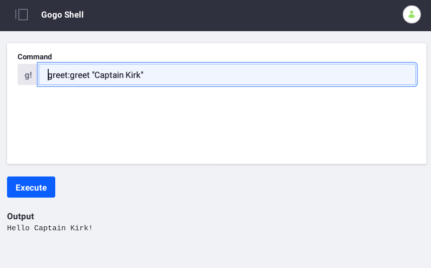

# Using an OSGi Service

TODO How to discover a capability? https://docs.liferay.com/dxp/portal/7.2-latest/javadocs/

Liferay APIs are readily available as OSGi services. You can access a service by creating a field of that type and adding the [`@Reference`](https://docs.osgi.org/javadoc/osgi.cmpn/7.0.0/org/osgi/service/component/annotations/Reference.html) annotation to the field. Here's what it looks like:

```java
@Reference
BlogsEntryService _blogsEntryService;
```

All Declarative Services components can access other services this way. The run time framework injects the fields with components of the type they reference.

The following example demonstrates how a Client module uses an OSGi service called `Greeting`. An API module defines `Greeting` and an Implementation module provides a `Greeting` service implementation. The example Client module creates a Gogo Shell command that responds with greetings produced from the `Greeting` service. Consider this example to be a "Hello World" for OSGi services.



You can use OSGi services in any kind of module. This example Client module focuses on using the the `Greeting` service.

Liferay service package Javadoc is available at these locations:
* [Liferay DXP Apps](https://docs.liferay.com/dxp/apps/)
* [Liferay DXP Portal](https://docs.liferay.com/dxp/portal/7.2-latest/javadocs/)
* [Liferay CE Apps](https://docs.liferay.com/ce/apps/)
* [Liferay CE Portal](https://docs.liferay.com/ce/portal/7.2-latest/javadocs/)

```note::
   For instructions on how to create an OSGi service, please see `APIs as OSGi Services <./apis-as-osgi-services.md>`_.
```

## Deploy an Example

Start using the example.

1. Start a [Liferay Docker container](../../installation-and-upgrades/installing-liferay/using-liferay-dxp-docker-images/dxp-docker-container-basics.md).

    ```bash
    docker run -it -p 8080:8080 liferay/portal:7.3.2-ga3
    ```

1. Download and unzip `liferay-j1h1.zip`.

    ```curl
    curl https://learn.liferay.com/dxp-7.x/liferay-internals/fundamentals/liferay-j1h1.zip -O
    ```

    ```bash
    unzip liferay-j1h1.zip
    ```

1. Build the example modules.

    ```bash
    ./gradlew jar
    ```

    Each module JAR file is generated to that module's `build/libs` folder.

     ```
     j1h1-api/build/libs/com.liferay.learn.j1h1.api-1.0.0.jar
     j1h1-impl/build/libs/com.liferay.learn.j1h1.client-1.0.0.jar
     j1h1-impl/build/libs/com.liferay.learn.j1h1.impl-1.0.0.jar
     ```

1. Deploy the example module JARs.

    API module:

    ```bash
    docker cp j1h1-api/build/libs/com.liferay.learn.j1h1.api-1.0.0.jar $(docker ps -lq):/opt/liferay/deploy
    ```

    Implementation module:

    ```bash
    docker cp j1h1-impl/build/libs/com.liferay.learn.j1h1.impl-1.0.0.jar $(docker ps -lq):/opt/liferay/deploy
    ```

    Client module:

    ```bash
    docker cp j1h1-client/build/libs/com.liferay.learn.j1h1.client-1.0.0.jar $(docker ps -lq):/opt/liferay/deploy
    ```

1. Confirm the deployments in the Docker container console.

    ```
    STARTED com.liferay.learn.j1h1.api_1.0.0
    STARTED com.liferay.learn.j1h1.impl_1.0.0
    STARTED com.liferay.learn.j1h1.client_1.0.0
    ```

1. Open the [Gogo Shell](/using-the-gogo-shell/using-the-gogo-shell.md).

1. In the command field, use the `greet:greet` command to send a greeting.

    ```groovy
    greet:greet "Captain Kirk"
    ```

1. Confirm the output.

    ```
    Hello Captain Kirk!
    ```

The client module leverages the API and Implementation modules to produce the content returned from the `greet:greet` Gogo Shell command.

Read on to learn how to use an OSGi service from a client.

## Walk Through the Example

* [Write Your Business Logic](#TODO)
* [Annotate External Service References](#TODO)
* [Make the Client a Component](#TODO)

### Write Your Business Logic

You can implement business logic using any OSGi services you need. The code below uses `Greeting`.

```
public void greet(String name) {
    Greeting greeting = _greeting;

    greeting.greet(name);
}

private Greeting _greeting;
```

The method above invokes a `Greeting` instance's `greet` method with its `name` parameter. `Greeting` is the OSGi service type that the Implementation module registers. The class must get a `Greeting` instance from the OSGi service registry.

### Annotate External Service References

Getting an OSGi service requires creating a field of the service type and adding a [`@Reference`](https://docs.osgi.org/javadoc/osgi.cmpn/7.0.0/org/osgi/service/component/annotations/Reference.html) annotation to that field.

```java
@Reference
private Greeting _greeting;
```

The `GreetingCommand` client class has the above private `Greeting` field called `_greeting` that uses the `@Reference` annotation. The `@Reference` annotation tells the OSGi runtime to instantiate the field with a `Greeting` service from the registry. The runtime binds a `Greeting` object to the `_greeting` field. If `GreetingImpl` is the only registered `Greeting` service component, the runtime injects `_greeting` with a `GreetingImpl`.

### Make the Client a Component

To use the `@Reference` annotation, the class must be Declarative Services component. Add the `@Component` annotation to the class and declare it to implement a particular service.

```java
@Component(
   property = {"osgi.command.scope=greet", "osgi.command.function=greet"},
   service = Object.class
)
public class GreetingCommand {
```

The `GreetingCommand` client class is a service component of type `Object`. Unless there's a particular interface or class you need to implement, making your class a service of type `Object` is fine.

```note::
   As in Java, where every class is a subclass of ``java.lang.Object`` (even though you don't need to specify it by default), in Declarative Services, the runtime must know the type of class to register. Because you're not implementing any particular type, your parent class is ``java.lang.Object``, so you must specify that class as the service. While Java doesn't require you to specify `Object` as the parent when you're creating a class that doesn't inherit anything, Declarative Services does.
```

The `GreetingCommand` class' two properties define a Gogo shell command scope and a command function. All commands have a scope to define their context, as it's common for multiple APIs to have similar functions, such as `copy` or `delete`. These properties specify a command called `greet` in a scope called `greet`. While you get no points for imagination, this sufficiently defines the command.

The deployed `GreetingCommand` component provides the Gogo Shell command `greet:greet` that takes a `String` as input.

## Conclusion

The API and Impl modules created the service and this client used the service to create a simple Gogo Shell command. The same OSGi service can be used in different ways by different clients. The API-Provider-Consumer contract fosters loose coupling, making your software easy to manage, enhance, and support.

Now that you're familiar with creating and using OSGi services in modules, you can explore how to [configure dependencies](./configuring-dependencies/configuring-dependencies.md) on more artifacts.

## Additional Information

* [Importing Packages](./importing-packages.md)
* [Exporting Packages](./exporting-packages.md)
* [Semantic Versionings](./semantic-versioning.md)