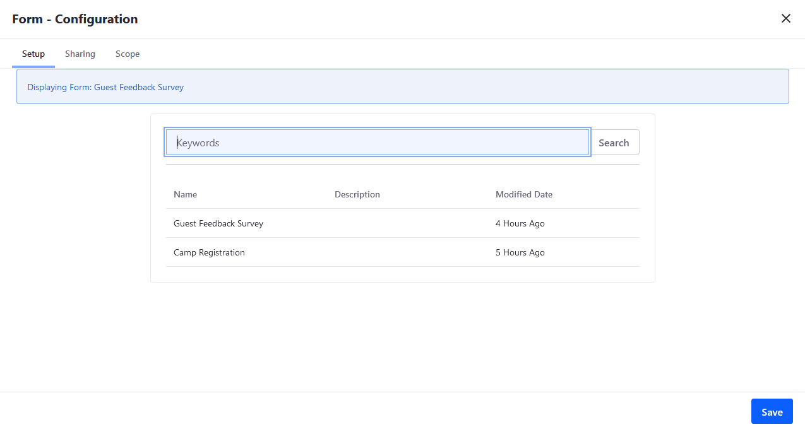

# Forms Configuration Reference

This article serves as a reference for all Forms and the Form application configurations.

## Forms Options

You can export and import forms between Sites to save time and not have to recreate them. To access the _Export / Import_ menu, navigate to _Site Administration_ &rarr; _Content and Data_  &rarr; _Forms_. Click the  icon in the upper right then _Export / Import_.

 See [Exporting and Importing Forms](./exporting-and-importing-forms.md) and [Importing and Exporting Pages and Content](../../../site-building/building-sites/importing-exporting-pages-and-content.md) to learn more.

## Form Settings

Each form has its own _Settings_ menu.

To access the Settings menu, choose the desired form (for example, _Guest Survey Feedback_). Click  icon in the upper right then _Settings_.

### Form Options

| Field | Description |
| --- | --- |
| Require User Authentication | Requires users to sign in before submitting the form |
| CAPTCHA | Requires users to answer CAPTCHA questions when submitting the form |
| Save Answers Automatically | Saves answers to the form automatically |
| Redirect URL on Success | Specifies a redirect URL once the form is submitted successfully. |
| Select a Storage Type | Sets JSON as the default storage type; not editable. |
| Select a [Workflow](./advanced-forms-usage/using-forms-with-a-workflow.md) | Select a workflow definition to review the form submission; workflow is deactivated by default. |

### Email Notifications

On the _Email Notifications_ tab, you can configure the Forms app to send a notification email each time a form entry is submitted. You should set up a mail server first; see [Connecting to a Mail Server](../../../installation-and-upgrades/setting-up-liferay-dxp/configuring-mail/connecting-to-a-mail-server.md) to learn more.

| Field | Description |
| --- | --- |
| From Name | Specifies a user name |
| From Address | Specifies an email address used to send the email |
| To Address | Specifies the recipient's email address |
| Subject | Specifies the email message, such as a confirmation |

To learn more, see [Configuring Form Notifications](./configuring-form-notifications.md)

## Form Widget Configuration

You can configure the _Form_ widget deployed to a Site Page. To access the _Configuration_ menu, click the  icon next to the widget title then _Configuration_.

### Setup

On the _Setup_ tab, you can choose the desired Form to be used in this widget.

### Sharing

On the _Sharing_ tab, you can embed this application on other platforms besides DXP.

### Scope

On the _Scope_ tab, you can change the widget's [scope](https://help.liferay.com/hc/articles/360028819992-Widget-Scope) from Global, Site, or Page.

## Additional Information

* [Forms Permissions Reference](./forms-permissions-reference.md)
* [Widget Scope](https://help.liferay.com/hc/articles/360028819992-Widget-Scope)
