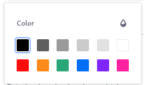
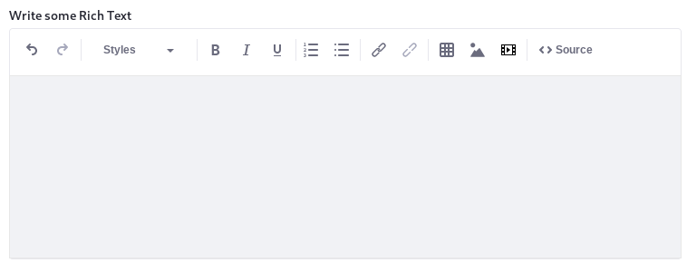

# Forms Field Types Reference

This article documents the available elements when building a form.

1. Open the _Product Menu_ () then click the compass icon () on the _Site Administration_ menu. Select the site where the form will be created.
1. Click _Content & Data_  &rarr; _Forms_.
1. Click the _Add_ button (). The form builder view appears.
1. Click the _Add_ button () one more time to display the _Add Elements_ sidebar (if it is not already opened).

 

## Form Fields and Elements

### Paragraph 

This is static text on the form. Users do not enter data into form text fields. The form creator enters text that form users see displayed on the form. This is useful for longer instructions.

### Text Field 

Users enter text into these fields. For example, a Full Name field is a text field. By default, a text field keeps all input on a single line of text. To accommodate longer responses, choose the multi-line setting when configuring the text field [as in this example](./creating-forms.md). You can put limits on the text users can enter (e.g., numbers from 1-10, email addresses, etc.) by using the text field's [validation options](./validating-text-and-numeric-field-entries.md).

### Select from List 

Users select one option (or more, if configured to allow it) from a list of choices. Choices are entered manually or are automatically populated by a data provider. For example, a Country of Residence field can be selected from list field populated by a Countries of the World data provide

### Single Selection 

Using a radio button, users select one option from a list of options displayed on the form

### Date 

Users select a date using a date picker.

### Multiple Selection 

Users select one or more options from check boxes (or toggles, if configured).

### Grid 

Using radio buttons, users select from options laid out in rows and columns. One selection can be made per row. This is useful when the same response metric is needed for multiple questions.

### Numeric 

Users enter numeric data (integers or decimals) into numeric fields. Non-number input is not accepted.

### Upload 

Users can select a file from the Documents and Media library or upload a file from their local file systems.

### Image 

Users can select an image file (`.jpg`, `.png`) from Web Content Images, the Documents and Media library, or upload an image file from their local file systems.

### Color 

Users can enter the hex code of a color by selecting it from the color picker or entering the code directly.

### Rich Text 

Users can enter Rich Text content.

## Additional Information

* [Creating Forms](./creating-forms.md)
