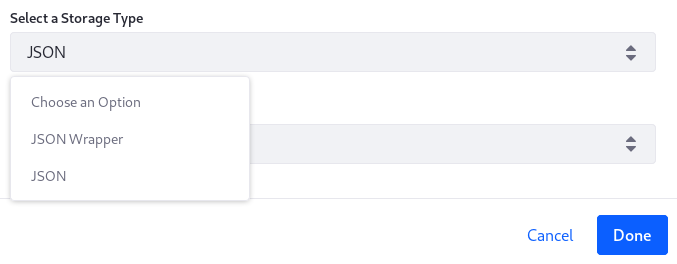
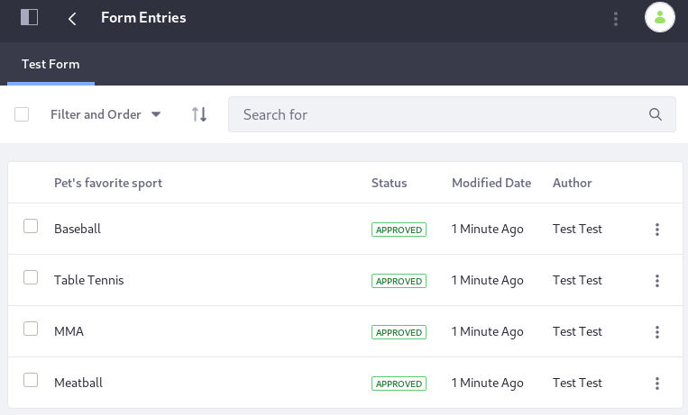

# Writing a Form Storage Adapter

> Available: Liferay DXP 7.3 and Liferay DXP 7.2 versions that include the fix for [LPS-97208](https://issues.liferay.com/browse/LPS-97208) (planned for Liferay DXP 7.2 SP3).

By default, forms are stored as JSON in Liferay DXP's database. This example shows you how to implement a new storage adapter to inject custom logic into a form record persistence event.



First, you'll look at the [default storage adapter's](https://github.com/liferay/liferay-portal/blob/7.3.1-ga2/modules/apps/dynamic-data-mapping/dynamic-data-mapping-service/src/main/java/com/liferay/dynamic/data/mapping/internal/storage/DDMJSONStorageAdapter.java) logic, which saves form records in the Liferay DXP database as JSON content. Then you'll add logic to store each Form Record on the file system.

## Examine a Running DDM Storage Adapter

To see how storage adapters work, you'll deploy an example and then add some form data using the example adapter.

### Deploy the Example

1. Start Liferay DXP. If you don't already have a docker container, use

    ```bash
    docker run -it -p 8080:8080 liferay/portal:7.3.2-ga3
    ```

    If you already have a docker container, use

    ```bash
    docker start -i [container_name]
    ```

1. Download and unzip [the DDM File System Storage Adapter project](./writing-a-form-storage-adapter/liferay-r2f1.zip).

    ```bash
    curl https://learn.liferay.com/dxp/7.x/en/process-automation/forms/developer-guide/liferay-r2f1.zip -O
    ```

    ```bash
    unzip liferay-r2f1.zip
    ```

1. From the module root, build and deploy.

    ```bash
    ./gradlew deploy -Ddeploy.docker.container.id=$(docker ps -lq)
    ```

    ```tip::
       This command is the same as copying the deployed jars to /opt/liferay/osgi/modules on the Docker container.
    ```

1. Confirm the deployment in the Liferay Docker container console.

    ```bash
    STARTED com.liferay.learn.r2f1.impl_1.0.0 [1009]
    ```

### Use the Deployed Storage Adapter

1. Opening your browser to `https://localhost:8080`

1. Go to the Forms application in _Site Menu_ &rarr; _Content & Data_ &rarr; _Forms_.

1. Click the *Add* button () to open the Form Builder.

1. In the Form Builder view, click the *Options* button () and open the *Settings* window.

1. Under *Select a Storage Type*, choose the File System type and click _Done_.

1. Add a [Text Field](./../user-guide/creating-forms.md) to the form, publish the form, and submit it a few times.

1. To verify the form data were persisted, go to the Form's Records:

   From _Site Menu_ &rarr; _Content_ &rarr; _Forms_, click the Form's *Actions* button (), then _View Entries_.

   

## Understand the Extension Point

The example contains only one class: `DDMFileSystemStorageAdapter`, a service implementing a `DDMStorageAdapter` to provide logic for storing Form Entries. The deployed example holds logic identical to the default implementation used for all forms: `DDMJSONStorageAdapter`. Later, you'll add file system storage to the code that's already here.

### Register the Adapter Class with the OSGi Container

The `DDMFileSystemStorageAdapter` implements the `DDMStorageAdapter` interface, but must be registered as an OSGi service:

```java
@Component(
	immediate = true, property = "ddm.storage.adapter.type=file-system",
	service = DDMStorageAdapter.class
)
public class DDMFileSystemStorageAdapter implements DDMStorageAdapter {
```

The `service` component property registers your implementation as a `DDMStorageAdapter` service.

The `property = "ddm.storage.adapter.type=file-system"` provides an identifier so that your service is registered as a unique `DDMStorageAdapter` implementation. Other services can now reference it like this:

```java
@Reference(target = "(ddm.storage.adapter.type=file-system)")
private DDMStorageAdapter fileSystemDDMStorageAdapter;
```

### Understand the DDMStorageAdapter Interface

The interface requires three methods to handle CRUD operations on form records: `delete`, `get`, and `save` (which also handles update logic).

```java
public DDMStorageAdapterDeleteResponse delete(
        DDMStorageAdapterDeleteRequest ddmStorageAdapterDeleteRequest)
    throws StorageException;
```

```java
public DDMStorageAdapterGetResponse get(
        DDMStorageAdapterGetRequest ddmStorageAdapterGetRequest)
    throws StorageException;
```

```java
public DDMStorageAdapterSaveResponse save(
        DDMStorageAdapterSaveRequest ddmStorageAdapterSaveRequest)
    throws StorageException;
```

Each method must return a
_DDMStorageAdapter[[Save](https://github.com/liferay/liferay-portal/blob/7.2.0-ga1/modules/apps/dynamic-data-mapping/dynamic-data-mapping-api/src/main/java/com/liferay/dynamic/data/mapping/storage/DDMStorageAdapterSaveResponse.java)/[Get](https://github.com/liferay/liferay-portal/blob/7.2.0-ga1/modules/apps/dynamic-data-mapping/dynamic-data-mapping-api/src/main/java/com/liferay/dynamic/data/mapping/storage/DDMStorageAdapterGetResponse.java)/[Delete](https://github.com/liferay/liferay-portal/blob/7.2.0-ga1/modules/apps/dynamic-data-mapping/dynamic-data-mapping-api/src/main/java/com/liferay/dynamic/data/mapping/storage/DDMStorageAdapterDeleteSaveResponse.java)]Response_
object, constructed using a static inner `Builder` class's `newBuilder`
method.

All methods are passed a `DDMStorageAdapter[Save/Delete/Get]Request`. The request objects contain getter methods that return useful contextual information.

### Declare the Service Dependencies

This code relies on several services deployed to an OSGi container:

`DDMContentLocalService`, a `DDMFormValuesSerializer`, and a `DDMFormValuesDeserializer`. They're declared at the end using Declarative Services `@Reference` annotations, provided by `org.osgi.service.component.annotations.Reference`.
```java
@Reference
private DDMContentLocalService _ddmContentLocalService;

@Reference
private DDMFormValuesDeserializerTracker _ddmFormValuesDeserializerTracker;

@Reference
private DDMFormValuesSerializerTracker _ddmFormValuesSerializerTracker;
```

Using this structure, you'll now add file system storage to the example adapter.

## Implement File System Storage

Since the example already overrides the necessary methods, you only need add the appropriate logic to each one. You'll create private utility methods for your functionality and then call them from the overridden methods.

### Implement File Deletion

1. Set a private variable `_PATHNAME` so you can control where the files are stored. The path here points to the Liferay install location in the Docker container.

   ```java
   private static final String _PATHNAME = "/opt/liferay/form-records";
   ```

1. Create a `_deleteFile` utility method (use the `java.io.File` class here):

   ```java
   private void _deleteFile(long fileId) {
       File file = new File(_PATHNAME + "/" + fileId);

       file.delete();
   }
    ```

1. Find the existing `delete` method. At the start of this method (before the `try` block), set a `fileId` variable as the primary key returned by the delete request object:

   ```java
   long fileId = ddmStorageAdapterDeleteRequest.getPrimaryKey();
   ```

1. Immediately after, call your `_deleteFile` method, passing it the file ID:

   ```java
   _deleteFile(fileId);
   ```

Now the code first deletes the file from the file system before it deletes the copy in the database.

### Implement File Retrieval

You'll follow the same procedure for the `get` method: create a private utility method and then call it.

1. Add the `_getFile` utility method:

   ```java
   private void _getFile(long fileId) throws IOException {
       try {
           System.out.println(
               "Reading the file named:" + fileId + "\n" +
                   "The file contents: " +
                       FileUtil.read(_PATHNAME + "/" + fileId));
       }
       catch (IOException e) {
           throw new IOException(e);
       }
   }
    ```

   Import `com.liferay.portal.kernel.FileUtil`.

1. At the beginning of the `get` method (inside the `try` block), set the `storageId` (retrieved by `ddmStorageAdapterGetRequest.getPrimaryKey()`) as the `fileId` and call a `_getFile` utility method which prints the retrieved content to the Liferay log.

   ```java
   long fileId = ddmStorageAdapterGetRequest.getPrimaryKey();

   _getFile(fileId);
   ```

### Implement File Creation Logic

There are two types of save requests: 1) a new record is added or 2) an existing record is updated. At each save, you'll have the `update` method overwrite the existing file, using the current `ddmFormValues` content.

1. Create a `_saveFile` utility method:

   ```java
   private void _saveFile(long fileId, DDMFormValues formValues)
       throws IOException {

       try {
           String serializedDDMFormValues = _serialize(formValues);

           File abstractFile = new File(String.valueOf(fileId));

           FileUtil.write(
               _PATHNAME, abstractFile.getName(), serializedDDMFormValues);
       }
       catch (IOException e) {
           throw new IOException(e);
       }
   }
    ```

1. Add this logic and the call to `_saveFile` to the `insert` method by replacing the existing `return` statement:

   ```java
   DDMStorageAdapterSaveResponse ddmStorageAdapterSaveResponse =
        builder.build();

   long fileId = ddmStorageAdapterSaveResponse.getPrimaryKey();

   _saveFile(fileId, ddmFormValues);

   return ddmStorageAdapterSaveResponse;
   ```

   When the `insert` method saves a new form, you must retrieve the primary key from the `DDMStorageAdapterSaveResponse` object, because before that the record and its primary key is not yet created in the database.

1. You must also call `_saveFile` near the end of the `update` method. Replace the existing return stament with

   ```java
   DDMFormValues ddmFormValues =
       ddmStorageAdapterSaveRequest.getDDMFormValues();

   long fileId = ddmStorageAdapterSaveRequest.getPrimaryKey();

   _saveFile(fileId, ddmFormValues);

   return builder.build();
    ```
   This code has one small difference: the `ddmFormValues` comes from the save request instead of the response. This is already done in the existing logic of the `insert` method.

The `_serialize` and `_deserialize` methods use the default JSON format. You could replace these methods to save in another format.

## Deploy and Test the Storage Adapter

Use the same `deploy` command as earlier to deploy the Storage Adapter. From the module root run

```bash
./gradlew deploy -Ddeploy.docker.container.id=$(docker ps -lq)
```

Now verify that it's working:

1. Go to the Forms application in _Site Menu_ &rarr; _Content_ &rarr; _Forms_.

1. Click the *Add* button  to open the Form Builder.

1. In the Form Builder view, click the *Options* button () and open the *Settings* window.

1. From the select list field called *Select a Storage Type*, choose the File System type and click _Done_.

1. Add a [Text Field](./../user-guide/creating-forms.md) to the form, publish the form, and submit it a few times.

1. To verify the form records were written to the container's file system, execute a `find` and `cat` via `docker exec` to print their contents to the command line:

   ```bash
   docker exec -it $(docker ps -lq) find /opt/liferay/form-records -type f -exec cat {} +
   ```

   The JSON for each form record file is printed to the command line:

    ```json
    {"availableLanguageIds":["en_US"],"defaultLanguageId":"en_US","fieldValues":[{"instanceId":"d0bVzHXG","name":"PetsFavoriteWine","value":{"en_US":"white zinfandel"}}]}
    ```

## Conclusion

If you want to download the completed project, use this command:


```bash
curl https://learn.liferay.com/dxp/7.x/en/process-automation/forms/developer-guide/liferay-r2f2.zip -O
```

By implementing a `DDMStorageAdapter`, you can save forms records in any storage format you want.
