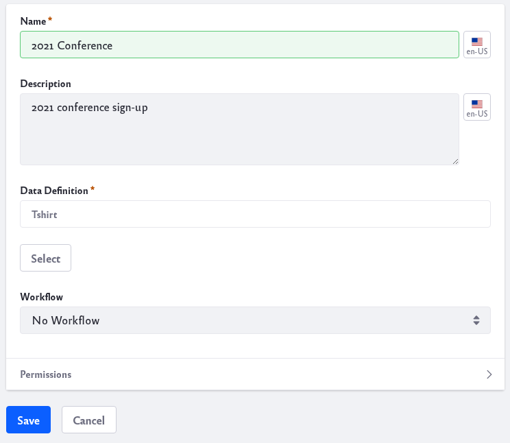
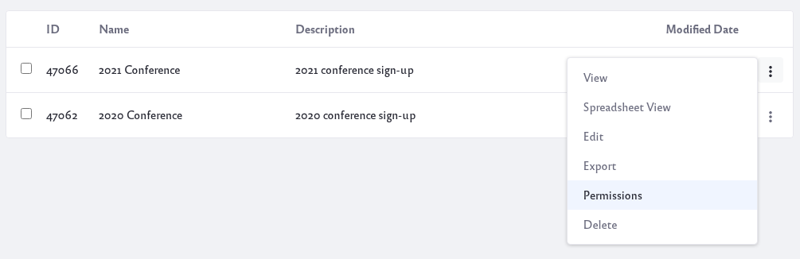
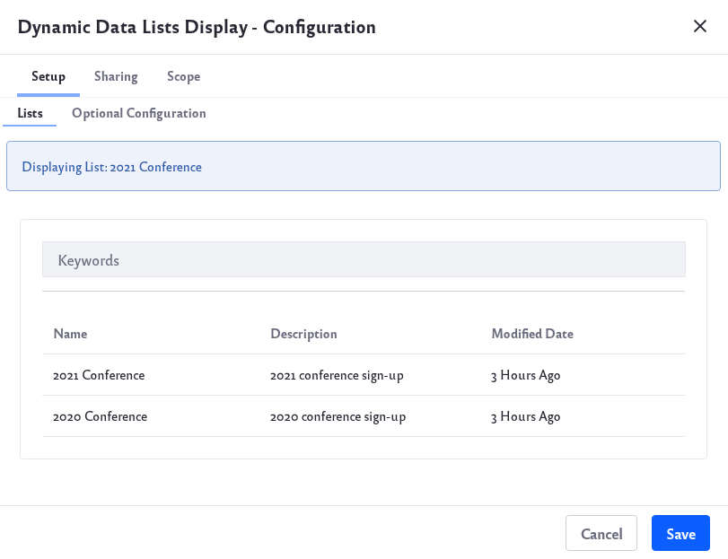

# Creating Data Lists

To create a data list:

1. Navigate to *Content & Data* &rarr; *Dynamic Data Lists*. 

1. Click the Add icon () to create a new list.

    Note, to add Dynamic Data Lists, you must have permission to access the Dynamic Data Lists app in Site Administration.

1. Give the list a name and a description.

    

1. Click the *Select* button under Data Definitions. A new form will open for you to select a Data Definition.

1. To use a workflow with this list, select it from the Workflow drop-down list.

1. To change the list’s default permissions, expand the form’s Permissions section and make your selections.

1. Click *Save* to finish creating the list. Your new list appears in the table.

## Creating List Records

By default, only administrators have permission to add records to a data list. To give other users this permission,

1. Navigate to *Content & Data* &rarr; *Dynamic Data Lists*.

1. Click the Actions icon () for the list you want to manage. Click *Permissions*. 

    

1. Select *Add Record* for the Roles that need permissions.  To give unauthenticated Users permission to add records select *Add Record* for Guest. Click *Save* to finish.

New records can be added to a list from Site Administration or from a page that has the Dynamic Data Lists Display widget. See the section below for configuring this widget.

To add a record from Site Administration,

1. Navigate to *Content & Data* &rarr; *Dynamic Data Lists*.

1. Click on the name of the data list you want to add a record to.

1. Click the Add icon () and a new form will open to add a record.

1. Fill out the necessary fields and click *Publish*.

To add a record from a page with the Dynamic Lists Display widget, 

1. Navigate to the page with the widget.

1. Click the Add icon () and a new form will open to add a record.

1. Fill out the necessary fields and click *Publish*.

## Configuring the Dynamic Data Lists Display Widget

To configure the widget, 

1. Click the Options icon () of the widget and click *Configuration*.

    

1. Select the list to use with the widget by clicking on the name of the Dynamic Data List.

    Click the *Optional Configuration* tab for additional settings: 

    **Display Template:** Select a display template to utilize. Learn more at [Creating Display Templates](./creating-display-templates.md).

    **Form Template:** Select a form template to utilize. Learn more at [Creating Form Templates](./creating-form-templates.md)

    **Editable:** Whether users can add records to the widget’s list.

    **Form View:** Whether to display the Add Record form by default, instead of the List View. Note that even without this selected, users can still add records via the widget’s Add icon (Add).

    **Spreadsheet View:** Whether the List View displays each record in a row, with columns for the record attributes.

1. When finished with configuration, click *Save* .