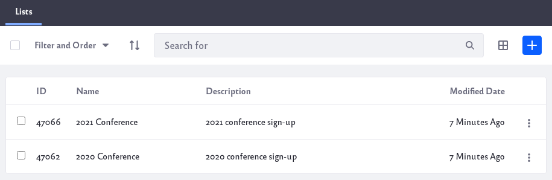

# Getting Started with Dynamic Data Lists

```important::
   Dynamic Data Lists is deprecated as of Liferay DXP 7.3. It is replaced by `App Builder <../../../developing-applications/developing-low-code-applications/app-builder-overview.md>`_ and `Forms Reports <../sharing-forms-and-managing-submissions/form-reports.md>`_.
```

Dynamic data lists display forms created from field sets called data definitions. Data definitions consist of a form’s field types (e.g., text, boolean, date, radio buttons, selector menus, etc.) and those fields’ labels and settings. Data definitions effectively serve as data models for a dynamic data list. For example, you could create a data definition with three fields for conference registration: one for a user’s name, one for their email address, and a dropdown list for t-shirt size. This data definition could then be used for every conference registration form you create.



**Data Definitions:** Define a form’s fields.  

**Dynamic Data Lists:** Display a form based on a data definition.

You can create one or multiple dynamic data lists from a single data definition. The user data entered for each dynamic data list is kept separate, even if the data definition is shared. For instance, you could use the example data definition above to create several dynamic data lists, and then place them anywhere you need to get feedback from users. Because each dynamic data list’s form data is separate, you don’t need to worry about trying to figure out which dynamic data list the user input came from.

Dynamic data lists are flexible. You don’t have to restrict dynamic data lists to simple input. You could create something as complex as an entire data entry system for real estate listings, or any other simple list-based application you can dream up.

You create data definitions and dynamic data lists from the Site Menu’s Content &rarr; Dynamic Data Lists application. Creating data definitions and lists doesn’t require any coding. However, additional formatting can be added with [FreeMarker templates](https://freemarker.apache.org/).

The following articles describe how to create and use data definitions and dynamic data lists:

* [Creating data definitions](./creating-data-definitions.md)
* [Creating dynamic data lists](./creating-data-lists.md)
* [Creating form templates](./creating-form-templates.md)
* [Creating display templates](./creating-display-templates.md)

## System Configuration

There are two settings you can configure in *Control Panel* &rarr; *System Settings* &rarr; *Content and Data* &rarr; *Dynamic Data Lists*: Dynamic Data Lists Service and Dynamic Data Lists.

Under the Dynamic Data Lists Service setting: 

**Add Default Structures:** This is enabled by default and pre-loads several embedded data definitions to base data lists on. Once loaded on portal startup, these definitions must be deleted manually from the Site Menu → Dynamic Data Lists application. This setting applies to the first start of a virtual instance.

Under the Dynamic Data Lists setting:

**Changeable Default Language:** If enabled, the default language of a data definition becomes changeable.

**CSV Export:** Choose whether Dynamic Data List records can be exported in CSV format with or without a warning, or disable this option. Here’s what the warning says:

```warning::
   This CSV file contains user supplied inputs. Opening a CSV file in a spreadsheet program may be dangerous.
```

**Default Display View:** Choose whether to use a table based default view or a list based default view.
