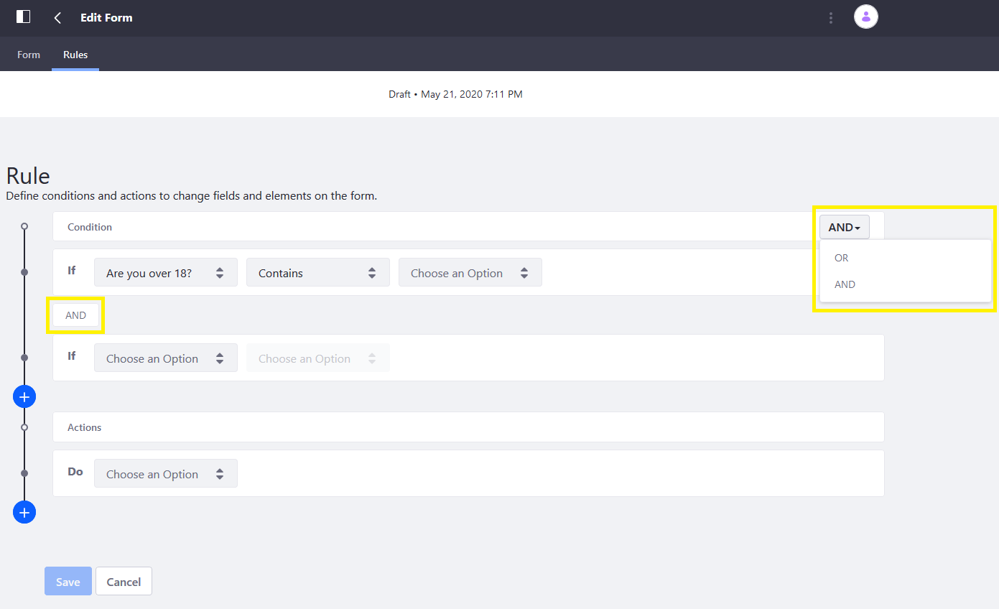

# Form Rules Overview

Forms can be dynamic, where the answer to one question changes the rest of the form. One answer may allow skipping the next three questions, while another requires answering additional questions. Fields like these are called _conditional fields_. Once you have decided which fields are conditional, use a Form Rule to determine what happens based on the answer to that question (for example, skips page 3 and goes to page 4 on a multi-page form).

Each Form Rule contains a Condition and an Action; see [Form Rules Reference](./form-rules-overview.md) to learn more.

[Create a form](../creating-forms.md) that has all the fields first before adding Form Rules. See [Forms Field Types Reference](../forms-field-types-reference.md) for more information about each field type. Once all the fields have been created, add the Form Rules. Here is a list of Form Rules:

* [Show-Hide Rule](#show-hide-rule)
* [Enable-Disable Rule](#enable-disable-rule)
* [Jump-to-Page Rule](#jump-to-page-rule)
* [Autofill Rule](#autofill-rule)
* [Require Rule](#require-rule)
* [Calculate Rule](#calculate-rule)

## Show-Hide Rule

Use the Show-Hide Rule if you want respondents to answer additional questions. For example, a camp registration form asks if the camp participant is over 18 years old. If the answer is _NO_, the form displays an additional field asking for the guardian's name. This field is hidden if the participant answers _YES_.

See [Using the Show-Hide Rule](./form-rules/using-the-show-hide-rule.md) to learn more.

## Enable-Disable Rule

Like the Show-Hide Rule, the Enable/Disable Rule makes a field editable based on one or more conditions. This is useful for entering optional information or gathering data from only those who fall under a particular group. For example, a campsite or a doctor's office might ask people to list medications or allergies that might affect treatment. This field is editable only if the user selects Yes.

See [Using the Enable-Disable Rule](./form-rules/using-the-enable-disable-rule.md) to learn more.

## Jump to Page Rule

Another option is to use the Jump to Page Form Rule. As its name indicates, respondents can jump to a different page in the Form based on their answers. This is useful if some pages do not apply to all the form's users.

See [Using the Jump-to-Page Rule](./form-rules/using-the-jump-to-page-rule.md) to learn more.

## Autofill Rule

The Autofill Rule filters a form field's options based on pre-configured conditions. One common use is populating states and provinces, countries and regions then applying a conditional filter. For example, respondents select their geographic region (Europe, North America, Asia), then select a country (Germany, USA, Malaysia). You should first connect a [data provider](./data-providers-overview.md) before using the _Autofill_ Rule. See [Using Data Providers to Populate Form Options](./using-data-providers-to-populate-form-options.md) to learn more.

## Require Rule

You can use a Require rule to make a field required based on one or more conditions. Require Rules work in association with other Rules, such as the _Show_ Rule. For example, a car rental form has a section where respondents indicate if they are applying a discount to the rental. If the answer is _YES_, the respondents must enter the promo code in order to get the discount.

See [Using the Require Rule](./form-rules/using-the-require-rule.md) to learn more.

## Calculate Rule

Create Calculate Form rules that populate a numeric field by calculating its value based on other fields. For example, a Calculate rule can calculate a camp or conference's total registration costs by multiplying the number of attendees and the registration fee (17 people at $130 each).

```important::
   Calculations are limited to numeric fields.
```

See [Using the Calculate Rule](./form-rules/using-the-calculate-rule.md) to learn more.

## Form Rule Conditions and Actions

Rules have two components:

* **Conditions** determine whether any actions are executed.
* **Actions** determine what happens if the condition is met.

```note::
   Rules are stored in the database in JSON format by default.
```

Users can choose _OR_ or _AND_ to define the relationship between multiple conditions:

* **OR**: The action is triggered if _any_ of the conditions you specify evaluates to _true_.
* **AND**: The action is triggered only if *all* the conditions you specify evaluate to *true*.

    

## Accessing the Rule Builder

1. Navigate to the Form where the Form Rule is to be applied.
1. Click on the _Rules_ tab.

    

1. Click the _Add_ button () to get started.

## Specifying Conditions

When building a rule, you must specify a field (for example, _Are you over 18?_), a condition (_Is equal to_), and the Value (_Yes/ No_) to be compared against. If the condition's _if statement_ is _true_, the action is triggered. If it is _false_, nothing happens.

| Condition | Description |
| --- | --- |
| Is equal to | Checks whether the inputted value is equal to the condition. Example: if a language matches Spanish, then trigger the action.  |
| Is not equal to | Checks whether the inputted value is not equal to the condition. |
| Contains | Checks whether the inputted value contains the value. |
| Does not contain | Checks whether the inputted value does not contain the value. |
| Is empty | Checks whether a field *is* empty. |
| Is not empty | Takes an action as long as a field is *not* empty. |
| User | Checks whether the user belongs to a certain Role. If yes, the action is triggered. |

## Form Rule Actions

The following Actions are available:


| Action | Description |
| --- | --- |
| [Show](./using-the-show-hide-rule.md) | Sets the visibility of a form field based on a predefined condition. |
| **Enable** | Use a predefined condition to enable or disable a field. |
| **Require** | Use a predefined condition to make a field required. |
| [Jump to Page](./using-the-jump-to-page-rule.md) | Based on user input, skip over some form pages directly to a relevant page. _This rule doesn't appear in the rule builder until a second page is added to the form_. |
| **Autofill with Data Provider** | Use a [data provider](../using-data-providers-to-populate-form-options.md) to populate fields when a condition is met in another field. |
| **Calculate** | Populate a field with a calculated value using data entered in other fields. |

## Additional Information

* [Creating Forms](../creating-and-managing-forms/creating-forms.md)
* [Using the Autofill Rule](./using-the-autofill-rule.md)
* [Using the Calculate Rule](./using-the-calculate-rule.md)
* [Data Providers Overview](../data-providers-overview.md)
