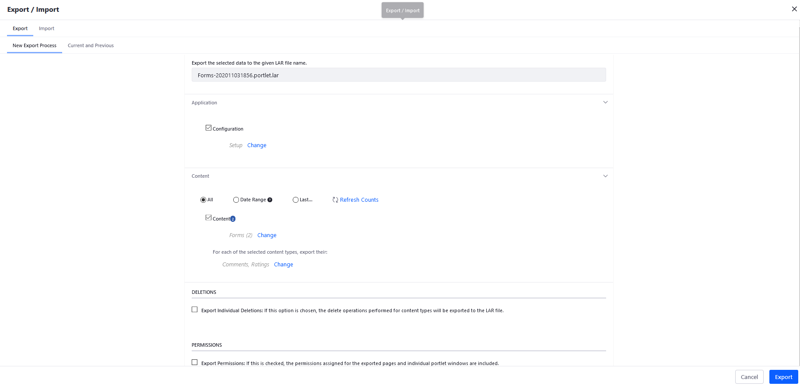

# Exporting and Importing Forms

You can export all your forms as a `LAR` file and then import them into a different site. This way, you can save time and resources by not having to recreate your all your Forms whenever you create a new site.

See [Importing and Exporting Pages and Content](../../../site-building/building-sites/importing-exporting-pages-and-content.md) to learn about the Import/Export process.

## Exporting Forms as a LAR File

To export your forms as a `LAR` file:

1. Navigate to _Site Administration_ &rarr; _Content and Data_  &rarr; _Forms_.
1. Click the  icon in the upper right then _Export / Import_.
1. Enter a different name for the `LAR` file.
1. Select the desired configuration and content:

    * **Configuration**: Checked
    * **Content**: All
    * **Deletions**: Unchecked
    * **Permissions**: Unchecked.

    

1. Click _Export_.
1. Click the `LAR` file to download it to your local machine.

    

1. Choose the desired folder then click _OK_ in the confirmation box.

The Forms `LAR` file has been downloaded. You can import this to another site.

## Importing Forms into a Site

Follow the steps below:

1. Navigate to another site (in the example above, the Forms were created in the DXP Guest Site so use a different site).
1. Navigate to _Site Administration_ &rarr; _Content and Data_  &rarr; _Forms_.
1. Click the  icon in the upper right then _Export / Import_.
1. Click the _Import_ tab.
1. Drag and drop the `LAR` file or click _Select File_ to browse its location.
1. Click _Continue_.
1. Expand the _Update Data_ section.
1. Click _Mirror_ (recommended).

    

1. Click _Import_.
1. Click the _Export / Import_ window.

The Forms from the DXP Guest site are imported into this Site.

## Additional Information

* [Creating Forms](./creating-forms.md)
* [Forms Configuration Reference](./forms-configuration-reference.md)
* [Importing and Exporting Pages and Content](../../../site-building/building-sites/importing-exporting-pages-and-content.md)
