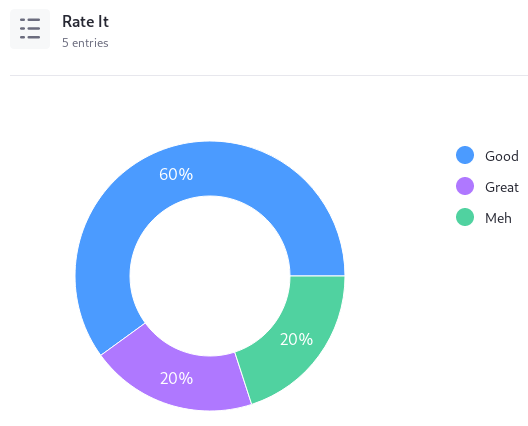
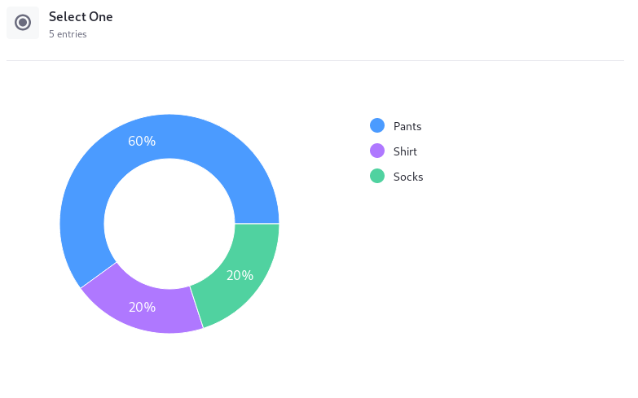
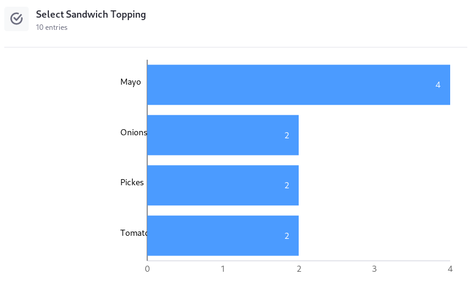

# Form Metrics

> Available: Liferay CE/DXP 7.3

Once users begin submitting form entries, you can access a field-by-field report on the form's records:

1. Navigate to the Forms application. In the Product Menu (), go to _Content & Data_ &rarr; _Forms_.

1. Click the form's _Name_ to open the form builder view.

1. Click the _Entries_ tab.



```tip::
   Form Metrics shows you aggregated form data. To see each form entry individually, see `Managing Form Entries <./managing-form-entries.md#viewing-form-entries>`__.
```

## Form Fields and Chart Types

The data presentation is different depending on the field type:

| Field(s) | Data Display Format | Additional Information |
| -------- | ---------- | ---------------------- |
| Color<br />Date<br />Number<br />Text| Field List | Number fields also include these summary statistics: Average, Maximum Value, Minimum Value, Sum |
| Select from List<br />Single Selection | Pie Chart | None |
| Grid<br />Multiple Selection | Bar Graph | Multiple Selection graphs are horizontal, where Grid graphs are vertical with grouped bars
| Image<br />Paragraph<br />Rich Text<br />Separator<br />Upload | _No Metrics_ | These fields don't have metrics to report |

### Field Lists

The Color, Date, Number, and Text fields accept free-form data entry from the form's users, so data can't really be tabulated for these fields. Instead, they're presented as a simple list of responses. However, since the number field includes validation to 


### Pie Charts

The Select from List and Single Selection fields accept only one entry selected from a list of choices. A pie chart is displayed to show the proportion of users' selections.



### Bar Graphs

The Multiple Selection field accepts multiple entries for one selection request (e.g., _Select the toppings for your sandwich:_). The proportion of selections is displayed in a horizontal bar graph. 



The Grid field accepts a single entry for each of multiple related questions (e.g., _Rate these Sylvester Stallone movies as Good, Bad, or No Opinion:_). The proportion of selections is displayed in a vertical bar graph, with bars grouped by question.


## Related Topics

* [Viewing Form Entries](./managing-form-entries.md#viewing-form-entries)
* [Exporting Form Entries](./managing-form-entries.md#exporting-form-entries)
* [Editing Form Entries](./managing-form-entries.md#editing-form-entries)
