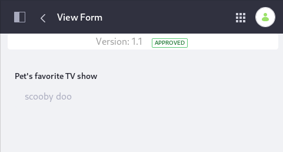

# Managing Form Entries

Once users begin submitting form entries, you can access the form entry data through the UI or export the data to a different file format for further analysis and review.

## Viewing Form Entries

1. Open the _Product Menu_ () then click the compass icon () on the _Site Administration_ menu. Select the site where the form was created.
1. Navigate to _Content & Data_ &rarr; _Forms_.
1. Click the _Actions_ () button for the form and select _View Entries_.

    

1. If the form has multiple fields that do not fit into the window, click the *Actions* () button next to the entry and select *View*.

    

1. The _View Form_ page shows the responses from each form page. Click *Next* to advance.

    

1. Click _Back_ to return to view the _Form Entries_ again.

## Editing Form Entries

> Available: Liferay CE/DXP 7.3

To edit form entries:

1. Open the _Product Menu_ () then click the compass icon () on the _Site Administration_ menu. Select the site where the form was created.
1. Navigate to _Content & Data_ &rarr; _Forms_.
1. Click the _Actions_ () button for the form and select _Edit_.
1. Once you finish editing, click _Submit_.



Users need the following permissions to edit Form Entries: 

- Update permission on the Form Instance
- View permission on the Site and Asset Library Menu
- Access permission on the Forms application in Site and Asset Library Administration


```note::
   The Update permission on the Form Instance is the same permission required to edit the Form itself.
```

The Update Form Instance permission can also be granted on a single form, by navigating to the Forms application, then opening the Actions menu () for a single form. Select _Permissions_. In the Permissions editor for the form, grant the _Update_ permissions to the Role. These Users must still have the _View Site and Asset Library Menu_ and _Forms: Access in Site and Asset Library Administration_.

## Exporting Form Entries

To export the form entries:

1. Navigate to the Forms application in your site's _Content & Data_ section.
1. Click the *Actions* () button next to the form and select *Export*.

    

1. Choose a File Extension. You can export entries in `CSV`, `JSON`, `XLS`, or `XML`.

    

1. Click *OK* then open the file or save it locally.

### Disabling CSV Export

There is a system level setting to determine whether administrators can export entries in CSV format:

1. Navigate to _Control Panel_ &rarr; _Configuration_ &rarr; _System Settings_.
1. Click the _Forms_ category in _Content & Data_.
1. Click the _Forms_ entry under the _SITE SCOPE_ menu.
1. The CSV Export property has three options:

    * **Enabled** to enable CSV Export without a warning
    * **Enabled (Show Warning)** to enable CSV Export with the following warning to administrators:

        `This CSV file contains user supplied inputs. Opening a CSV file in a spreadsheet program may be dangerous.`

    * **Disabled** to turn off CSV Export.

   

1. Select the option to enable or disable the ability to export entries.
1. Click _Save_ when finished.

## Deleting Form Entries

1. Navigate to _Site Adminstration_ &rarr; _Content & Data_ &rarr; _Forms_.
1. Click the _Actions_ () button next to the selected form and select _View Entries_.
1. Select all entries by checking the box next to **Filter and Order**. An _X_ appears in the top right corner of the Form Entries screen.

    

1. Click the _X_ button to delete all the entries.

Alternately, users can delete just one entry; check the box next to the chosen entry and then click the _X_ in the upper right corner. Click _OK_ to confirm the command.

## Related Topics

* [Form Metrics](./form-metrics.md)
