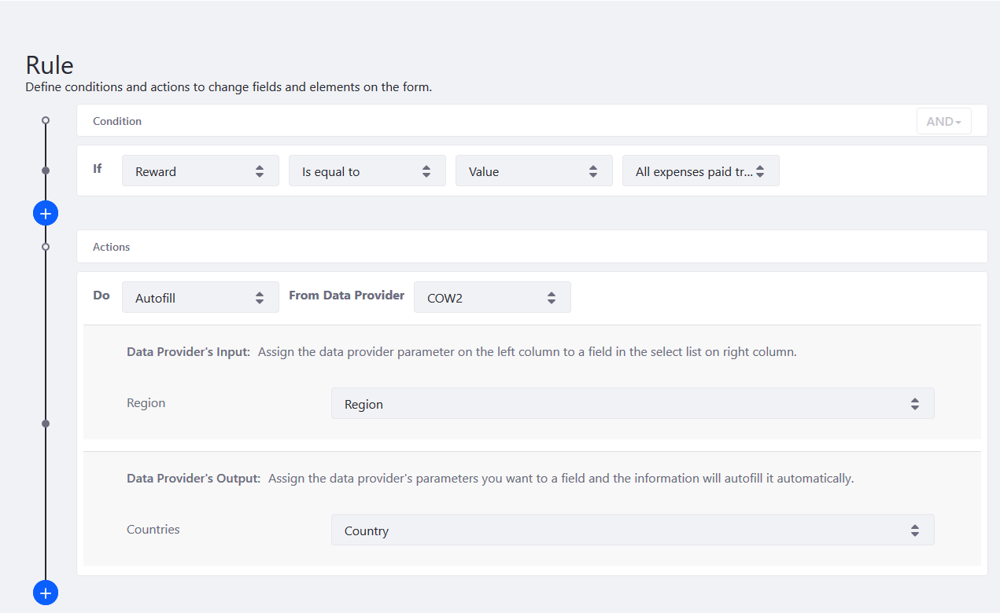

# Using the Autofill Rule

User can use the _Autofill_ Rule which filters a form field's options based on pre-configured conditions. If you already have a [data provider](../data-providers-overview.md) enabled, the _Autofill_ Rule is the next step in enhancing your form. See [Using Data Providers to Populate Form Options]((../using-data-providers-to-populate-form-options.md)) to learn more.

In this tutorial, we have a sample form that asks the respondent to select either a cash reward or a vacation. If the respondent selects the latter, he must then choose the geographical region and then a country. To do so, we are using the Autofill Rule to filter countries based on a geographic region.

Follow the steps below:

1. Configure a [data provider which imports the countries of the world with regional filters.](../using-data-providers-to-populate-form-options.md)
1. [Create a form](../../creating-forms.md) that has the following:

    * A Single Select field called _Rewards_ with two options: "Cash" or "All expenses paid trip"
    * A Text field called _Region_
    * A Select from List field called _Choose a Destination Country_ that uses the [restcountries.eu](https://restcountries.eu) data provider

## Configuring the Autofill Rule

To configure an Autofill rule:

1. Click the _Rules_ tab.
1. Click the Add () button.
1. Select _Reward_ from the If Condition.
1. Create the rule: _Is equal to_ &rarr; _Value_ &rarr; _All expenses paid trip_.
1. Select _Autofill_ from the _Do_ Action dropdown menu.
1. Select the data provider from the _From Data Provider_ dropdown menu.
1. Select _Region_ from the _Region_ dropdown menu.
1. Select _Country_ from the _Country_ dropdown menu.

    

1. Click _Save_ when finished.

## Verifying the Autofill Rule

1. Publish the form.
1. Navigate to the site where the form is displayed.
1. Enter a valid region into the Region field and observe that the options in the Select from List Field are filtered based on the Region. The [restcountries.eu](https://restcountries.eu) service has these regions: Africa, Americas, Asia, Europe, Oceania, and Polar.

    

Users can now search for a region then the countries in the form.

## Additional Information

* [Creating Forms](../../creating-forms.md)
* [Data Providers Overview](../data-providers-overview.md)
* [Using Data Providers to Populate Form Options](../using-data-providers-to-populate-form-options.md)
