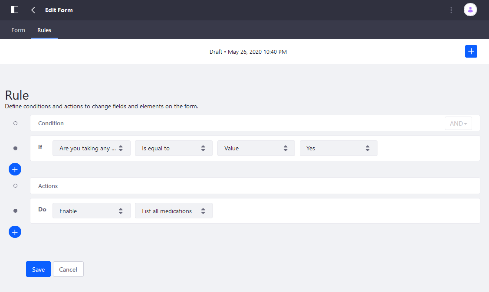
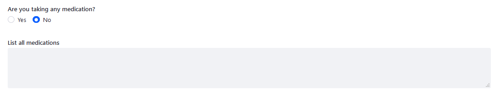
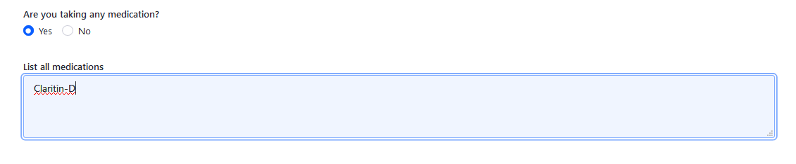

# Using the Enable-Disable Rule

Use an enable/disable rule to make a field editable based on one or more conditions. This is useful for entering optional information or gathering data from only users who fall under a particular group. For example, a campsite or a doctor's office might ask people to list any medications or allergies that might affect treatment. This field is editable only if the user selects Yes.

Continuing this example, assume there is a registration form that includes the following fields:

* _Are you taking any medications?_: a required single selection field with two options: _Yes_ and _No_.
* _List all medications_: a text field element.

Configure the Enable/Disable Rule:

1. Click the _Rules_ tab.
1. Click the Add () button.
1. Select _Are you taking any medications?_ from the Condition dropdown menu.
1. Create the condition: _Is equal to_ &rarr; _Value_ &rarr; _Yes_.
1. Select _Enable_ under the Actions dropdown menu.
1. Select _List all medications_.

    

1. Click _Save_ when finished.

The Enable Rule has been created and users can edit the field only if they have selected Yes. Otherwise, the field is grayed out.

If the respondents has answered YES, then they are able to edit the field.

## Additional Information

* [Creating Forms](../../creating-forms.md)
* [Form Rules Overview](./form-rules-overview.md)
* [Using the Require Rule](./using-the-require-rule.md)
* [Using the Enable Rule](./using-the-enable-disable-rule.md)
* [Using the Jump to Page Rule](./using-the-jump-to-page-rule.md)
* [Using the Autofill Rule](./using-the-autofill-rule.md)
* [Using the Calculate Rule](./using-the-calculate-rule.md)