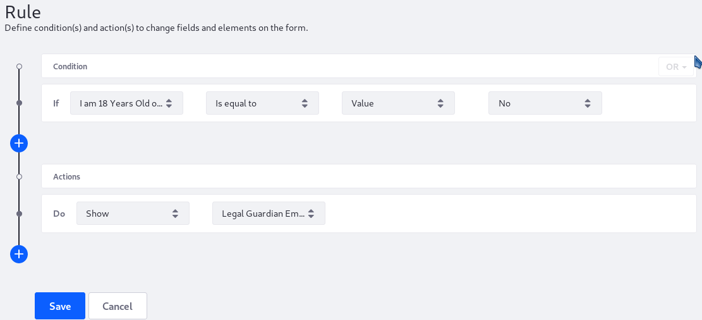

# Using the Show-Hide Rule

Users can use a _Show_ action to determine whether to show a field if the condition is met. Otherwise, this field is hidden.

In this example, there is [a camp registration form](../../creating-forms.md) that has two text fields:

* _I am 18 Years Old or Older_: a required single selection field with two options: _Yes_ and _No_.
* _Legal Guardian Email Address_: a text field that accepts valid email addresses.

## Configuring the Show Action Rule

To configure a Show-Hide action rule:

1. Click the _Rules_ tab.
1. Click the Add () button.
1. Select _I am 18 Years Old or Older_ from the _If_ dropdown menu.
1. Select _Is equal to_ from the next dropdown menu.
1. Select _Value_ from the third dropdown menu.
1. Select _No_ from the final dropdown menu.

    

1. In the _Actions_ section, select _Show_ from the dropdown menu.
1. Select _Legal Guardian Email Address_ from the second Options dropdown menu.
1. Click _Save_ when finished.

     

Now the *Legal Guardian Email Address* field is only displayed in the form if the user selects *No* in the *I am 18 years old or older* field.

## Additional Information

* [Creating Forms](../../creating-forms.md)
* [Form Rules Overview](./form-rules-overview.md)
* [Using the Require Rule](./using-the-require-rule.md)
* [Using the Enable Rule](./using-the-enable-disable-rule.md)
* [Using the Jump to Page Rule](./using-the-jump-to-page-rule.md)
* [Using the Autofill Rule](./using-the-autofill-rule.md)
* [Using the Calculate Rule](./using-the-calculate-rule.md)
