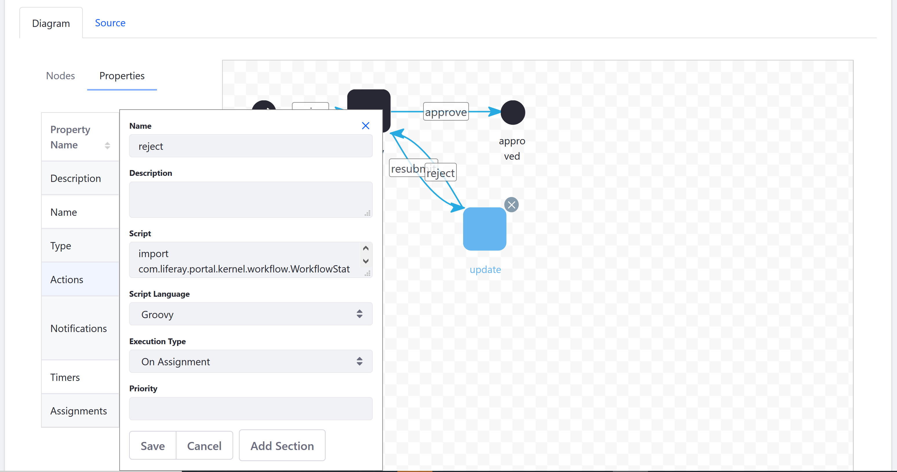

# Configuring Workflow Actions and Notifications

> Subscribers

Using the workflow designer, users can configure Workflow Actions and notifications for each node.

Actions are very adaptable and you can specify when the Action occurs: before entering the node, after exiting a node, or once a task node is assigned. For example, when a reviewer rejects an Web Content article, a Workflow Action sets the asset's status as _Pending_ and automatically reassigns the article to the original author.


Workflow Notifications are sent to tell task assignees that the workflow needs attention or to update asset creators on the status of the process. They can be sent for tasks or any other type of node in the workflow.


However, not every node requires a Workflow Action or a notification. Generally, Start and End nodes do not have actions or notifications, unless you want to notify the original author that the review process has begun or ended.

In the Single Approver definition, the two [Task nodes (Review and Update)](./creating-workflow-tasks.md) have Actions and Notifications.

## Adding Actions

Add a Reject _Action_ to the _Update_ Task node if the submission needs more work. The Reject Action contains a Groovy script which, when executed, sets the asset's status as _denied_ then _pending_.

Follow the steps below:

1. Go to the _Global menu_ &rarr; _Applications_ &rarr; _Process Builder_.
1. Click the _Workflows_ tab.
1. Click on the Workflow definition (for example, _Single Approver_).
1. Click the _Update_ node.

    

1. Double click _Actions_ to define an action.
1. Enter _reject_ in the Name field.
1. Select _Groovy_ from the _Script Language_ dropdown menu.
1. Select _On Assignment_ from the _Execution Type_ dropdown menu.
1. Enter the script in the _Script_ field. The Single Approver workflow contains an Update task with an action written in Groovy that sets the status of the asset as _denied_, then sets it to _pending_.

    ```java
    import com.liferay.portal.kernel.workflow.WorkflowStatusManagerUtil;
    import com.liferay.portal.kernel.workflow.WorkflowConstants;

    WorkflowStatusManagerUtil.updateStatus(WorkflowConstants.getLabelStatus("denied"), workflowContext);
    WorkflowStatusManagerUtil.updateStatus(WorkflowConstants.getLabelStatus("pending"), workflowContext);
    ```

    

1. Click _Save_ when finished.

Once you have configured the _Update_ node, add a notification that informs the asset creator that the submission has been rejected at this time and needs more work.

## Adding Notifications

Add notifications to the _Update_ Task node which informs the asset creator that the submission needs more work and has been reassigned back to him.

Follow the steps below:

1. Double click on _Notifications_ in the _Update_ node's Properties tab.

 

1. Enter the following:
    * **Name:** Creator Modification Notification
    * **Description**: Enter a description for this notification

1. Select _Freemarker_ from the _Template Language_ dropdown menu.
1. Enter a message in the _Template_ field:
    * `Your submission was rejected by ${userName}, please modify and resubmit.`

1. Select the Notification Type; this field is multiple-select so you can multiple users:

    * Email
    * User Notification

1. Select _On Assignment_ from the _Execution Type_ dropdown menu. The Notification is sent when someone is assigned to this task.
1. Select a recipient type (_Asset Creator_).

     

1. Click _Save_ when finished.

Notifications on the Update node have been added.

## Additional Information

* [Creating Workflow Tasks](./creating-workflow-tasks.md)
* [Using Forks and Joins](./using-forks-and-joins.md)
* [Using Condition Nodes](./using-condition-nodes.md)
* [Workflow Nodes](./assigning-task-nodes.md)
