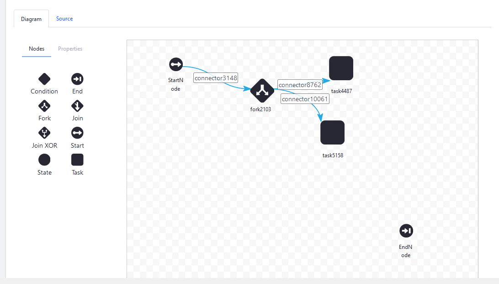

# Using Forks and Joins

> Subscribers

Here you'll learn how to use the _Fork_, _Join_ and _Join XOR_ nodes. These nodes are useful for workflow processes that have multiple reviewers like the [Legal-Marketing Definition](./workflow-designer-overview/resources/legal-marketing-definition.xml) sample.

You can split the review task so that two reviews can happen at the same time. In the Legal-Marketing example workflow, the process is linear: the workflow goes from Marketing to Legal before publication, but you can use _Fork_ and _Join_ (or Join XOR) to build a concurrent workflow process.

## Using the Fork and Join Nodes

1. Go to the _Global Menu_ &rarr; _Applications_ &rarr; _Process Builder_.
1. Click the _Workflows_ tab.
1. Click the () to add a new workflow.
1. In the workflow designer Canvas, delete the old connector between the _Start_ node and _End_ node.
1. Drag and drop the _Fork_ node onto the canvas then connect _Start_ node to the _Fork_ node. You can rename the nodes and connectors later.
1. Drag and drop two _Task_ nodes. Connect the _Fork_ node to the two _Task_ nodes.

    

1. Drag and drop the _Join_ node. Connect the two _Task Nodes_ to the _Join_ Node.
1. Connect the _Join_ node to the _End_ Node.
1. Rename the nodes and connectors and add any [Actions or Notifications](./configuring-workflow-actions-and-notifications.md).

    

1. Click _Publish_ when finished.

### Using the Join XOR Node

With a regular Join node, for the workflow to proceed beyond the join, the transition from both parallel executions must be invoked. However, if you use a Join XOR node instead, the workflow proceeds as long as the transition from one of the parallel executions is invoked.

## Additional Information

* [Activating Workflow](../../using-workflows/activating-workflow.md)
* [Workflow Nodes](./workflow-nodes.md)
* [Creating Workflow Tasks](./creating-workflow-tasks.md)
* [Using Condition Nodes](./using-condition-nodes.md)
* [Configuring Workflow Actions and Notifications](./configuring-workflow-actions-and-notifications.md)
