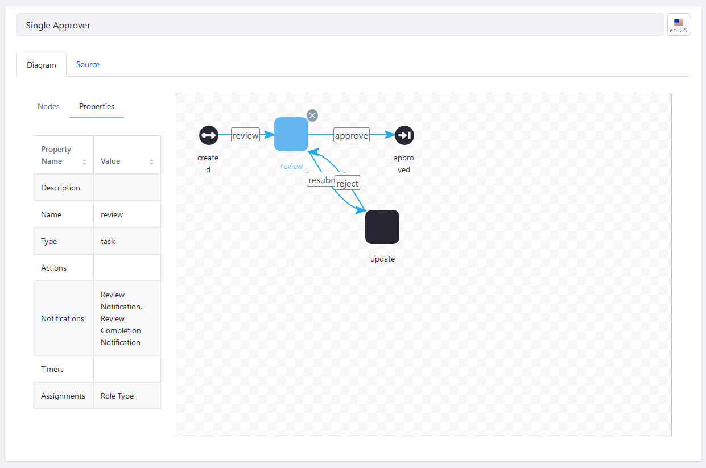
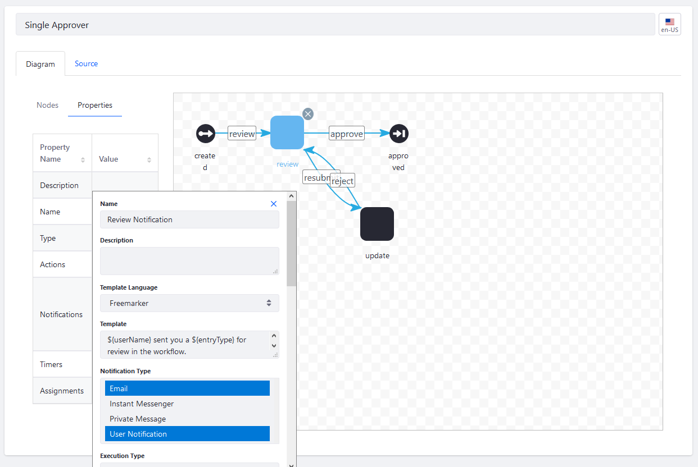

# Creating Workflow Tasks

> Subscribers

You'll use the default [Single Approver Definition](../workflow-designer-overview/workflow-processes/single-approver-definition.xml) to illustrate creating workflow tasks. It has two task nodes: _Review_ and _Update_. The _Review_ node describes the review step, where a content creator has submitted an asset for review. In response to the review, the asset can be accepted or rejected. If it's rejected, the process moves to the _Update_ task. This task gives the submitter the opportunity to modify the asset and resubmit it for review.

Task nodes are often the most complex parts of a workflow definition. They can have Assignments which can assign the task to users or a Resource Action (see [Workflow Designer Node Reference](./workflow-designer-node-reference.md)).

Furthermore, task nodes also contain Notifications and Actions (defined in scripts). See [Configuring Workflow Actions and Notifications](./configuring-workflow-actions-and-notifications.md).

Once the review is finished, _Task_ nodes advance to the next node. In this case, the process moves to the _Approved_ End node.

You're ready to begin creating the Single Approver workflow:

1. Go to the _Global Menu_ &rarr; _Applications_ &rarr; _Process Builder_.
1. Click the _Workflows_ tab.
1. Click the () to add a new workflow.
1. Give your workflow a descriptive name, like _My Single Approver_.
1. In the Workflow Designer Canvas, delete the old connector between the _Start_ node and _End_ node: select it with your mouse and hit the Del key on your keyboard.
1. Drag and drop the _Task_ node onto the canvas. Connect _Start_ node to the _Task_ node by making sure no nodes are selected and then moving your pointer to the edge of the start node. When the cursor changes shape, you can click and drag a connector from the Start node to the Task node.
1. Select the connector and rename it _review_.
1. Click the _Task_ node to begin updating its properties.
1. Double click the _Name_ field to give the node a name: _review_.
1. Double click _Notifications_.
1. Enter this information:

    * **Name**: Review Notification
    * **Template Language**: Freemarker
    * **Template**: Enter this Freemarker notification: `${userName} sent you a ${entryType} for review in the workflow.`
    * **Notification Type**: Use the Ctrl key to select _Email_ and _User Notification_; this is a multiple select field so you can choose more than one.
    * **Execution Type**: On Assignment
    * **Recipient Type**: Task Assignees

    

    Click _Add Section_.

    Enter this information:

   * **Name:** Review Completion Notification
   * **Template Language:** Freemarker
   * **Template:** Enter this Freemarker notification: `Your submission was reviewed<#if taskComments?has_content> and the reviewer applied the following ${taskComments}</#if>.`
   * **Notification Type:** Email
   * **Execution Type:** On Exit
   * **Recipient Type:** User

1. Click _Save_ when finished.
1. Double click _Assignments_. You can assign the review task to a Role, Role Type, a specific User, or a Resource Action. In this example, assign the review Task to a Role Type. Select these Roles, clicking _Add Section_ each time you must add a new Role:

   * Asset Library Administrator
   * Asset Library Content Reviewer
   * Asset Library Owner
   * Organization Administrator
   * Organization Content Reviewer
   * Organization Owner
   * Administrator
   * Portal Content Reviewer
   * Site Administrator
   * Site Content Reviewer
   * Site Owner

   For more information about Roles and Permissions, see [Understanding Roles and Permissions](../../../../users-and-permissions/roles-and-permissions/understanding-roles-and-permissions.md) and [Assigning Users to Roles](../../../../users-and-permissions/roles-and-permissions/assigning-users-to-roles.md).

   

1. Click _Save_ when finished.

1. Click the End node and rename it to _Approved_.

1. Connect the _Review_ node to the _Approved_ End node. Name the connector _approve_.

This _Task_ node is now configured; it sends a notification that a submission is ready for review to those Users assigned to a specific Role.

<!-- Justin, as you can see I've expanded the instructions above so that they are creating the Single Approver workflow, which is what I'd asked you to do. Please continue from what I've started above until the Single Approver workflow is re-created in the designer. You can use the XML file as a guide to show what to do in the designer. After this should be one or more reference documents (I'll leave the organization up to you) explaining how to use the other nodes in the designer. -Rich -->

You can also assign the _Task_ node to a Resource Action instead of another user or a Role Type. To learn more see [Workflow Task Node Reference](./workflow-task-node-reference.md).

Create additional nodes such as an _Update_ node. You can also connect the _Task_ node to other nodes such as [Forks and Joins](./using-forks-and-joins.md) or [Conditions](./using-the-condition-node.md) nodes.

## Additional Information

* [Activating Workflow](../activating-workflow.md)
* [Configuring Workflow Actions and Notifications](./configuring-workflow-actions-and-notifications.md)
* [Workflow Designer Nodes Reference](./workflow-designer-nodes-reference.md)
* [Workflow Task Node Reference](./workflow-task-node-reference.md)
