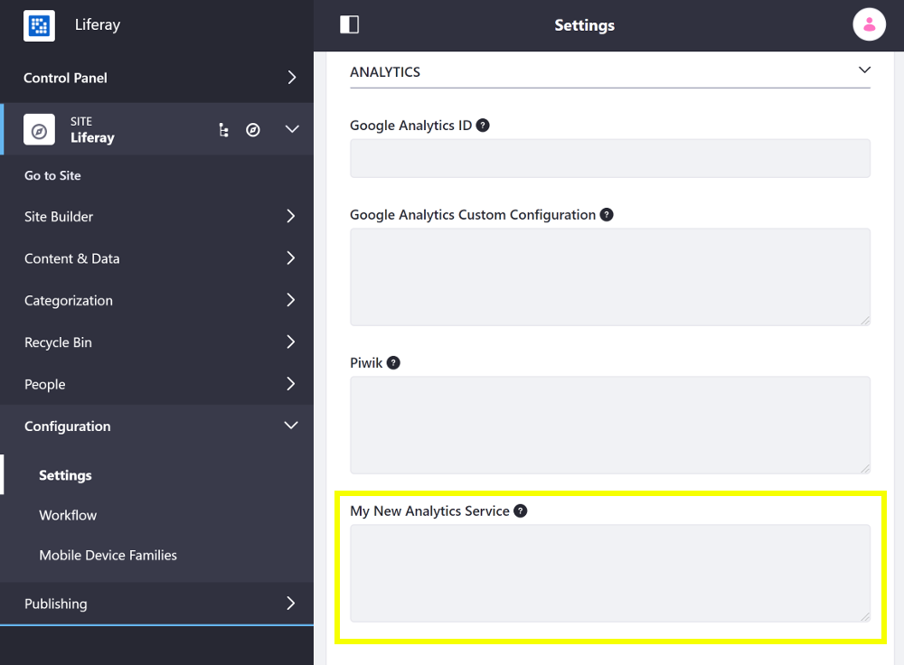

# Adding a New Analytics Service

Liferay Portal includes built-in support for Google Analytics and Piwik for analyzing traffic on your Site. If you require a different analytics service, you can add it for your Site. Follow these steps:

1. Open the Product Menu and go to *Control Panel* &rarr; *Configuration* &rarr; *Instance Settings*.
1. Select *Analytics* under the Platform heading.
1. Enter the name of any additional service you want to add in the *Analytics* field provided.

1. Once you have entered the name, open the Product Menu and go to the *Configuration* &rarr; *Site Settings* &rarr; *Advanced* &rarr; *Analytics* page for the Site where you wish to add analytics.
1. Copy the JavaScript tracking code provided by your analytics platform into the corresponding field for your service.

Now all pages on the selected Site contain the tracking script and send analytics data to your analytics platform.