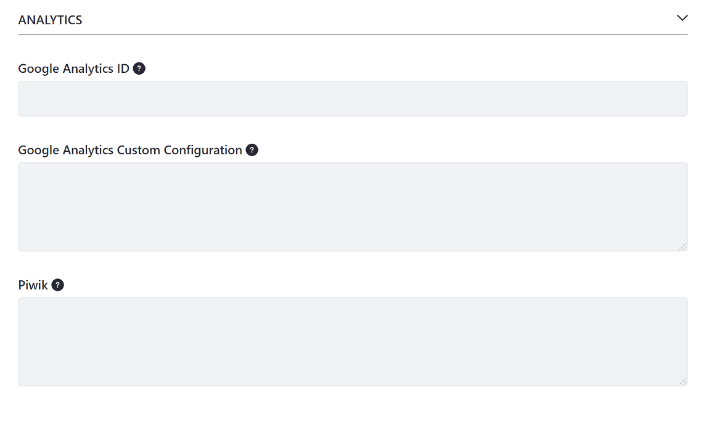

# Advanced Site Settings

Advanced Settings relate to security (like User Roles) or require external configuration (like creating a Google Analytics account) to use.

## Default User Associations

**Site Roles:** Specifies the Site Roles that newly assigned Site members have by default

**Teams:** Specifies the Teams to assign newly assigned Site members to by default.

 See [Roles and Permissions](TODO) and [Creating Teams for Advanced Site Membership Management](TODO) for more information.

## Analytics

**Google Analytics ID:** Specifies the Google Analytics ID

**Google Analytics Custom Configuration:** Sets the custom options for Google Analytics

**Piwik:** Specifies the tracking code for Piwik Analytics

If you require a different analytics service, you can add it. See [Adding a New Analytics Service](./adding-a-new-analytics-service.md) for more information.

## Maps

The *Maps* option configures the maps API provider used by your Liferay Portal instance when displaying geolocalized assets. Geolocalized assets can be displayed for documents, web content articles, DDL records, etc. See [Geolocating Assets](TODO) for more information.

## Recycle Bin

The *Recycle Bin* panel provides options for enabling/disabling the Recycle Bin and specifying how long to retain assets in the Recycle Bin before deleting them.

**Enable Recycle Bin:** Whether to enable the Recycle Bin for the Site

**Trash Entries Max Age:** Specifies the age (in minutes) to store assets in the Recycle Bin before permanently deleting them

See [Restoring Deleted Assets](TODO) for more information on the Recycle Bin.

## Content Sharing

**Allow subsites to display content from this site:** Specifies whether sub-sites can display content from this Site. Administrators of this Site's sub-Sites can use all structures, templates, categories, widget templates, and more from this parent Site. Even if you initially allowed content sharing between the parent Site and its sub-sites, you can disable this option and immediately revoke content sharing from all sub-Sites.

You can also manage content sharing at the global level. See [Managing Content Sharing Globally](./managing-content-sharing-globally.md) for more information.
