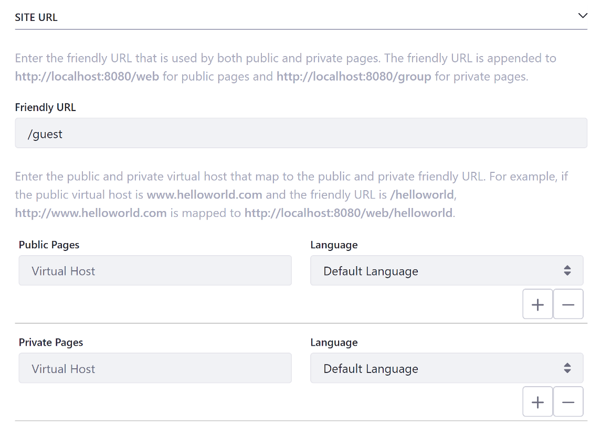

# Configuring General Site Settings

General settings range from core configuration, like your Site's Membership Type, to finer details like Documents and Media indexing options. 

## Details

**Name:** The Site's name. You can translate the name into multiple languages. See [Modifying Localizable Site Fields](./modifying-localizable-site-fields.md) for more information.

**Description:** Describes the Site's intended function. The description can also be translated into other languages. See [Modifying Localizable Site Fields](./modifying-localizable-site-fields.md) for more information.

**Active:** Whether a Site is active or inactive. Inactive Sites are inaccessible but can be activated later if needed.

**Membership Type:** Specifies how restrictive a Site is. Sites can have one of three membership types:

  * **Open:** Users can join and leave whenever they want. It appears in the My Sites app.

  * **Restricted:** Users must request membership to join.

  * **Private:** A Site Administrator must explicitly invite a User to join and then add them manually to the Site. Private membership Sites don't appear in the My Sites app.

**Allow Manual Membership Management:** Whether Users can be added and removed manually from the Site. By default, manual Site membership management is enabled. This lets Users join the Site or request membership to the Site if it's restricted using the My Sites app. If your Site's membership is handled automatically be a membership policy, you can disable this setting. See [Managing Membership Policies for Sites](TODO) for more information.

```note::
  Site memberships can be handled automatically by a membership policy. The membership policy can check various pieces of information from each User, such as their first names, last names, birthdays, job titles, Organizations, and User Groups. Using this information, the Site membership policy can automatically assign members to the Site. If your Site implements a membership policy, you can disable the *Allow Manual Membership Management* option; when the option is disabled, the *Members* section of Site Administration (Site Memberships and Site Teams) is hidden, even from Administrators.
```

**Parent Site:** lets you select a parent Site for the Site that's being created. Organizing Sites hierarchically like this provides many benefits. See [Site Hierarchies](../../01-building-sites/site-hierarchies.md) for more information.

**Limit membership to members of the parent site**: This option only appears for Child Sites. If enabled, Users can only be members of the Site if they're members of the parent Site.

## Pages

Under Pages you can view your Site's Public or Private Pages, if any exist. If they don't exist, a *Site Templates* selector appears for creating pages with a Site Template.


## Categorization

*Categorization* helps Administrators organize the Site and makes it easier for Users to find your Site and its content through search and navigation. For more information on using tags and categories, see [Organizing Content with Tags and Categories](TODO).

## Site URL

**Friendly URL:** Specifies your Site's URL paths (i.e. `/my-site`). Friendly URLs are used for both Public and Private Pages. The public Site base URL is `https://localhost:8080/web`, and the private one is `https://localhost:8080/group`. This helps Users quickly access their Site without having to recall an extended URL. Each friendly URL must be unique. The URL path is appended to the `https://localhost:8080/` URL (i.e. `https://localhost:8080/web/my-site/`). If you add a friendly URL for your Site's home page, you should update the Home URL field as well. See [Updating Your Instance's Home URL](./updating-your-instances-home-url.md).

**Public/Private Pages:** Specifies the virtual host to map the Public and Private Pages of the Site to. See [Configuring Virtual Hosts Site URLs](./configuring-virtual-hosts-site-urls.md) for more information.



## Documents and Media

**Enable Directory Indexing:** Whether Site Administrators can browse your Site's Documents and Media files and folders. For example, a Site Administrator of a Site called *My Site* can browse documents at `http://localhost:8080/documents/my-site` if this option is enabled.

## Site Template

If you created your Site using a Site Template, this section appears and displays information about the link between the Site Template and the Site. Specifically, you can see which Site Template was used and whether or not it allows modifications to the pages inherited from it by Site Administrators. To learn more about Site Templates and how to create your own, see [Building Sites from Templates](../../building-sites/building-sites-with-site-templates.md).

## Open Graph

```note::
  Available in Liferay DXP 7.3+
```

The Open Graph section provides configuration settings for the [Open Graph protocol](https://ogp.me/) for your Site.

**Enable Open Graph:** Whether to embed Open Graph meta tags on every page to share content on applications supporting Open Graph, such as Facebook, Twitter, Slack, etc.

**Open Graph Image:** The default image to use for Open Graph tags. You can override the default image set here by setting a different image for the individual page's configuration.

## Asset Auto Tagging

**Enable Auto Tagging of Assets on This Site:** Whether to use Asset Auto Tagging rules on your Site. See [Asset Auto Tagging](TODO) for more information.

## Sharing

**Enabled:** Whether to enable person to person document sharing for a Site. The default value is Yes. This can be configured at the instance level (instance settings) and globally (System Settings)

## Custom Fields

*Custom Fields* only appears if you've created them in Control Panel &rarr; *Configuration* &rarr; *Custom Fields*. For more information on Custom Fields, see [Custom Fields](TODO).