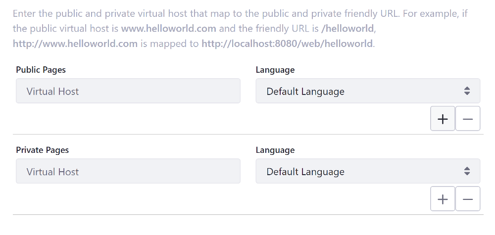

# Configuring Virtual Hosts Site URLs

A virtual host connects a domain name to a Site. You can use this to define a domain name (i.e., `www.my-site.com`) for your Site. This can be a full domain or a subdomain. You can use this to host a number of websites as separate Sites on one Liferay Portal server. 


Follow these steps to configure virtual hosts Site URLs:

1. With your provider, set the DNS name to point to your Liferay Portal instance's IP address (e.g. `developers.my-site.com`).
1. Inside Liferay Portal, open the Product Menu and go to *Configuration* &rarr; *Site Settings* under the Site Menu.
1. Under the General tab, expand the Site URL panel.
1. In the Public Pages or Private Pages inputs for the Developers Site, set the URL to point to the domain ( e.g. `http://developers.my-site.com`).

## Configuring Multiple Virtual Hosts

```note::
  Available since Liferay DXP 7.3 SP2+
```
You can have multiple virtual hosts for websites that have multiple domains. After following the steps in the previous section, continue with these steps:

1. Click the `+` button next to the Public Pages and/or Private Pages URL input to add a new URL for that page set.

  

1. Enter the domain URL for each page set, and specify the default locale for each. For instance, if you have a domain for each translation of a Site (e.g. `unchien.ca` and `adog.ca`), you can add a virtual host for the public and private pages of each domain and specify the default locale for each. 

  

Locales are constrained to the Site's available languages, if defined. If a locale isn't specified, the default locale for the Site is used. Sites respond on all associated domains.

```important::
  Domains can only be applied to a single Site. You can't map a single domain to multiple Sites.
```