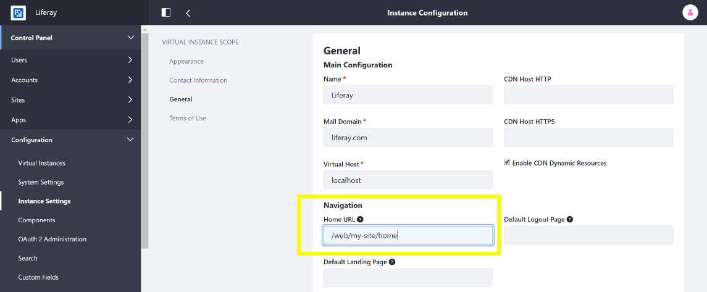

# Updating Your Instance's Home URL

Note that if you [add a friendly URL for your instance's home page](./configuring-site-settings.md#site-url), you should update your instance's Home URL field so that page requests to `http://localhost:8080` redirect properly:

1. Open the Product Menu and go to *Control Panel* &rarr; *Configuration* &rarr; *Instance Settings*.
1. Select *Instance Configuration* under the Platform heading and click the *General* link.
1. Under *Navigation*, in the Home URL field, enter your new friendly home URL. For example, setting the friendly URL of your default Site to `/my-site` makes your Site's public home page's URL `https://localhost:8080/web/my-site/home`. So, you would enter `/web/my-site/home`.

Once you've entered this setting, page requests to `localhost:8080` redirect to the friendly URL of your Liferay Portal instance's new home page.