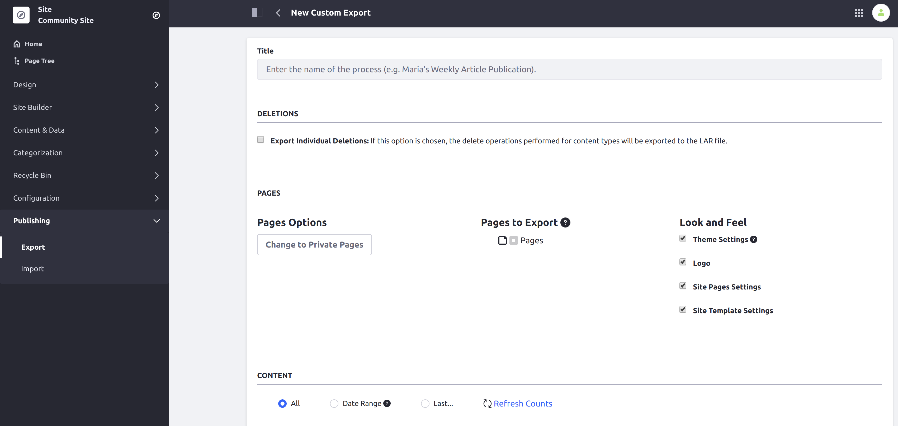
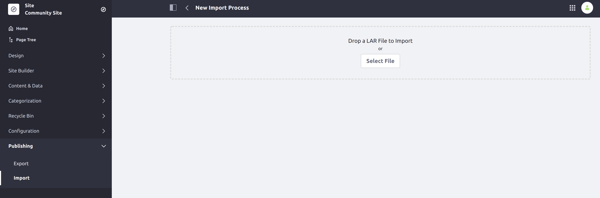

# Sharing Site Templates

To export a Site that uses Site Templates or Page Templates to a different Liferay DXP installation (through a LAR file or remote publication), the Site Templates must be exported and imported manually first, before the Site.

To export a Site using a Site Template, follow these steps:

1. Open the [Global Menu](../../getting-started/navigating-dxp.md) (  ) and go to *Control Panel* &rarr; *Site Templates*.

1. Open the *Actions* Menu () for the Site Template you want to export and select *Manage*.

1. While managing the Site Template, go to the Site Menu and navigate to *Publishing* &rarr; *Export*.

1. Click the *Add* icon () to create a new custom export.

    

1. Select the content and pages you want to export and click *Export*.

1. Click on the *Download* icon for the template that you exported.

1. In your target environment (Liferay Portal instance), open the Global Menu (  ) and go to *Control Panel* &rarr; *Site Templates*.

1. Create a new Site Template.

1. Open the *Actions* Menu () for the Site Template and select *Manage*.

1. While managing the Page Template, go to the Site Menu and navigate to *Publishing* &rarr; *Import*.

1. Import the Site Template LAR you downloaded.

The Site Template can be used normally in the new environment. For more information on exporting/importing content, see [Importing/Exporting Pages and Content](./importing-exporting-pages-and-content.md).

