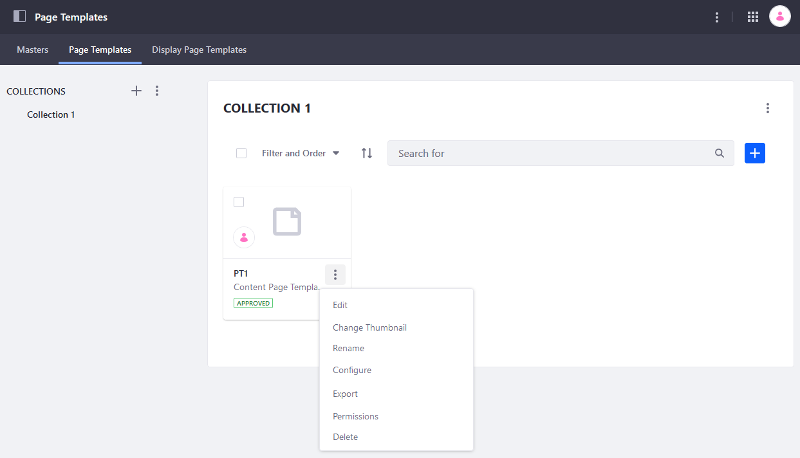
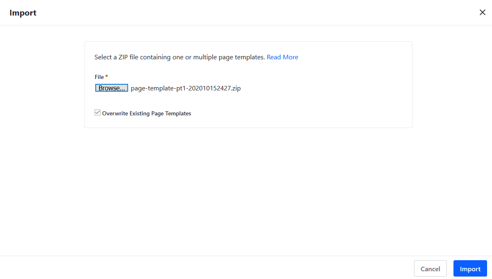

# Exporting and Importing Page Templates

Once you have [created a Page Template](./creating-a-page-template.md), you can [export](../../building-sites/importing-exporting-pages-and-content.md) it, continue to edit the content on your local machine, and then import the template back into Liferay DXP. When you import the page template, you can import the template back into the original site or into another DXP site. This saves time so you do not have to recreate the same content.

```tip::
   Page Templates are part of the larger Collections framework. For more information, see `About Collections and Collection Pages <../../../content-authoring-and-management/collections-and-collection-pages/about-collections-and-collection-pages.md>`_.
```

For more general information about the Export/Import Framework, see [Importing/ Exporting Sites and Content](../../building-sites/importing-exporting-pages-and-content.md).

To export a Page Template:

1. Navigate to the site where the _Page Template_ has been created.
1. Click the Product Menu () icon to open the _Control Panel_.
1. Click _Design_ &rarr; _Page Templates_.
1. Click the _Page Templates_ tab.
1. Click the _Collections_ where the page template resides (for example, _Collection 1_).
1. Click the Options () icon next to the desired Page Template.
1. Click _Export_.

    

1. Click _OK_ in the confirmation window.

The Page Template has been downloaded as a ZIP file in the designated Downloads folder on your local machine.

```tip::
   You can export more than one Content Template at once. However, you cannot include Widget Templates with Content Pages in the same ZIP file.
```

## Importing a Page Template

To import a Page Template:

1. Navigate to the site where the _Page Template_ is to be imported.
1. Click the Product Menu () icon to open the _Control Panel_.
1. Click _Design_ &rarr; _Page Templates_.
1. Click the Options () icon at the top right then _Import_.

    

1. Click _Browse_ and navigate to where the exported Page Template file is located.
1. Click _Open_ in the browser window.
1. Click _Import_.

    

1. Close the _Import_ window.

The Page Template has been imported.

## Additional Information

* [Creating a Page Template](./creating-a-page-template.md)
* [Importing/ Exporting Sites and Content](../../building-sites/importing-exporting-pages-and-content.md)
* [Creating Collections](../../../content-authoring-and-management/collections-and-collection-pages/creating-collections.md)
