# Building Content Pages

```note::
   This information applies to Liferay DXP 7.3+. For previous Liferay DXP versions, see .
```

Once you've [added a Content Page](../adding-pages/adding-a-page-to-a-site.md), you may begin building your page by adding and configuring the various [Content Page elements](./content-pages-overview.md).

1. Open the Product Menu and, under the Site Menu, go to *Site Builder* &rarr; *Pages* to open the Site Builder.
1. Click the Add Page button () at the level where you want to add the new page, and select *Add Page*.

    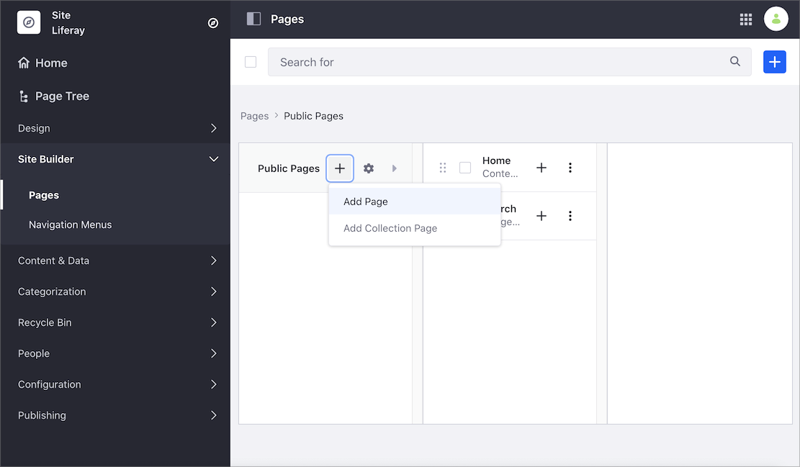

1. Select the *Blank* template or one of the exiting templates.
1. In the *Add Page* dialog, type your page's *Name*.
1. Alternatively, click the Actions Menu () of an existing Content Page and select *Edit*.

    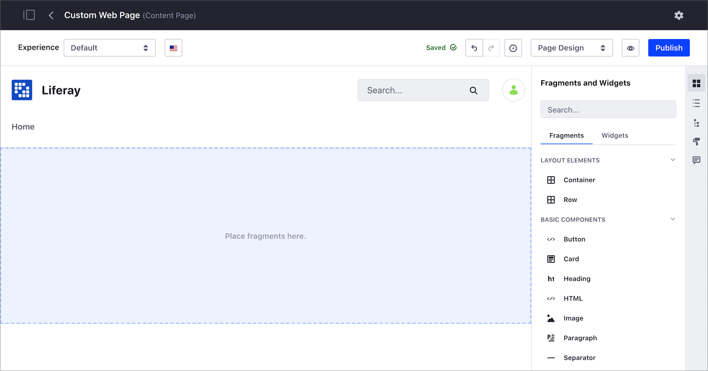

    When you enter the Site Builder view, you can add or edit your content using two different editing modes:
    
    - *Page Design*: Using this mode, you can edit the page design and content. This option is only available for users with the permissions to update the page and the page content.
    - *Content Edition*: Using this mode, you can only edit the content. This options is available for users with permission to update the page, but not the page content.
    
    The editing options available in the Content Page sidebar depend on the editing mode you choose.
    
    

1. From the Content Page sidebar, select the *Fragments and Widgets* button () and start adding the Fragments and Widgets for your content.

    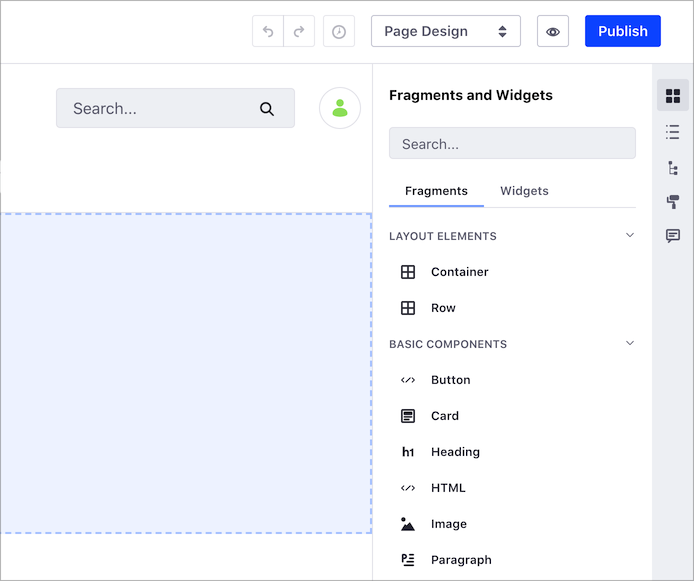

    ```note::
       New Content Pages start empty and in a *Draft* status. The page is not visible until it is published.
    ```

1. Configure the look and content preferences of the Fragments and Widgets using the following configuration options:

    * [Setting the Layout Style](#setting-the-layout-style)
    * [Editing Text Inline](#editing-text-inline)
    * [Editing Hyperlinks](#editing-hyperlinks)
    * [Editing Images](#editing-images)
    * [Configuring the Grid Layout](#configuring-the-grid-layout)
    * [Copying a Fragment](#copying-a-fragment)
    * [Saving a Fragment Composition](#saving-a-fragment-composition)
    * [Mapping Content](#mapping-content)

    

    ```tip::
       In progress work on a Content Page is automatically saved.
    ```

1. You can revert any action using the *Undo* () or *Redo* () buttons, or you can return to a previous version of your edits using the *History* () button.

    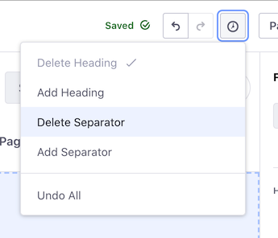

1. To preview your Content Page, click the *Preview* button ().
1. Click the *Publish* button in the top right to make the updates available to the live page.

## Configuring Elements on a Content Page

Many elements that can be added to a content page can be configured and customized. When you click on an element, the Content Page sidebar shows the available configuration options for the element.

### Setting the Layout Style

You can set different style options for your Content Page layout, like background color, background image, margins, opacity, etc.

1. Click the layout element you want to change.
1. In the Content Page sidebar, under the *Styles* tab, configure the style options for your content:

    * Content Display and Container Width
    * Margin
    * Padding
    * Background and Border color
    * Effects

      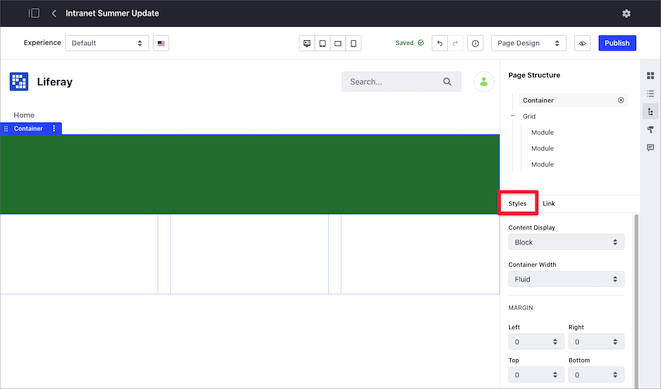

```note::
   The available color palette can be configured by the Fragment developer. See [Fragment Configuration Types Reference](../../../site-building/developer-guide/reference/fragments/fragment-configuration-types-reference.md) for more information.
```

### Editing Text Inline

1. Double-click the page element containing your text to enter into the edit text mode.
1. Select the text that you want to edit.
1. Use the inline text editor to update the text styles, typographical emphasis, alignment, and other text formatting options.

    

### Editing Hyperlinks

1. Click on the link, button, or image that you want to edit.
1. On the Content Page sidebar, under the *Link* tab, choose the options for your link:

    * *Link:* defines a manual link or maps it to an existing content field
    * *URL:* set the link's URL
    * *Target:* set the link's behavior

        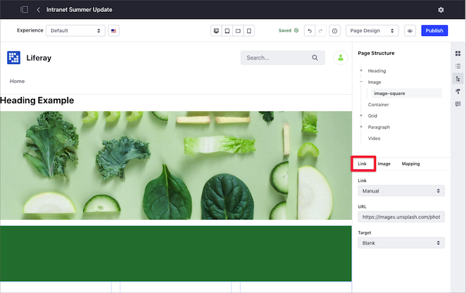

    When you choose the *From Content Field* option for your link, you can configure the following options:

    * *Content:* set the content type
    * *Field:* set the field to display for the selected content. Some of the available content fields are:

        * Categories
        * Tags
        * Display Page URL
        * Description
        * Publish Date
        * Summary
        * Title
        * Last Editor Name
        * Author Name
        * Basic Web Content

    * *Target*: set where to open the linked content.

### Editing Images

1. Click on the image you want to edit.
1. In the Content Page sidebar, you can configure the image using three different options:

    * *Link*: enter the URL for your image.
    * *Image*: select an image from your computer or from the Documents and Media library.
    * *Mapping*: select an image by [mapping content](#mapping-content).

    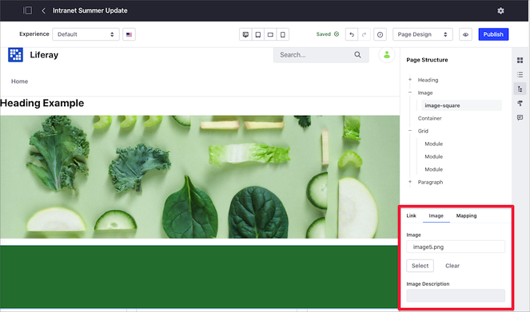

You can also specify a background image for a layout by [setting the layout style](#setting-the-layout-style) or provide a link for your image by [editing hyperlinks](#editing-hyperlinks).

### Configuring the Grid Layout

1. Click the Grid element you want to configure.
1. In the Content Page sidebar, under the *Styles* tab, select the style options for your content.
1. Under the *Configuration* tab, select the *Number of Modules* (from 1 to 6) to specify the number of columns for the grid.
1. Click *Show Gutter* to show the spacing between modules.

You can adjust the columns width to create a more custom layout:

1. Click on the Row to select it. A blue dot appears between each of the columns, indicating that they can be resized.
1. Click one of the blue dots and drag to the left or right to adjust the size of the column.

    

### Copying a Fragment

You can duplicate a Fragment (Component, Section, Row, etc.) to save time:

1. Click the Fragment you want to copy.
1. Click the Options Menu () for the container and select *Duplicate*.

    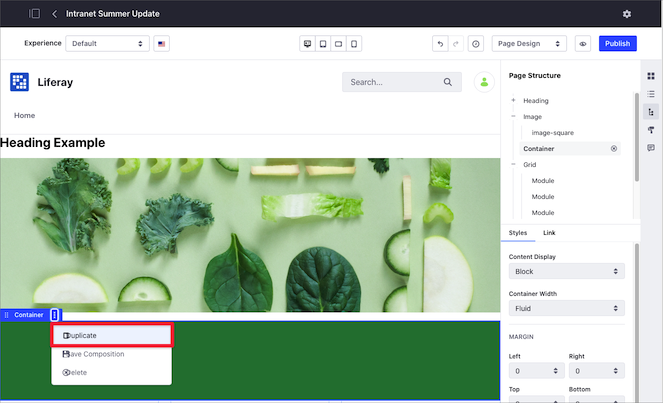

```note::
  When you ducplicate a Fragment, you also ducplicate the mappings and customizations.
```

```warning::
  Layouts (Sections or Rows) containing instanceable Widgets cannot be duplicated. In this case, a message will appear, indicating the Widget preventing the duplication.
```

### Saving a Fragment Composition

You can save customized Fragment compositions (Section or Row layout Fragments) as new Fragments, so you can reuse them in your other Fragment-based pages:

1. Click the Row or Section composition you want to save.
1. Click the Options Menu () for the container and select *Save Composition*.

      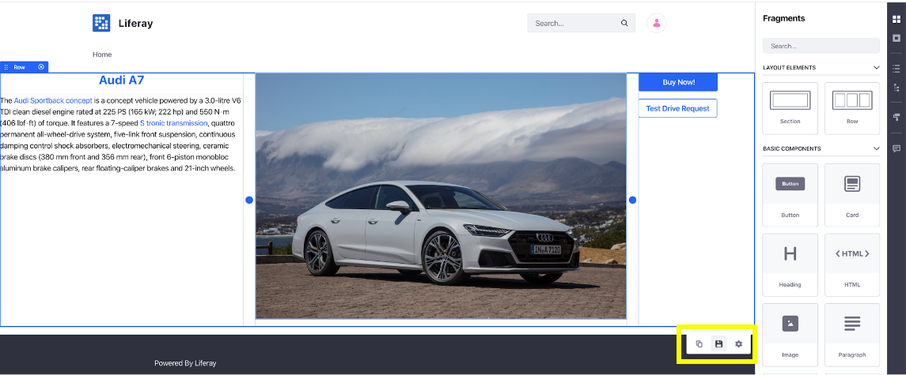

1. In the Save as Fragment dialog that appears, provide a name and other optional information:

    * Fragment *Description* and *Thumbnail*.
    * *Save Inline Content* option, for including inline content such as fragment entries (links, images, text, etc.)
    * *Save Mapping Configuration* option, for including [mapped content](#mapping-content).
    * *Collection* to save the Fragment.

      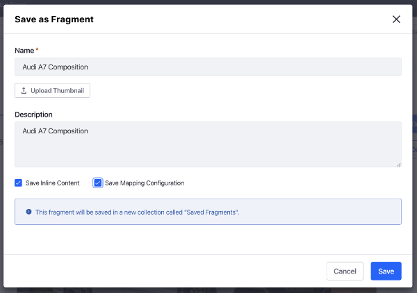

```note::
   If no Site-specific Fragment Collection exists, the saved Fragment composition is automatically saved to a new Fragment Collection called Saved Fragments.
```

You can use the saved Fragment composition immediately using the Fragments sidebar or through the Page Fragments administrative application.

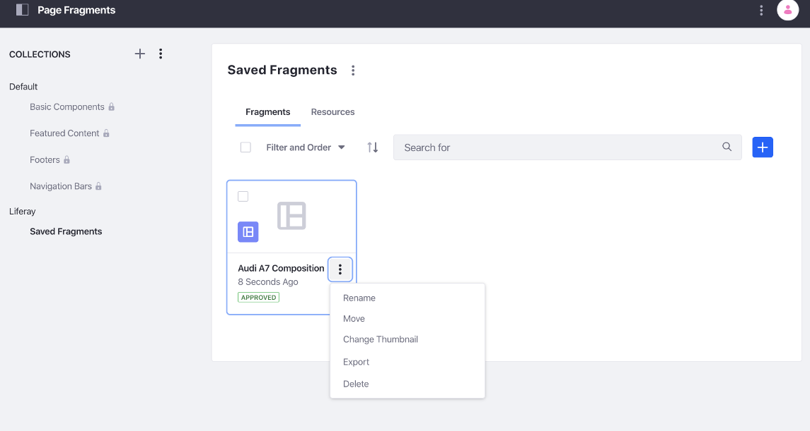

Compositions can be exported or imported between sites just as any other Fragment.

```note::
  The latest version of the `Liferay Fragments Toolkit <../../developer-guide/developing-page-fragments/using-the-fragments-editor.md>`_ supports creation, export/import, and preview of Fragment compositions.
```

### Mapping Content

You can also map these elements to existing content. You can set the *Content* for the element (web content article, document, or blog) and choose its applicable *Field* to display (e.g., title, author name, tags, etc.).

To map your elements to existing content:

1. Click the Grid element you want to map.
1. In the Content Page sidebar, under the *Mapping* tab, click the *Add* button ().
1. Select the content you want to map to your Content Page element.
1. Select the *Field* of your content that you want to map.

    

<!-- 
####################################################
Content from Liferay Help Center follows
####################################################
-->

## Liferay DXP 7.1 and 7.2

<!-- This content belongs to the "Content Page Elements" article in Liferay Help Center. -->

Content Pages, like Widget Pages, are built by dragging and dropping elements
onto the page and then configuring the way those elements appear. There are
three kinds of elements: 

**Sections** are fragments that define a space to place other elements.
A section fills the entire width of the page. Sections can be thought of as
*complete* Fragments that serve a purpose by themselves. A large banner image
with a text overlay is an example of something you might build as a section.


**Layouts** are special Sections that define spaces where you can add fragments
or widgets. Each layout you add fills the width of the page. You can add any
number of layouts to the page.

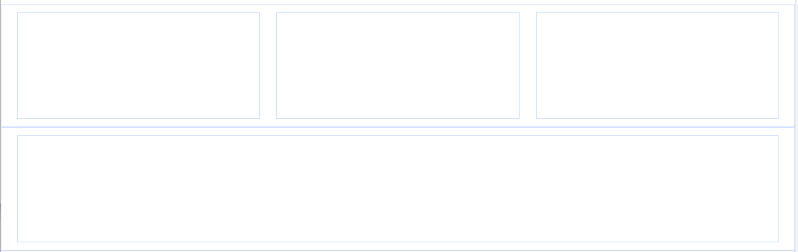

**Components** are small design elements or pieces that add functionality to the
page. A component might be an image with formatting or a block of text with
styling pre-applied. Components must be added to the page inside a Layout. If
you add a component outside an existing Layout, a one column layout is
automatically added to contain the Component. While Sections should be complete
by themselves, Components work together to build pages piece by piece.

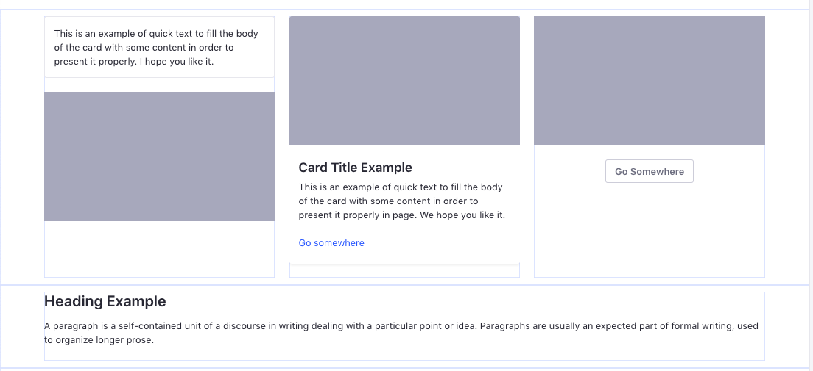

Liferay DXP ships with a plethora of Layouts, Sections, and Components to use to
build pages, and a
[web developer can create their own Fragments](https://help.liferay.com/hc/en-us/articles/360032884532-Creating-Page-Fragments) to add to these. 

## Editable Elements

Fragments can have editable elements. After a Fragment has been added to a page,
you can click on an editable area to provide your own text, image, or links in
place of the default defined in the Fragment.

You can also map these elements to content. You can set the *Content* for the
element (web content article, document, or blog) and choose its applicable
*Field* to display (e.g., title, author name, tags, etc.). You can configure
this by selecting the element's *Map* button
().

```note::
   Many mapping improvements were released in Liferay DXP 7.2 SP1+ and Liferay Portal 7.2 GA2+. For example, mapping editables to text/URL fields of existing content and mapping Fragment background images to image fields of existing content. You can also map [custom fields](https://help.liferay.com/hc/en-us/articles/360028818872-Custom-Fields). To ensure you leverage the latest editable element mapping features, upgrade to these versions.
```

For more information on developing these elements, see 
[Fragment Specific Tags](https://help.liferay.com/hc/en-us/articles/360029147771-Fragment-Specific-Tags).

Now you'll learn about each editable type.

### Editable Text

Editable text can be plain or rich text. Plain text has no special styling. Rich
text enables text styles, typographical emphasis, alignment, and list
formatting.

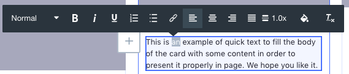

### Editable Images

Editable image elements allow replacing the image URL or an image from your
Documents and Media library. You can provide a link target for the image.

To edit an image from the Content Page editor,

1.  Click on the image you want to replace.

2.  Click .


From here, you can click *Select* to upload an image from Docs and Media or
define an image URL. Click *Clear* to reset the image. You can also specify an
image description.

You can also specify a background image for a layout from Section Builder. Click
the Layout, select *Layout Background Image*, and define the image to display.

```note::
   Mapping a Layout background image is available in Liferay DXP 7.2 SP1+ and Liferay Portal 7.2 GA2+.
```

For more information on developing editable images, see 
[Making Images Editable](https://help.liferay.com/hc/en-us/articles/360029147771-Fragment-Specific-Tags#making-images-editable).

You can also define a link for your image. You'll learn about this next.

### Editable Links

Editable links can be associated with entities that redirect you to a content
type or Page (e.g., buttons).

To edit a link from the content page editor,

1.  Click on the link or button that you want to edit.

2.  Click on  to edit the link text.

3.  Click on  to edit the link properties.

4.  Click on  to edit the link mapping
    (described earlier).

From the Link Properties popup, you can define the following link options:

*Manual:* defines a manual link or map it to an existing content field.

- *URL:* sets the link's URL.
- *Target:* set the link's behavior.

*From Content Field:* 

- *Content:* sets the content type.
- *Field:* sets the field to display for the selected content.

Some of the content fields include

- Categories
- Tags
- Display Page URL
- Description
- Publish Date
- Summary
- Title
- Last Editor Name
- Author Name
- Basic Web Content

For more information on developing editable links, see 
[Creating Editable Links](https://help.liferay.com/hc/en-us/articles/360029147771-Fragment-Specific-Tags#creating-editable-links).

Next you'll learn about the Content Page Editing Interface.

## Related Information

* [Developing a Page Fragment](../../developer-guide/developing-page-fragments/developing-fragments-intro.md)
* [Using Master Pages](../defining-headers-and-footers/master-page-templates.md)
* [Changing Content Pages Look and Feel](./content-pages-overview.md#look-and-feel)
* [Content Page Personalization guide](../../personalizing-site-experience/personalizing-site-experience.md)
