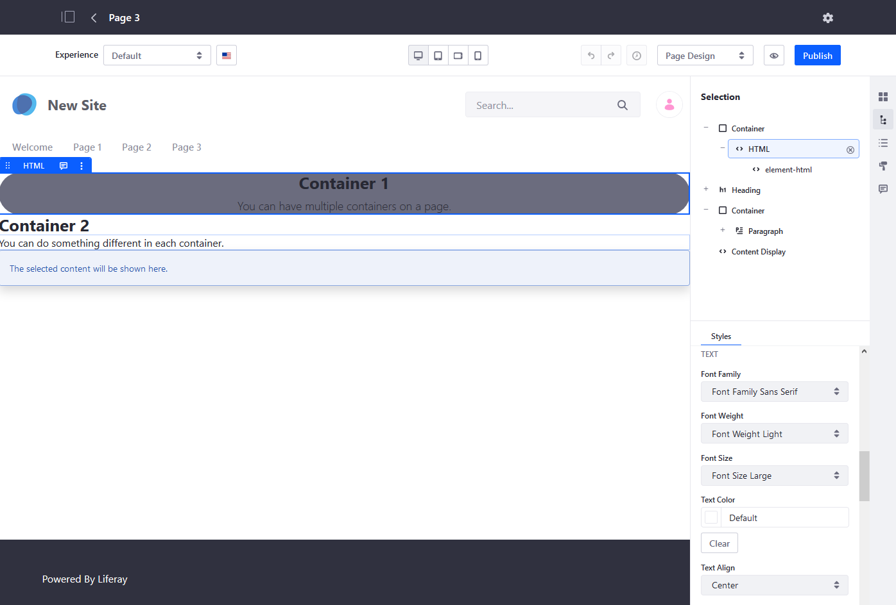

# Configuring Fragment Styles

Adding Fragment Styles often enhances the look and feel of each Page Fragment. You can add borders, change the font, the background color, or upload a background image. See the [Fragment Styles Reference](./fragment-styles-reference.md) for a complete list of all available styles. Many of the styles have definitions and tokens found in the Style Book; see [Creating a Style Book](../../site-appearance/creating-a-style-book.md) for more information.

```tip::
   Many of the styles correspond to CSS classes. If you know CSS, many of the fields will be familiar.
```

To configure a _Fragment_'s style:

1. Navigate to the site where the content is published.
1. Click _Edit_ on the Content page that supports fragments.
1. Select the desired fragment (for example, a _Container Fragment_ or _HTML_).
1. Click the _Selection_ () icon.
1. Click the _Styles_ tab.
1. Configure the fragment's styles as desired.

    

1. Click _Publish_ when finished.

The Fragment has been configured.

## Additional Information

* [Content Pages Overview](./content-pages-overview.md)
* [Using Fragments](./using-fragments.md)
* [Fragment Styles Reference](./fragment-styles-reference.md)
* [Creating a Style Book](../../site-appearance/creating-a-style-book.md)
* [Style Book Tokens](../../site-appearance/developer-guide/style-book-token-definitions.md)
