# Content Pages Overview

```note::
   This information applies to Liferay DXP 7.3+. For previous Liferay DXP versions, see .
```

The default type of page used in Liferay DXP is a Content Page. The Content Page editing UI provides access to many different drag-and-drop elements (Fragments and Widgets) that are available for immediate use with minimal configuration. Continue reading to get an overview of the Content Pages UI. See [Building Content Pages](./building-content-pages.md) to jump directly in to building a Content Page.

The editing options available in the Content Page sidebar depend on the editing mode you choose. For more information, see [Building Content Pages](./building-content-pages.md).

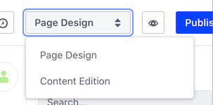

In the *Page Design* mode, the Content Page sidebar contains these elements for editing and collaborating on your Content Page:

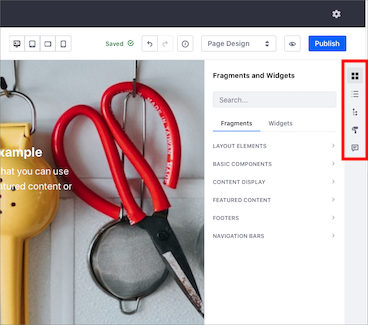

|  |  |
| --- | --- |
|  | [Fragments and Widgets](#fragments-and-widgets) |
|  | [Contents](#contents) |
|  | [Page Structure](#page-structure) |
|  | [Page Design Options](##page-design-options) |
|  | [Comments](#comments) |

## Fragments and Widgets

Fragments and Widgets are two different groups of elements that you can drag-and-drop to build your content.

- [Fragments](#fragments)

    Fragments can have editable elements, such as [text](./building-content-pages.md#editing-text), [images](./building-content-pages.md#editing-an-image), or [links](./building-content-pages.md#editing-a-hyperlink), that you can replace with custom content. You can also [map these elements](./building-content-pages.md#mapping-content) to content that is already available on the site itself. For more information on developing these elements, see [Fragment Specific Tags](../../developer-guide/developing-page-fragments/fragment-specific-tags-reference.md).

    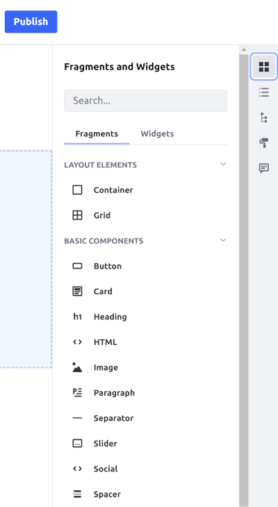

- [Widgets](#widgets)

    Widgets are applications and tools available out-of-the-box that you can add to the page.

    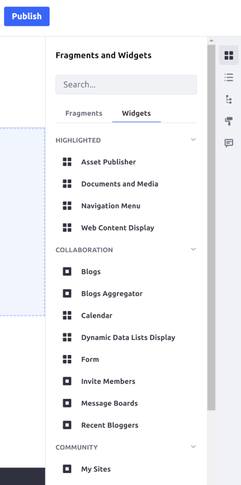

### Fragments

You can find the following Fragments under the Content Page sidebar:

- [Layout Elements](#layout-elements)
- [Basic Components](#basic-components)
- [Content Display](#content-display)
- [Featured Content](#featured-content)
- [Footers](#footers)
- [Navigation Bars](#navigation-bars)

#### Layout Elements

The Layout Elements section contains two Fragments:

- *Container*: A Fragment that can contain Rows. Each Section you add fills the width of the page. A Section can contain multiple Rows stacked.
- *Grid*: A Fragment containing a set of columns that you can add Fragments or Widgets to. A Row can be nested inside another Row to create more complex layouts. You can [adjust the spacing](./building-content-pages.md#configuring-a-row-s-columns) of a Row's columns to create new designs.

    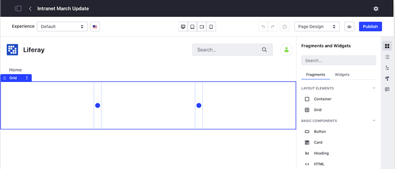

#### Basic Components

Basic Components are small design elements or pieces that add functionality to the page. A Component might be an image with formatting or a block of text with styling pre-applied. Components work together to build pages piece by piece.

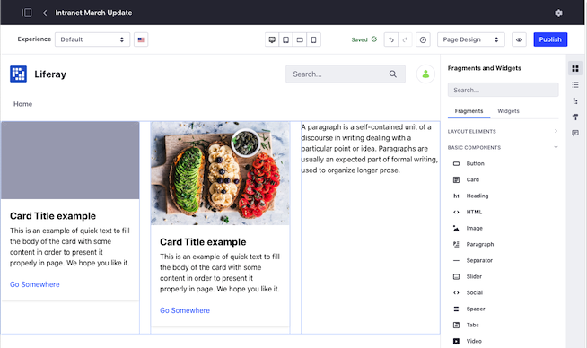

#### Content Display

You can display a single existing web content, blog entry, or document by adding a Content Fragment from the *Content Display* panel. See [Using the Content Display Fragment](./using-fragments.md#using-the-content-fragment) for more information.

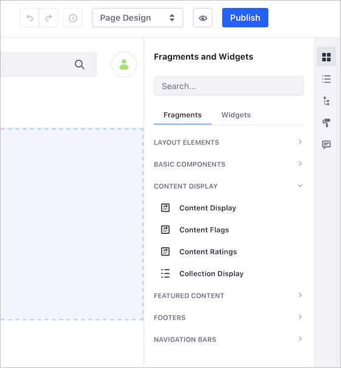

#### Featured Content

The *Featured Content* panel contains complete Fragments (composed of multiple components) that can be immediately used and customized as soon as they are added to a page. A large banner image with a text overlay and customizable CTA (Call to Action) is an example of a Fragment that is ready for immediate use.

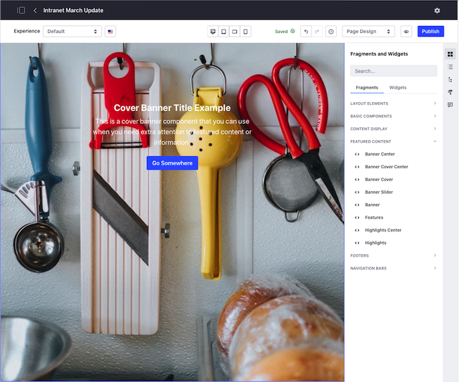

#### Footers

The *Footers* panel includes Fragments that you can add as the Footer of the page. See [Master Pages](../defining-headers-and-footers/master-page-templates.md) for their use.

#### Navigation Bars

The *Navigation Bars* panel includes Fragments that you can add as the Header of the page. See [Master Pages](../defining-headers-and-footers/master-page-templates.md) for their use.

### Widgets

See [Using Widgets on Content Pages](./using-widgets-on-a-content-page.md) for more information on how to use Widgets for your Content Page.

   ```note::
   While portlets are rendered according to `render-weight <https://docs.liferay.com/ce/portal/7.3-latest/definitions/liferay-portlet-app_7_3_0.dtd.html#render-weight>`_ on Widget Pages, that is not true for Content Pages. Portlets are rendered in the order they appear on the page on Content Pages (i.e. left to right, top to bottom).
```

## Contents

The *Contents* panel provides a list of the web content that's used on the page. This includes content displayed in a widget and content mapped to content fields. Click the *Contents* button () to open the *Contents* panel. From this panel, you can perform a variety of actions to edit and manage web content. See [Managing Web Content on Content Pages](./managing-web-content-on-content-pages.md) for more information.

## Page Structure

*Page Structure* provides a hierarchical view of the Fragments and their contents on the page. Click on a field in the page structure to highlight it on the page. Headers and Footers appear in the hierarchy as well for custom [Master Page Templates](../defining-headers-and-footers/master-page-templates.md), but they're disabled because they can only be modified from the Master Page Template.

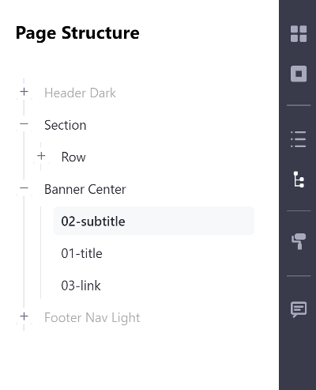

## Page Design Options

Click the *Look and Feel* icon () to change the theme or manage other options for the page. These options are further explored in [Configuring Individual Pages](../page-settings/configuring-individual-pages.md#look-and-feel).

## Comments

You can comment on a Page Fragment to discuss changes and collaborate. Comments are disabled by default, but Administrators can enable them. See [Using Fragment Comments](./using-fragment-comments.md) for more information.

<!-- 
####################################################
Content from Liferay Help Center follows
####################################################
-->

## Liferay DXP 7.1 and 7.2

<!-- This content belongs to the "Content Page Management Interface" article in Liferay Help Center. -->

Unlike Widget Pages, Content Pages can only be edited through the *Site 
Builder* and cannot be edited live on the page. Any edits that you make to a 
page are saved as a draft until you publish the page. Subsequent changes 
after the initial publication are again saved as a draft, without affecting the 
live page, until the page is published again. To create a Content Page,

1.  Go to *Site Management* &rarr; *Site Builder* &rarr; *Pages*.

2.  Click .

3.  On the next page, select *Content Page* and provide a name for the page.

    You will be brought to the Content Page management interface.
 
    

To edit an existing Content Page,

1.  Go to *Site Administration* &rarr; *Site Builder* &rarr; *Pages*.

2.  Click *Actions* ()
    &rarr; *Edit* next to the Content Page you want to edit.

You can also get to this page by selecting the *Edit* button
() from the Control Menu if
you're viewing the published Content Page.

On this page you can view a preview of your page, add Fragments and Widgets, 
and manage the configuration for the page or any Fragments and Widgets 
currently residing on the page.

Your tools for building the page are all found on the right side of the page. 
From top to bottom, the options are

- [Sections](#sections)
- [Section Builder](#section-builder)
- [Widgets](#widgets)
- [Page Structure](#page-structure)
- [Look and Feel](#look-and-feel)

### Sections

When you open *Sections* you see a list of Collections available. Initially, 
you only have the **Basic Sections** Collection which is included with the 
product. You can open the Collection and drag Sections directly onto the page.


Once a section is added to a page, you can edit its background color,
background image, and spacing. Since these options are available to marketers
and administrators editing a page, the options are limited, and the color
palette can be set by the Fragment developer.

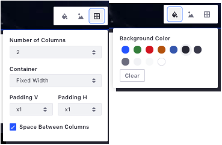

### Section Builder

In Section Builder, you start with *Layouts* and *Basic Components*. Add 
Layouts to the page to provide a space where you can add Components.


### Widgets

The Widgets section functions just like the *Add* menu on a Widget Page. The 
full list of available widgets is displayed, and you can add them to the page.

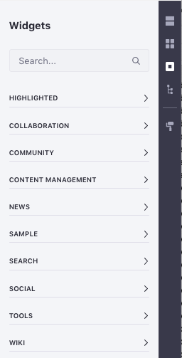

The main difference is that only the main configuration options for widgets on 
Content Pages. Various other configurations like *Look and Feel* are only 
available for widgets on Widget Pages.

### Page Structure

Page Structure provides a high level view of every Fragment and every field
within each Fragment on the page.


Clicking on a field in Page Structure will  highlight it on the page. On large
complicated page, this helps you keep on top  of where everything is and also
access items that might be hard to click on  directly.

### Look and Feel

Click the *Look and Feel* icon 
() 
to change the theme or manage other options for the page. These options are 
fully documented in 
[Creating Pages](/docs/7-2/user/-/knowledge_base/u/creating-pages). 

### Comments

You can also comment on any page fragments. This allows discussion and 
collaboration for teams creating content pages. 

Comments are disabled by default, but administrators can enable them from 
*Control Panel* &rarr; *Configuration* &rarr; *System Settings* &rarr; *Pages* 
&rarr; *Content Page Editor*. Select the *Comments Enabled* checkbox and click 
*Update*. This enables content page comments for all instances. To control this 
on an instance-by-instance basis, navigate to the same setting in 
*Instance Settings* (instead of System Settings). 


If comments are enabled, you can access them via the *Comments* icon 
(). 
The comments appear for the selected fragment. You can take the following 
actions in the comments UI for a fragment:

-   Add new comments and reply to any existing ones. 
-   Resolve comments by clicking the checkbox for each. Resolving a comment 
    hides it from view, unless *Show Resolved Comments* is selected. 
-   Edit and delete your own comments via the Actions button 
    () 
    for each. 

If you de-select a fragment or enter the comments UI without a fragment selected, 
a list of the fragments on the page appears with the number of comments for 
each. Selecting a fragment then shows its comments. 

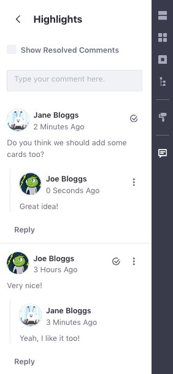

### The Title Bar

The title bar provides navigation back to the Main Menu, a link to page
configuration, and the ability to search for other pages. The title bar is
covered in more detail in 
[Creating Pages](/docs/7-2/user/-/knowledge_base/u/creating-pages). 


Great! Now you know how to use the content page interface!

## Related Information

* [Building Content Pages](./building-content-pages.md)
* [Page Fragments](../../displaying-content/using-fragments/using-page-fragments.md)
* [Using Fragment Comments](./using-fragment-comments.md)
