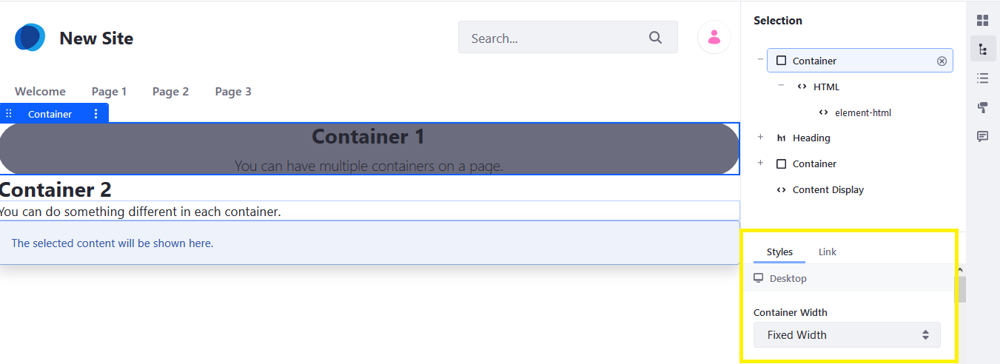
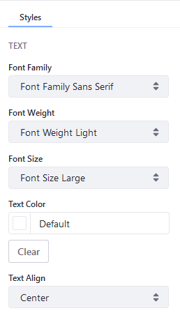

# Fragment Style Reference

This reference documents all the Fragment Styles available. To access the _Styles_ menu, navigate to the _Site Administration_ menu &rarr; _Site Builder_ &rarr; _Pages_. Click _Edit_ next to the desired page and then the _Selection_ () icon.

## Container Width

If you use a [_Container_ Fragment](./using-fragments.md#using-the-container-fragment), you can configure the Container Width to determine whether the Container Fragment's width is static, especially if the browser window changes size.



| Setting | Description |
| --- | --- |
| Fluid | If set to _Fluid_, the Container's width changes if the browser window is resized; you can configure the Left and Right Margins (see below). |
| Fixed Width | If set to _Fixed Width_, you cannot configure the Left and Right Margins. |

```tip::
   Many of the styles correspond to CSS classes. If you know CSS, many of the following fields will be familiar.

## Margin

Configure the Fragment's Margins using these settings:

| Field | Description |
| --- | --- |
| Margin Top | The _Margin Top_ property sets the top margin of an element. |
| Margin Bottom | The _Margin Bottom_ property sets the bottom margin of an element. |
| Margin Left | The _Margin Left_ property sets the left margin of an element. |
| Margin Right | The _Margin Right_ property sets the right margin of an element. |

## Padding

An element's padding is the space between its content and its border.

| Field | Description |
| --- | --- |
| Padding Top | The _Padding Top_ property sets the top padding (space) of an element. |
| Padding Bottom | The _Padding Bottom_ property sets the bottom padding of an element. |
| Padding Left | The _Padding Left_ property sets the left padding of an element. |
| Padding Right | The _Padding Right_ property sets the right padding of an element. |

## Size

Configure the element's dimensions.

| Field | Description |
| --- | --- |
| Width | This is the width of the element. |
| Height | This is the height of the element. |
| Min Width | If scaling, this is the minimum width. |
| Max Width | If scaling, this is the maximum width. |
| Min Height | If scaling, this is the minimum height. |
| Max Height | If scaling, this is the maximum height. |

### Overflow

The overflow property specifies what should happen if content overflows an element's box.

This property specifies whether to clip content or to add scrollbars when an element's content is too big to fit in a specified area.

| Field | Description |
| --- | --- |
| Default | The default is _Visible_ (see below). |
| Visible | The overflow is not clipped. It renders outside the element's box. |
| Hidden | The overflow is clipped, and the rest of the content will be invisible. |
| Scroll | The overflow is clipped, but a scroll-bar is added to see the rest of the content. |
| Auto | If overflow is clipped, a scroll-bar should be added to see the rest of the content. |

## Text



| Field | Description |
| --- | --- |
| Font Family | The _Font Family_ property specifies the font for an element. |
| Font Weight | The _Font Weight_ property sets how thick or thin characters in text should be displayed. |
| Font Size | The _Font Size_ property sets the size of a font. |
| Text Color | Choose a color for the text. |
| Text Align | The _Text Align_ property specifies the horizontal alignment of text in an element. Choose from _Left_, _Right_, _Center_, or _Justify_. |

## Background

| Field | Description |
| --- | --- |
| Background Color | Choose a background color from the palette. |
| Image Source | If set to _Manual Selection_, users can upload a background image. If set to _Content Mapping_, users can choose from a Web Content, Document and Media, or a Blog asset. |

## Borders

| Field | Description |
| --- | --- |
| Border Width | The _Border Width_ property sets the width of an element's four borders. |
| Border Radius | The _Border Radius_ property defines the radius of the element's corners and allows you to add rounded corners. |
| Border Color | The _Border Color_ property sets the color of an element's four borders. |

## Effects

| Field | Description |
| --- | --- |
| Opacity | This sets the transparency level; 100 is default and 0 is transparent. |
| Shadow | This adds a shadow around the box; can choose from a small, medium, or large shadow. |

## Additional Information

* [Configuring Fragment Styles](./configuring-fragment-styles.md)
* [Content Pages Overview](./content-pages-overview.md)
* [Using Fragments](./using-fragments.md)
