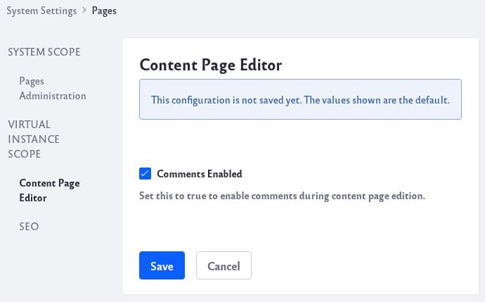
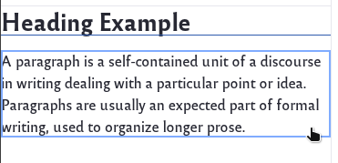

# Enabling and Using Fragment Comments

As you and your team use Fragments to create new pages, you can use the Fragment Comments tool for collaboration.

## Enabling Fragment Comments

Fragment Comments are enabled out-of-the-box in Liferay DXP 7.3, but they are disabled by default in Liferay DXP 7.2.

To enable comments for Fragments, follow these steps:

1. Go to the Control Paneel and navigate to *Configuration* &rarr; *System Settings* &rarr; *Content and Data* &rarr; *Pages*.

1. Select *Content Page Editor* under the Virtual Instance Scope. Check the *Comments Enabled* checkbox and click the *Save* button.

    

    You should now be able to use Fragment Comments.

    Note that this affects content page comments for all instances. To control this on an instance-by-instance basis, navigate to the same setting in *Instance Settings* (instead of *System Settings*).

## Using Fragment Comments

To use Fragment Comments, follow these steps:

1. Navigate to the Asset that contains the fragment you would like to add comment on.

1. Click the *Edit* icon () at the top of the page.

1. Use your cursor to select the fragment you wish to comment on.

    

1. Click on the Comments icon () in the right sidebar.

1. You can add comments to a specific Fragment. Other users can also reply to your comments.

    

    Write a comment and click on the *Comment* button. To reply, simply type your reply and click on the *Reply* button.

1. You can click on the *Resolve* icon, if another user has answered a question or resolved an issue. 

    

    Clicking the *Resolve* icon will hide the comment and any replies to the comment. To display previously resolved comments, simply place a check for the *Show Resolved Comments* checkbox.

    

1. Clicking on the *Options* icon () will allow you to edit or delete a comment. To edit, click on *Edit* and make your changes and click on the *Update* button.. To delete, click on *Delete*.
