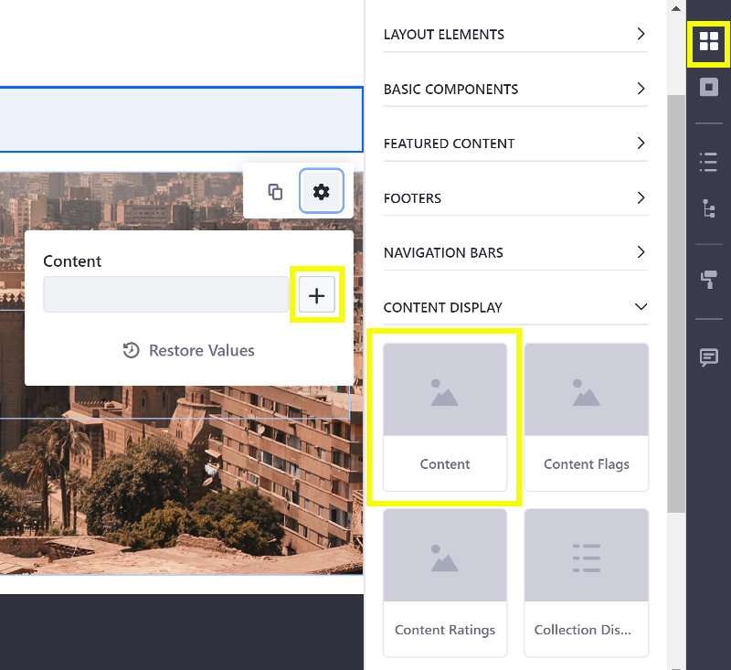

# Using Fragments

Here you'll learn how to use some of the common Fragments. These Fragments are covered here:

* [Content Fragment](#using-the-content-fragment)

## Using the Content Fragment

```note::
  Available in Liferay DXP 7.3+.
```

You can display a single existing web content, blog entry, or document by adding a Content Fragment from the *Content Display* panel. Follow these steps to use it:

1. Edit an existing Fragment-supported page (i.e. Content Page, Master Page, or Display Page).
1. Open the *Fragments* Panel and expand the *Content Display* heading and drag the *Content* Fragment onto the page.
1. With the *Content* Fragment selected, click the () icon to open the Fragment Configuration Menu.

    

1. Click the plus button next to the *Content* input and select an existing web content, blog entry, or document to display.