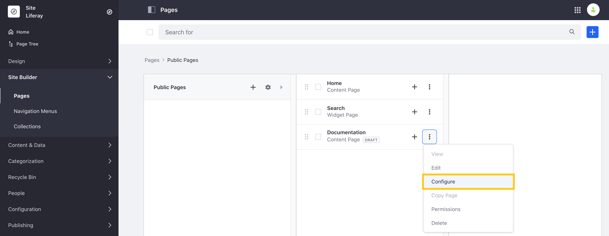
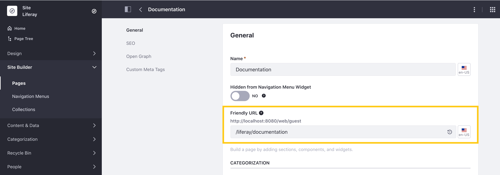
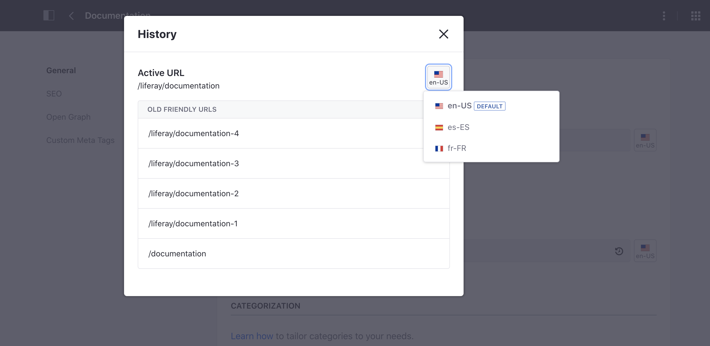
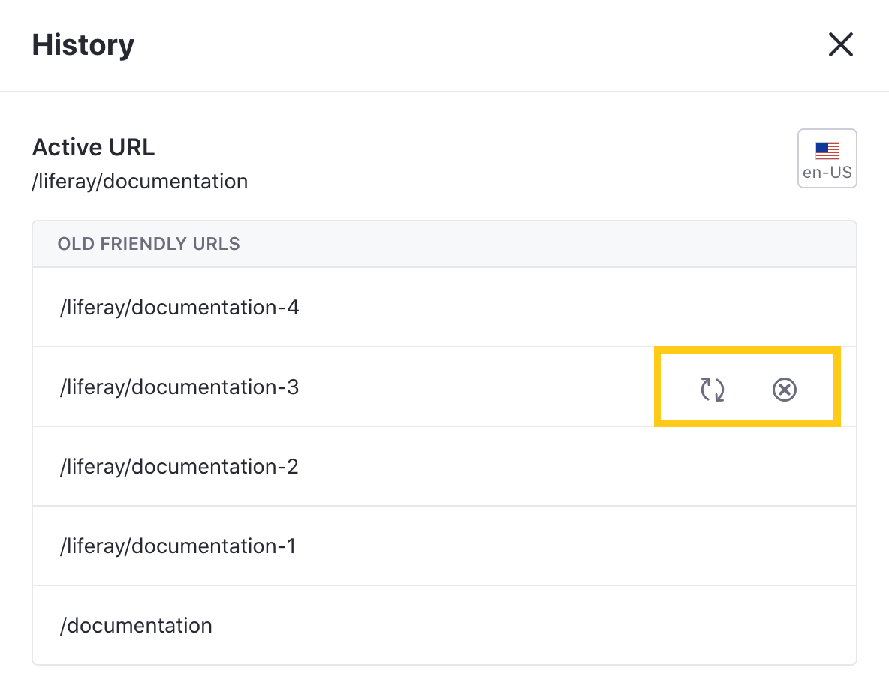

# Configuring Your Page's Friendly URL

With Liferay DXP, you can set user and SEO friendly URLs for each Page of your Site. These URLs can help users easily understand and recall your Page's address while providing key information to search engines and other tools crawling your Site.

When you create a Site Page, a friendly URL is automatically generated to match the Page's name, though you can change it at any time. Liferay DXP also maintains a history of previously used URLs for a Page to prevent broken links and provide an easy way to revert changes.

## Changing a Page's Friendly URL

To change a Page's friendly URL, open the *Product Menu* and go to *Site Builder* &rarr; *Pages*. Then click on the *Actions* button () for the Page you want to customize, and select *Configure*.



Alternatively, you can access individual Page settings by navigating to the Page you want to customize and clicking on the *Configure Page* button () at the top right of the *Application Bar*.

In the General tab, use the *Friendly URL* field to enter a new URL for the Page. If you would like to set a localized URL, click on the *Language Flag* and select your desired language. When finished, click *Save*.



The value entered in this field is appended to its [Site URL](./../../site-settings/managing-site-urls/configuring-your-sites-friendly-url.md) and must be unique.

```note::
   When setting a custom URL, you do not need to maintain the Site's Page hierarchy. This means a Child Page does not need to include its Parent as part of its friendly URL.
```

## Viewing and Managing a Page's URL History

Liferay DXP maintains a list of all friendly URLs used for a Page. This means that when you change a friendly URL, old URLs remain associated with your Page to prevent broken links, unless manually removed. For Page requests using an old URL, Liferay provides a redirect to the browser (or other consumer) pointing to the active friendly URL.

To view and manage the full list of URLS associated with a Page, click on the *History* icon (). This opens a modal window that displays the Page's active and old URLs for the selected language. YOu can also click on the *Language Flag* button to view set URLs for other languages.



From here, you can hover over an old URL to reveal the following options:

**Restore URL**: If you want to replace the active URL with an old one, click on the *Restore URL* button () for the URL you want to make active.

**Forget URL**: If you no longer want a friendly URL associated with a Page, click on the *Forget URL* button (). When users attempt to access the Page using a forgotten URL, the link breaks and Liferay renders a “Not found” message.



## Additional Information

* [Configuring Your Site's Friendly URL](./../../site-settings/managing-site-urls/configuring-your-sites-friendly-url.md)
* [Search Engine Optimization]()
* [Page Configuration UI Reference](./page-configuration-ui-reference.md)
