# Page Configuration UI Reference

You can configure individual Site pages to meet your needs. All changes made in this way are scoped to the selected page.

To configure a page, open the *Product Menu* and go to *Site Builder* &rarr; *Pages*. Then click the *Actions* button () for the page you want to customize and select *Configure*.


Alternatively, you can access individual page settings by navigating to the page you want to customize and clicking the *Configure Page* button (  ) at the top right of the *Application Bar*.

These settings are organized into the following tabs:

* [General](#general)
* [SEO](#seo)
* [Open Graph](#open-graph)
* [Custom Meta Tags](#custom-meta-tags)

```note::
   Many of these settings can be localized to provide translations based on a user's locale. See `Introduction to Localization <../../../installation-and-upgrades/setting-up-liferay-dxp/initial-instance-localization.md>`_ and `Modifying Localizable Site Fields <../../site-settings/configuring-site-languages/modifying-localizable-site-fields.md>`_ or more information.
```

## General

Here you can configure the basic information and design of a page, including its name, friendly URL, layout, and more.

### Name and Friendly URL

In the *Name* field, you can set a page's title, which is used for Site navigation and the browser's title bar. You can also use the *Friendly URL* field to set a new URL for a page or click the *Restore* icon (  ) to see and restore a previously used URL. <!--Link to Friendly URL article when finished.-->

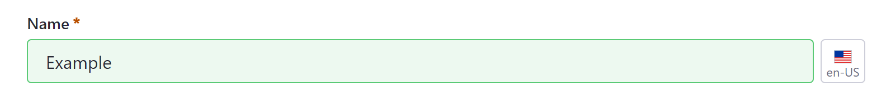


```tip::
   While a page's name and friendly URL are initially defined together at page creation, they are afterwards defined independently. It is best practice to update them together so that they match.
```

### Navigation Menu Widget

You can determine if a page is hidden from Navigation Menu widgets configured to display the Public Pages Hierarchy. When enabled, a hidden page can still appear in other navigation menus if added to them. See [Configuring Site Navigation](./../../04-site-navigation/configuring-site-navigation.md) for more information.


### Page Layout

For basic Widget Pages, you can select a layout template that defines row and column containers for widgets. If you create a Widget Page using a global template (e.g., blog, wiki, search), you can determine whether the page *Inherits Changes* made to the global template.

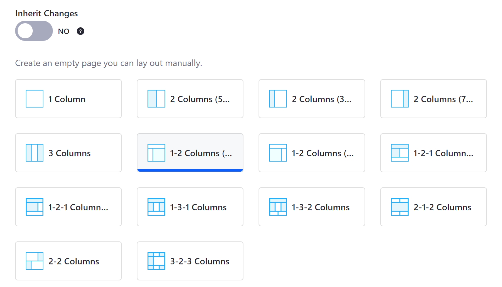

### Categorization

In the *Categorization* section, you can categorize page content using *Topics* and *Tags*. These tools help organize pages so users can more easily find your site's content through search and navigation. For more information on using tags and categories, see [Organizing Content with Tags and Categories](../../content-authoring-and-management/index.html#tags-and-categories).

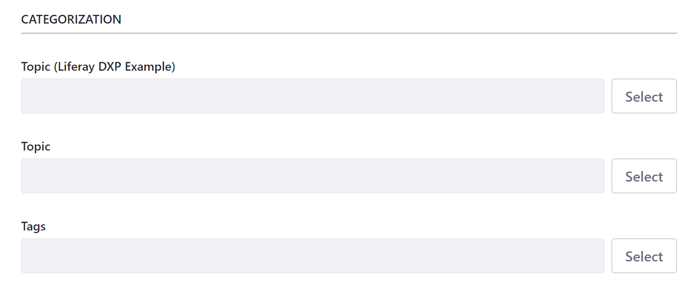

### Look and Feel

Here you can determine whether to use the page set's theme settings or define a unique look and feel for your page. When you choose to customize the page's theme, you can toggle various theme settings.

You can also access a *CSS* editor where you can add custom CSS code to the page. Any CSS code added to a page in this way will be loaded after the theme.


```note::
   While Widget Pages include the *Look and Feel* tab here, Content Pages include these settings in the *Edit* sidebar menu.
```

### Advanced Settings

Here you can access additional settings to customize your individual page's content and features, including query strings, mobile device rules, custom fields, and embedded widgets.

```note::
   While Widget Pages include the Advanced tab here, Content Pages include these settings in the Edit sidebar menu under *Look and Feel*.
```

**Query String**: Use this to provide default parameters for a page when no others exist. Query strings are useful for web content templates.

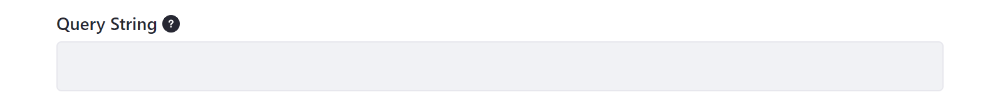

**Target**: Use this field to determine page link behavior using specific target attributes, such as opening the link in a new window, tab, or frameset.


**Icon**: Choose an icon to display along with a page's name in the Site's navigation menus.

**JavaScript**: Add JavaScript code to a page. Any added code is executed at the bottom of the page. You can also access this editor in a page set's *Configuration* page.

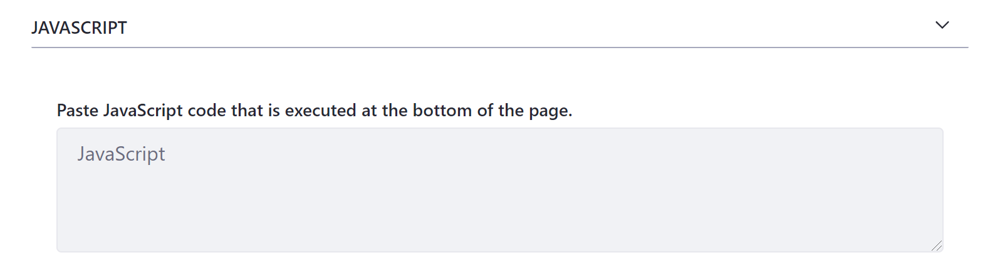

```tip::
   If your Site's theme uses JavaScript, it’s best to add custom JavaScript code to the theme rather than an individual page or page set. This ensures your Site’s JavaScript code remains in one place. If your theme does not use JavaScript, place all of your Site's JavaScript code here.
```

**Mobile Device Rules**: You can determine whether a page uses its page set's rules for mobile devices or is uniquely configured. These rules determine how a page's content renders for different types of mobile devices. See [Mobile Device Rules]() and [Creating Mobile Device Rules]() for more information and instructions on how to create your own rules.

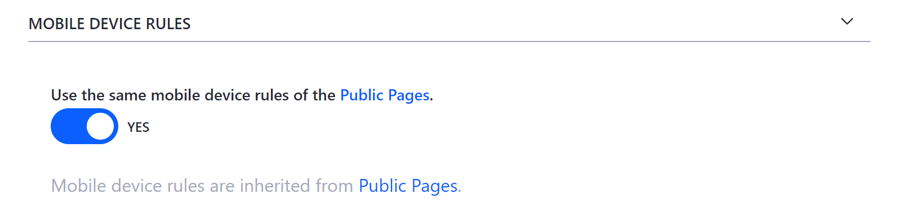

**Customization Settings**: You can determine whether a Widget Page's columns are *Customizable* for users. If customization is enabled, specify the columns users can customize. See [Personalizing Pages]() for more information.

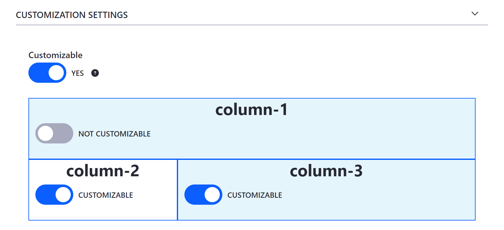

**Custom Fields**: You can view and configure the *Custom Fields* you've defined for Site pages. See [Custom Fields](../../../installation-and-upgrades/setting-up-liferay-dxp/custom-fields.md) for more information.

**Embedded Widgets**: In the *Embedded Widgets* section, you can access widgets you've embedded in a page using [Web Content Templates](), [Page Fragments](), or [Themes]().

```note::
   The *Custom Fields* and *Embedded Widget* sections only appear once you've created custom fields and embedded widgets in a page.
```

## SEO

Search engine optimization (SEO) refers to the methods used to improve your page's ranking in search engine results pages (SERP). The *SEO* tab provides easy access to settings you can use to optimize your page's content. See [Search Engine Optimization]() for more information about the following settings. <!--Rename current placeholder, "SEO Optimization," to "Search Engine Optimization".-->

### HTML Title

In the *HTML Title* section, you can set a page's title `<meta>` tag. This title is used by search engines to rank your page and serves as the page's heading in search engine results, though without replacing a page's [Name](#name-and-friendly-url).

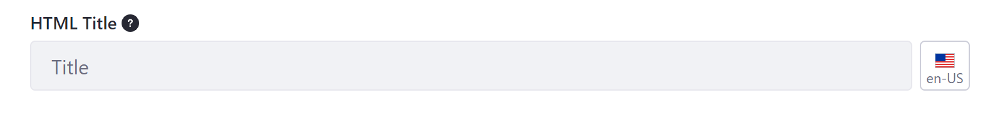

```tip::
   The recommended length for an HTML title is under 60 characters.
```

### Description

Here you can define a page's description `<meta>` tag. This description is used by search engines to rank your page and also appears in search results as a preview of your page.

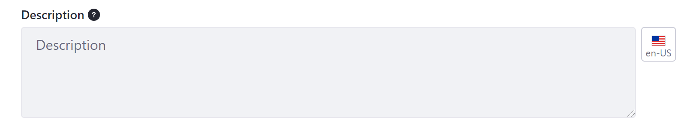

```tip::
   The recommended length for a page's description is under 155 characters.
```

### Custom Canonical URL

Here you can set a custom URL that is used instead of the URL set in your *System* or *Instance* settings.


```note::
   Any custom canonical URLs set for individual pages take precedent over the global and instance level settings.
```

### Keywords

Here you can list words that people are likely to use when searching for your page's content. These keywords contribute to your page's ranking.

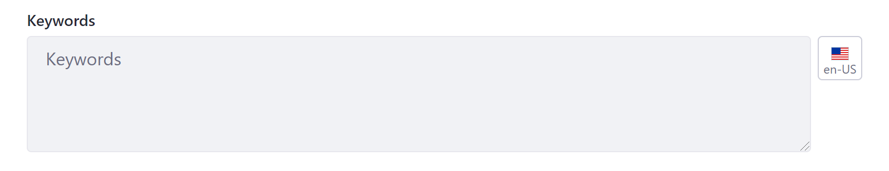

```tip::
   Use keywords often throughout your page's content, including titles, headings, descriptions, paragraphs, and image alt text.
```

### Preview SERP

Here you can see a preview of your page in search engine results (SERP) based on your configuration of the page's HTML title, description, and custom URL.

### Robots

Here you can configure `robots.txt` rules for a page. These rules provide instructions to search engines and other tools that crawl and index your site, either blocking or granting a crawler access to a specified path.

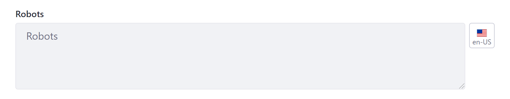

### Sitemap

Here you can exclude a page from your sitemap used by site crawlers. By excluding the page, you instruct site crawlers to skip the page when crawling and indexing your site.

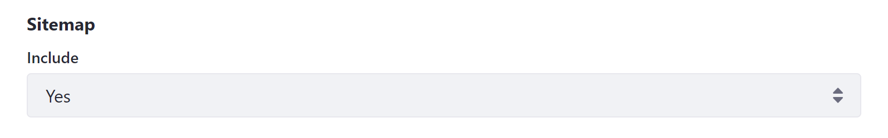

### Page Priority

Here you can set a page's priority from 0.0 to 1.0. This informs search engines and other tools how a page should be prioritized relative to other site pages.


### Change Frequency

In the *Change Frequency* section, you can indicate how frequently a page is updated for search engines and other tools crawling and indexing your site.

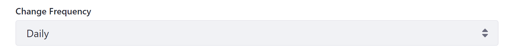

## Open Graph

[Open Graph](https://ogp.me/) is an Internet protocol that standardizes how a site's metadata appears in application contexts that support this protocol, such as Facebook, Slack, and Twitter. In the *Open Graph* tab, you can use Open Graph `<meta>` tags to define page metadata and create engaging representations of your site's content when shared online. See [Configuring Open Graph](./configuring-open-graph.md) for more information about the following settings.

```note::
   Page values defined via the Open Graph tab override values defined elsewhere in your Liferay instance.
```

### Image and Alt Description

Here you can define the `og:image` and `og:image:alt` properties for a page. You can also localize an image's alt description via the *Language Flag* button. Open Graph properties defined here override values defined in a page's Site settings.

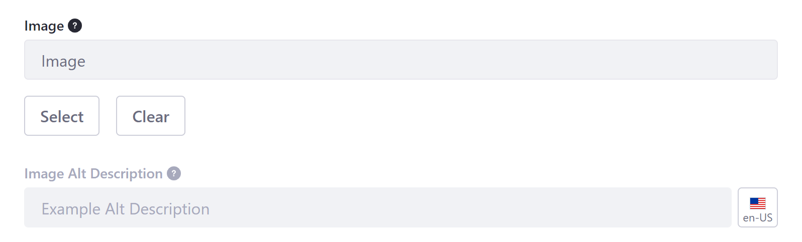

### Custom Title and Description

Here you can define the `og:title` and `og:description` properties. These properties create custom text used for rich previews in place of a page's HTML title and description.


### Preview Open Graph Page Representation

Here you can see a preview of your page when its URL is shared in contexts that support the Open Graph protocol. This preview is based on how you've configured Open Graph properties.

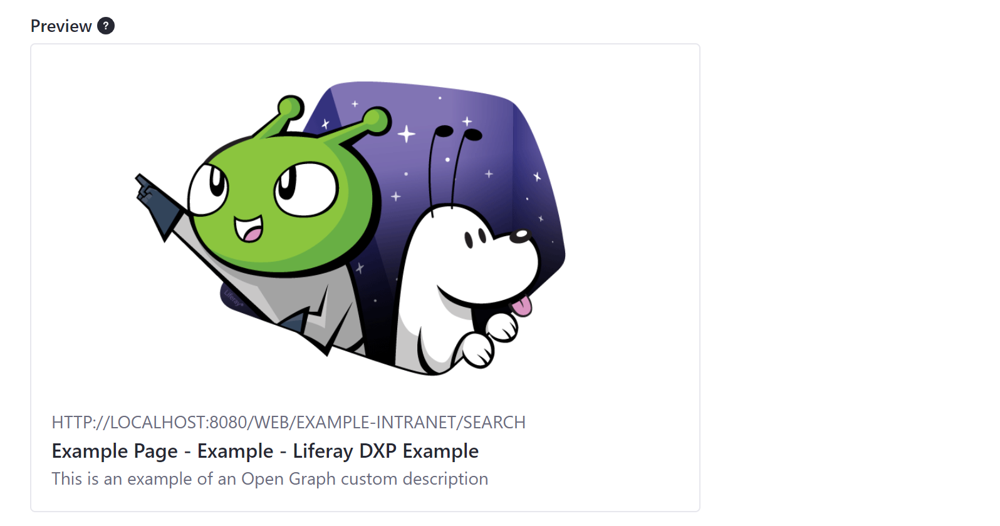

```note::
   An image's ratio may change depending on where the URL is posted.
```

## Custom Meta Tags

Here you can add custom `<meta>` tags to the `<head>` of a page. These tags are only visible in a page's HTML source code, describe a page's data, and determine formatting of data in different contexts, such as search engine results and social media posts. Each tag is defined using property and content attributes.


## Additional Information

* [Adding Pages to a Site](./../adding-pages/adding-a-page-to-a-site.md)
* [Content Pages Overview](../building-and-managing-content-pages/content-pages-overview.md)
* [Configuring Page Sets](./configuring-page-sets.md)
