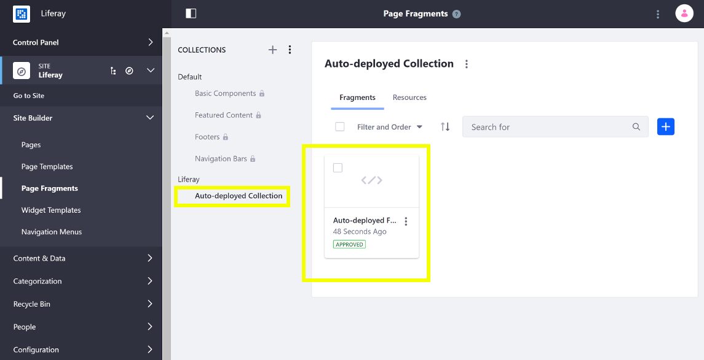
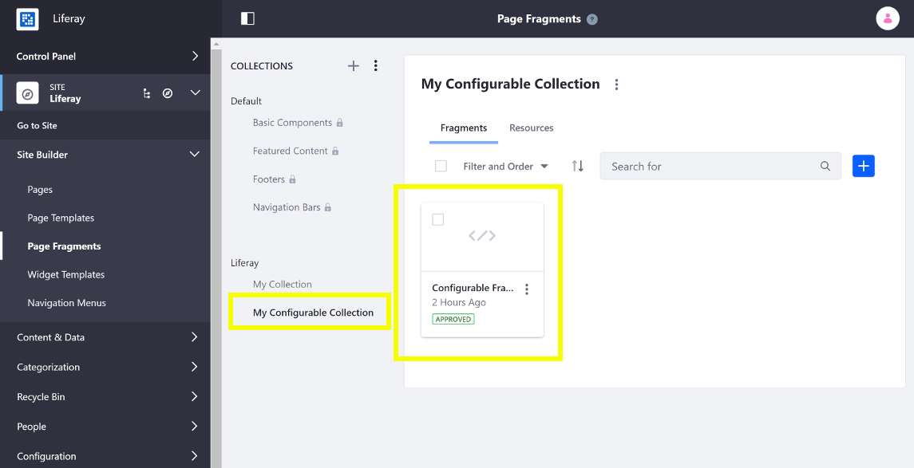
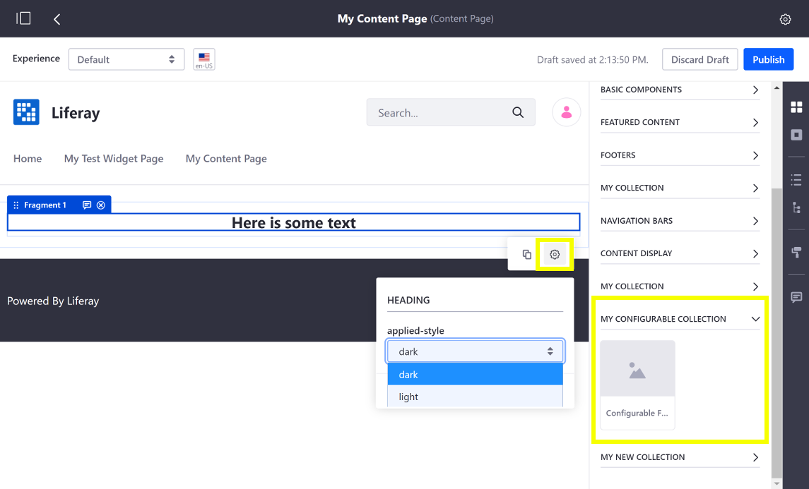

# Adding Configuration Options to Fragments

```note::
  Available since Liferay DXP 7.2 SP1.
```

Configurable options help make your Fragments flexible, so you don't have to maintain many similar Fragments. For example, instead of having one Fragment that has a heading with style A and another Fragment that has a heading with style B, you can create one Fragment that has a configurable style for the heading with options for style A and B. 
 Here you'll learn how to add configuration options to a Fragment:

1. [Deploy a Configurable Fragment](#deploy-a-configurable-fragment)
1. [Modify the Configuration](#modify-the-configuration)
1. [Propagate the Changes and Test](#propagate-the-changes-and-test)

## Deploy a Configurable Fragment

First, deploy an example to see how Fragment Configuration options work:

1. Run the command below to start the Docker container:

    ```bash
    docker run -it -p 8080:8080 liferay/portal:7.3.2-ga3
    ```

1. Download and unzip the [example configurable Fragment Collection](https://learn.liferay.com/dxp/7.x/en/site-building/developer-guide/developing-page-fragments/liferay-c7f8.zip):
		
	```bash
    curl https://learn.liferay.com/dxp/7.x/en/site-building/developer-guide/developing-page-fragments/liferay-c7f8.zip

    unzip liferay-c7f8.zip
    cd liferay-c7f8
	```

1. Import the Fragment Collection in the Docker container with the Fragments Toolkit. Alternatively, you can [import the Fragment manually](../../displaying-content/using-fragments/managing-page-fragments.md) instead.

    ```bash
    cd liferay-c7f8/configurable-marketing-fragment
    npm run import
    ? Liferay host & port http://localhost:8080
    ? Username test@liferay.com
    ? Password [hidden]
    
    Checking connection...
    Connection successful
    
    ? Company ID liferay.com
    ? Group ID Liferay
    ```

1. Verify that the Fragment Collection is available. Open your browser to `https://localhost:8080`, and open the Product Menu and go to Site &rarr; *Site Builder* &rarr; *Page Fragments*. The Collection appears with the other Collections.

    

1. Go to the Home Page and click the () icon to edit the Content Page.
1. Expand the *Configurable Marketing Collection* heading in the [Fragments panel](../../creating-pages/building-and-managing-content-pages/content-pages-overview.md#fragments) and drag the *Configurable Marketing Card* Fragment onto the page.
1. Select the Configurable Marketing Card. Open the Fragment Configuration Menu by clicking the () icon in the context menu that appears. From here, you can choose a configuration option for the text style to change the text from dark to light.

    

Great! You successfully imported and configured a configurable Fragment.

## Configuration Overview

The configuration (`configuration.json` in the [contributed Fragment Collection](./creating-a-contributed-fragment-collection.md) or [Fragments Toolkit project](./developing-page-fragments-with-the-fragments-toolkit.md) and *Configuration* tab in the [Editor](./developing-fragments-using-the-editor.md)) defines the type of configuration and the available options (if applicable). The example has the configuration below which provides the `select` option to choose *dark* or *light* for a Fragment's text style:

```json
{
    "fieldSets": [
        {
            "label": "text style",
            "fields": [
                {
                    "name": "textAppliedStyle",
                    "label": "applied-style",
                    "description": "this-is-the-style-that-will-be-applied",
                    "type": "select",
                    "dataType": "string",
                    "typeOptions": {
                        "validValues": [
                            {
                                "value": "dark"
                            },
                            {
                                "value": "light"
                            }
                        ]
                    },
                    "defaultValue": "dark"
                }
            ]
        }
    ]
}
```

```note::
  The ``label`` property is optional. If it's left out, your configuration option has no title.
```

```warning::
  An invalid JSON configuration can't be saved. Make sure your JSON configuration is valid before previewing or saving it.
```

The configuration values selected by the user are made available to the HTML through the FreeMarker context. They are referenced in the HTML with the notation `${configuration.fieldName}`. The example  (`${configuration.textAppliedStyle}`) returns `dark` or `light` depending on the configuration value selected by the user, setting the CSS class to `text-light` or `text-dark`:

```html
<div class="marketing-card-fragment-01">
  <div class="card">
    
    <div class="card-body">
      <h5 data-lfr-editable-id="02-card-title" data-lfr-editable-type="rich-text" class="card-title text-${configuration.textAppliedStyle}">Editable Card title</h5>
      <p data-lfr-editable-id="03-card-text" data-lfr-editable-type="rich-text" class="card-text text-${configuration.textAppliedStyle}">Here is some editable text.</p>
      <a data-lfr-editable-id="04-card-link" data-lfr-editable-type="link" href="#" class="btn btn-primary">Editable link</a>
    </div>
  </div>
</div>
```

The example demonstrates a select configuration. See the [Configuration Types Reference](./reference/configuration-types-reference.md) for a complete list of the available Fragment configuration types.

## Escape Configuration Text Values

Malicious code can be inserted into the text field, wreaking havoc for other users of the Fragment. You must escape Fragment text values so you're protected from cross-site scripting (XSS) attacks.

For generic cases, an HTML `escape()` method is available. See the [`HtmlUtil`](https://docs.liferay.com/ce/portal/7.3-latest/javadocs/portal-kernel/com/liferay/portal/kernel/util/HtmlUtil.html) class for more information.

```html
<div class="fragment_38816">
    "${htmlUtil.escape(configuration.text)}"
</div>
```

To prevent JavaScript attacks, such as setting an attribute or appending HTML children, use the `Liferay.Util.escapeHTML()` function:

```javascript
function (fragmentElement, configuration) {
    const escapedValue = Liferay.Util.escapeHTML(configuration.text)
}
```

## Modify the Configuration

Now that you know how the configuration works, you can modify it.

1. Open the Product Menu and go to Site &rarr; *Site Builder* &rarr; *Page Fragments*.
1. Select the *Configurable Marketing Collection*, and open the Actions Menu for the Configurable Marketing Card and select *Edit*.

    

1. Click the *configuration* tab and update the configuration to include a new configuration to hide/show the card's description:

    ```json
    "defaultValue": "dark"
    },
    {
    "name": "showDescription",
    "label": "Show Description",
    "description": "show-description",
    "type": "checkbox",
    "defaultValue": true
    }
    ```

1. Go back to the *Code* tab and wrap the paragraph element with a conditional statement to check for the checkbox's value. Click *Publish* to apply the changes.

    ```html
    [#if configuration.showDescription]
      <p data-lfr-editable-id="03-card-text" data-lfr-editable-type="rich-text" 
      class="card-text text-${configuration.textAppliedStyle}">
        Here is some editable text.
      </p>
    [/#if]
    ```

```note::
  You can also access the configuration's value through the JavaScript with the syntax ``const configurationValue = configuration.textAppliedStyle;``.
```

## Propagate the Changes and Test

Now you can test the updates.

1. Propagate the changes so they're reflected on the Home Page. Open the Actions Menu for the Configurable Marketing Fragment and select *View Usages*. 
1. Check the box for the Home Page and click the () button.

    

1. Go back to the Home Page and once again click the () icon to edit the Content Page.
1. Select the Configurable Marketing Card again and click the () to open the Fragment Configuration Menu.
1. Check/uncheck the *Show Description* checkbox to show/hide the card's text.

    

Great! Now you know how to add configuration options for your Fragments.

## Related Information

* [Auto-deploying Fragments](./auto-deploying-fragments.md)
* [Including Default Resources with Fragments](./including-default-resources-with-fragments.md)
* [Fragment Configuration Types Reference](../reference/fragment-configuration-types-reference.md)
