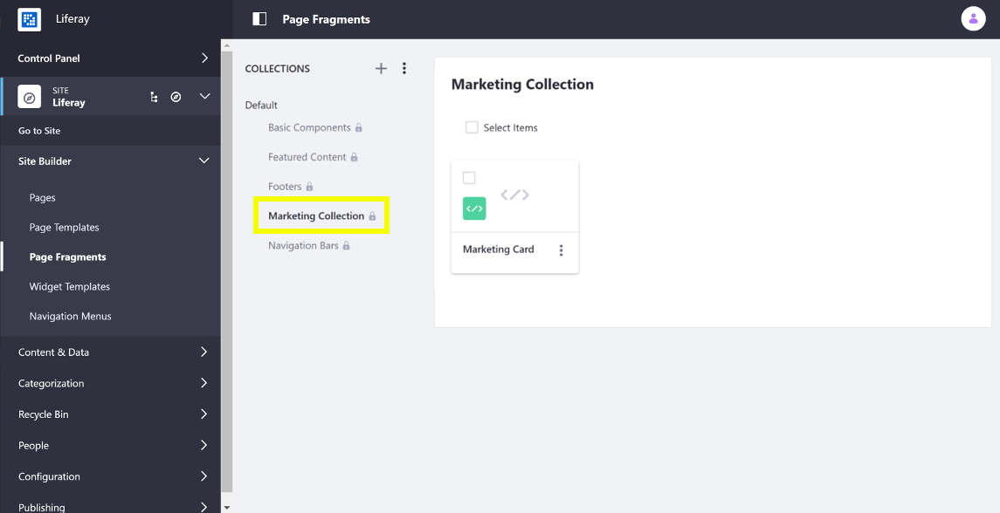
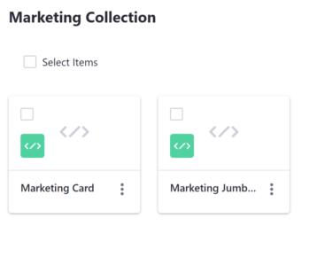

# Creating a Contributed Fragment Collection

Contributed Fragment Collections are deployable modules containing Page Fragments. The Fragments in a contributed Collection can be used just like regular Fragments, but aren't contained in the database and can't be modified directly through the UI. If you're running Liferay DXP 7.3+, it's better to use [Automatically deployed Fragments](./auto-deploying-fragments.md) created in compressed ZIP Collections. You can create these [with your own tools](developing-page-fragments-with-the-fragments-toolkit.md#collection-format-overview) or the [Liferay Fragments Toolkit](developing-page-fragments-with-the-fragments-toolkit.md), and they can be modified from the UI and can include image resources.

This example runs on Liferay DXP 7.3+.
 
```note::
  All Fragments added through a Contributed Fragment Collection are available globally to all Sites.
```

To add a contributed Fragment Collection, you extend the [`BaseFragmentCollectionContributor` Class](https://docs.liferay.com/dxp/apps/fragment/latest/javadocs/com/liferay/fragment/contributor/BaseFragmentCollectionContributor.html), which itself implements the [`FragmentCollectionContributor` interface](https://docs.liferay.com/dxp/apps/fragment/latest/javadocs/com/liferay/fragment/contributor/FragmentCollectionContributor.html).

Here, you'll learn how to contribute a Fragment Collection:

1. [Deploy a Contributed Fragment Collection](#deploy-a-contributed-fragment-collection)
1. [Add the Fragment Resources](#add-the-fragment-resources)
1. [Deploy and Test](#deploy-and-test)

## Deploy a Contributed Fragment Collection

First, deploy an example to see what a contributed Fragment Collection looks like:

1. Run the command below to start the Docker container:

    ```bash
    docker run -it -p 8080:8080 liferay/portal:7.3.2-ga3
    ```

1. Download and unzip the [Marketing Fragment Collection](https://github.com/liferay/liferay-learn/tree/master/docs/dxp/7.x/en/site-building/developer-guide/developing-fragments/creating-a-contributed-fragment-collection/liferay-l3m9.zip):

    ```bash
    curl https://github.com/liferay/liferay-learn/tree/master/docs/dxp/7.x/en/site-building/developer-guide/developing-fragments/creating-a-contributed-fragment-collection/liferay-l3m9.zip

    unzip liferay-l3m9.zip
    ```

1. Build the contributed Collection's JAR.

    ```bash
    cd liferay-l3m9\contributed-marketing-fragments-collection
    .\gradlew build
    ```

1. Copy the contributed Collection's JAR to the Docker container:

    ```bash
    cd build\libs
    docker cp com.liferay.learn.fragments-1.0.0.jar docker-container-name:/opt/liferay/deploy
    ```
    
    ```note::
      If testing on Windows, you may need to deploy to `docker-container-name:/opt/liferay/osgi/modules` directly if deployment fails.
    ```

1. Confirm the deployment to the Liferay Docker container console. The log message below should appear in the Docker console:

    ```bash
    INFO  [fileinstall-/opt/liferay/osgi/modules][BundleStartStopLogger:39] STARTED com.liferay.learn.fragments_1.0.0 [1121]
    ```

1. Verify that the contributed Collection and Fragment are available. Open your browser to `https://localhost:8080`, open the Product Menu, and go to *Site Builder* &rarr; *Page Fragments* under the Site Menu.

    

Great! You successfully deployed a contributed Fragment Collection.

As you can see, the contributed Fragment Collection appears with the default Fragment Collections, and the Fragments can't be modified from the UI. The only way to modify the Collection is to update the module they came from or [copy the Fragment to another Collection](../../fragments/managing-page-fragments.md#managing-individual-page-fragments) and modify the Fragment copy.

## Contributed Fragment Collection Logic and metadata

The Fragment Collection contributor overrides two methods in the `*FragmentCollectionContributor` Class to provide information about the Collection.

The `getFragmentCollectionKey()` method returns the key/name of the Fragment Collection where these fragments are contributed:

```java
@Override
public String getFragmentCollectionKey() {
    return "Marketing Collection";
}
```

The `getServletContext()` method returns the servlet context for the contributed Fragment Collection module:

```java
@Override
public ServletContext getServletContext() {
    return _servletContext;
}
```

The `ServletContext` points to the bundle's symbolic name so it can find the Fragment resources: 

```java
@Reference(
  target = "(osgi.web.symbolicname=com.liferay.learn.fragments)"
)
private ServletContext _servletContext;
```

The `bnd.bnd` file includes a few properties that must be defined for the Collection:

* The `osgi.web.symbolicname` matches the `Bundle-SymbolicName` in the `bnd.bnd` file.
* The `Web-ContextPath` Header indicates the module folder that contains the Collection, so the `ServletContext` is correctly generated.
* The `-dsannotations-options` enables the Declarative Service annotations found in the class hierarchy of the Component class. 

See the example project's [`bnd.bnd`](https://github.com/liferay/liferay-learn/tree/master/docs/dxp/7.x/en/site-building/developer-guide/developing-fragments/creating-a-contributed-fragment-collection/liferay-l3m9.zip) for a reference of these values.

Now you'll modify the project to include another Fragment in the contributed Collection.

## Add Fragment Resources

Follow these steps to add a new packaged Fragment to the contributed Fragment Collection:

1. Move the `liferay-l3m9/marketing-jumbotron` folder in the example's ZIP file into the `contributed-marketing-fragment-collection/src/main/resources/com/liferay/learn/fragments/dependencies/` folder. See [Developing Page Fragments with the Fragments Toolkit](./developing-page-fragments-with-the-fragments-toolkit.md) for more information on creating Fragments.

    ```note::
      Packaged Fragments go in the `dependencies` folder, and the class package name and resources package name must match (e.g. ``[class.package.path].dependencies``).
    ```

1. Include the Fragment's entry (as defined as the `fragmentEntryKey` entry in the Fragment's `fragment.json`) in the `collection.json`:

    ```json
    {
        "fragments": [
            "marketing-card",
            "marketing-jumbotron"
        ],
        "name": "Marketing Collection"
    }
    ```

    ```note::
      Contributed Fragment Collections do not support `included resources <./including-default-resources-with-fragments.md>`_.
    ```

## Deploy and Test

You can build and deploy the updated contributed Fragment Collection as you did above:

1. Build the updated contributed Collection's JAR.

    ```bash
    cd contributed-marketing-fragments-collection
    .\gradlew build
    ```

1. Copy the updated JAR to the Docker container:

    ```bash
    cd build\libs
    docker cp com.liferay.learn.fragments-1.0.0.jar docker-container-name:/opt/liferay/deploy
    ```

1. Verify that the updated Fragment is included in the contributed Collection. Open your browser to `https://localhost:8080`, and open the Product Menu and go to *Site Builder* &rarr; *Page Fragments* under the Site Menu.

    

Congratulations! You now know how to create a contributed Fragment Collection, and have added a new contributed Fragment Collection to Liferay DXP.

## Related Information

* [Developing Page Fragments with the Fragments Toolkit](./developing-page-fragments-with-the-fragments-toolkit.md)
* [Developing Page Fragments with the Editor](./developing-page-fragments-with-the-editor.md)
