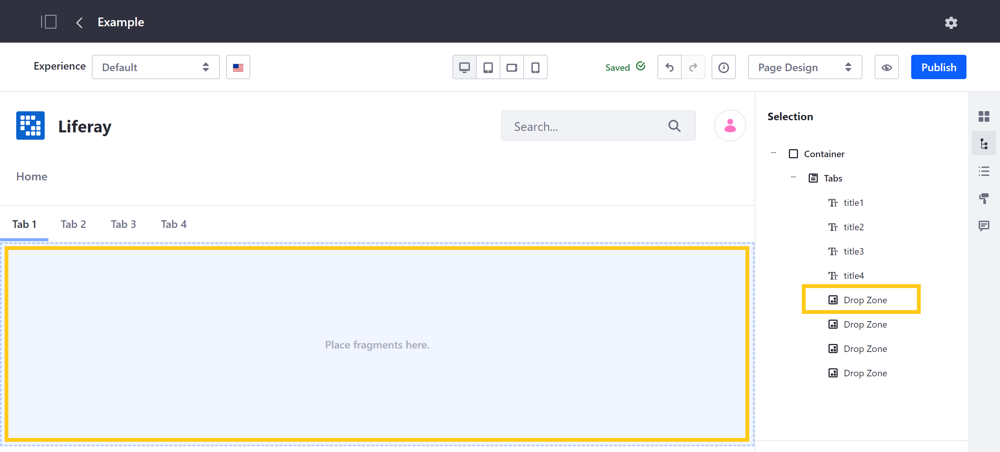

# Defining Fragment Drop Zones

Drop zones are integral to building your Content Pages. With them, you can create unique Page layouts and dynamic displays by defining areas within Fragments where Users can drag and drop other Fragments and widgets.

Follow these steps to define a drop zone:

1. Open the [Fragments Editor](./using-the-fragments-editor.md).

1. Add the `<lfr-drop-zone></lfr-drop-zone>` label to define a drop zone within a Fragment.

   Since a drop zone has no ID, it is rendered in your specified order and cannot be rearranged within a fragment.

   ```important::
      Drop zones cannot be added to editable elements within a fragment.
   ```

The following images demonstrate how this label is used to define drop zones within the Tabs Fragment.




Once defined, you can drag and drop any Fragment or widget into the drop zone.

## Additional Information

* [Developing Fragments](./developing-fragments-intro.md)
* [Using the Fragments Editor](./using-the-fragments-editor.md)
* [Using the Fragments Toolkit](./using-the-fragments-toolkit.md)
