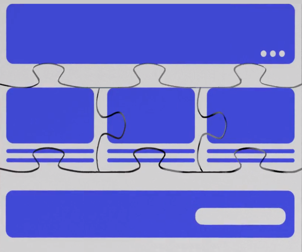

# Developing Fragments Introduction

Page Fragments are the building blocks for [Content Pages](../../creating-pages/understanding-pages.md#content-pages). They're individual Components, built from CSS, HTML, and JavaScript, that create the overall design for the page and add functionality. Fragments can be combined to create a more complex interaction (such as cards or paragraph elements), or they can stand alone on their own (such as a banner).

## Collections

Fragments are created inside of Collections. Collections provide an easy way to manage and share groups of related Fragments. Users navigate Collections when selecting Fragments to add to a page. To see examples, the admin page shows all the out-of-the-box Fragments (and their code). A Page Fragment's code can be updated through the admin interface. If you want your Page Fragment's code to be static (locked and unable to be edited through the interface) instead, you can create a [Contributed Fragment Collection](./creating-a-contributed-fragment-collection.md).

## Tooling

Several Page Fragments are included by default that you can use to [build Content Pages](../../creating-pages/building-content-pages.md). To cover your specific use case you may need to create your own Page fragments. You can build Page Fragments using the tooling of your choice, but internal and external tools are available to help:

* [The Built-in Fragments Editor](./developing-page-fragments-with-the-editor.md): use the built-in editor to develop Page Fragments inside of Liferay Portal.
* [The Fragments Toolkit](./developing-page-fragments-with-the-fragments-toolkit.md): use the Fragments CLI to generate, import, and export Page Fragments and Fragment Collections from your desktop.

Page Fragment files must be properly arranged in the folder structure and have the appropriate metadata to be imported onto your server. See the [project structure](./developing-page-fragments-with-the-fragments-toolkit.md#collection-format) for more information.

## Features

The HTML, CSS, and JavaScript are standard, but you can enhance Fragments further with these options:

* [Editable Elements](./fragment-specific-tags-reference.md): make text, images, links, and "rich" text elements editable, so the content can be replaced with custom text and images. This is the key feature of Fragments that makes them reusable. You can also embed widgets. 
* [Configuration Options](./making-a-page-fragment-configurable.md): Add configuration options to the application's Configuration Menu, such as the ability to modify the Fragment's font color.
* [FreeMarker](https://freemarker.apache.org/): FreeMarker is an enhanced form of standard HTML that gives you access to variables, conditional statements, and more. From your HTML, you can use the [alternative (square bracket) syntax](https://freemarker.apache.org/docs/dgui_misc_alternativesyntax.html) for FreeMarker.
<!--Learn more about the available FreeMarker objects in the Front-end Reference TODO.-->

## Best Practices

We recommend these best practices when writing your Fragment code:

* Make your code semantic and highly reusable.
* Namespace your Fragments properly so they don't interfere with other elements on the page outside of the Fragment.
* Use the autogenerated Fragment class as the basis for all CSS selectors you add to avoid impacting other Fragments.
* Use JavaScript sparingly, since it isn't easily reusable. Instead, reference external JavaScript libraries.
* [Escape Fragment configuration text values](./escaping-fragment-configuration-text-values-reference.md)