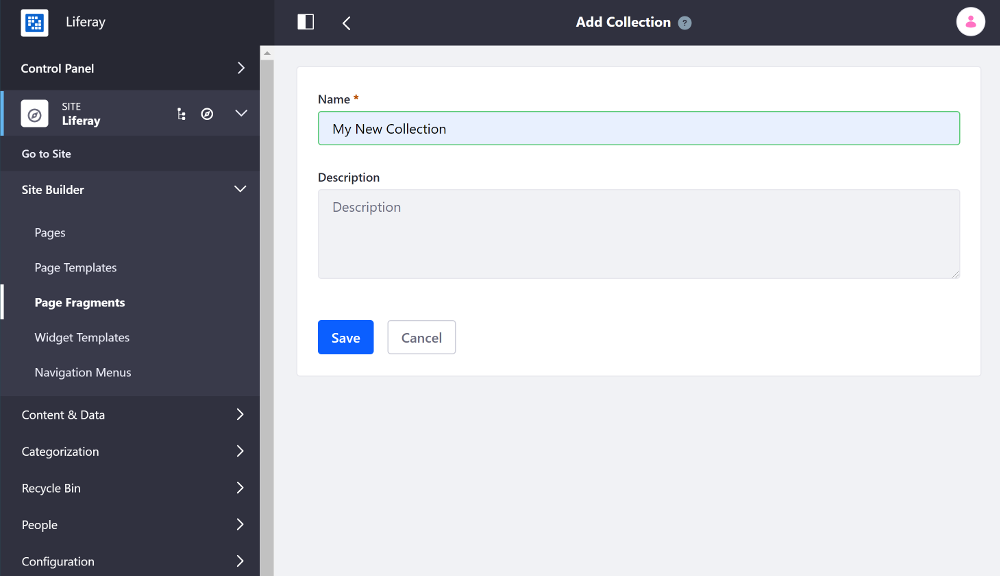
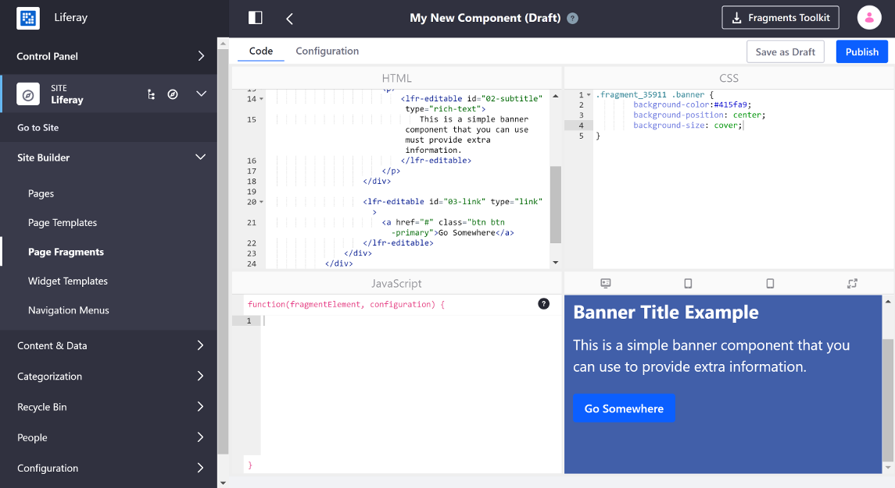

# Developing Page Fragments in the built-in Fragments Editor

The built-in [Page Fragments editor](../../page-fragments/the-page-fragments-editor.md) has all the tools you need to develop Page Fragments inside Liferay Portal.

## Overview

1. [Walk Through an Example](#walk-through-an-example)
1. [Additional Information](#additional-information)

## Walk Through an Example
  
1. Open the Product Menu and go to *Site Builder* &rarr; *Page Fragments* under the Site Menu, and select an existing Collection or click the [Add Button](../../../images/icon-add.png) next to the Collections heading to create a new Collection if it doesn't exist.
1. Inside the Collection, click the [] to create a new Fragment [Component](../../creating-pages/content-pages-overview.md#basic-components). 

    

    ```note::
      Prior to Liferay DXP 7.3, a Fragment could either be a Section or a Component. In Liferay DXP 7.3+, all Page Fragments are Components.
    ```

1. Write the HTML, CSS, and JavaScript in the corresponding panes. A live preview is displayed in the remaining pane as you update the code.

    HTML:

    ```html
    <div class="banner py-6 py-md-8 text-white" data-lfr-background-image-id="banner">
        <div class="container my-lg-6">
            <div class="row">
                <div class="col-12 col-md-8 col-xl-6">
                    <h1>
                        <lfr-editable id="01-title" type="rich-text">
                            Banner Title Example
                        </lfr-editable>
                    </h1>

                    <div class="mb-4 lead">
                        <p>
                            <lfr-editable id="02-subtitle" type="rich-text">
                                This is a simple banner component that you can use to provide extra information.
                            </lfr-editable>
                        </p>
                    </div>

                    <lfr-editable id="03-link" type="link">
                        <a href="#" class="btn btn-primary">Go Somewhere</a>
                    </lfr-editable>
                </div>
            </div>
        </div>
    </div>
    ```
  
    CSS (Replace `.fragment_number` with the class for your Component):

    ```css
    .fragment_number .banner {
        background-color:#415fa9;
        background-position: center;
        background-size: cover;
    }
    ```

    

1. Click *Publish* to save your work and make it available to add to a [Content Page](../../creating-pages/understanding-pages.md#content-pages).

  

## Related Information

* [Developing Page Fragments with the Fragments Toolkit](./developing-page-fragments-with-the-fragments-toolkit.md)
* [Making a Page Fragment Configurable](./making-a-page-fragment-configurable.md)