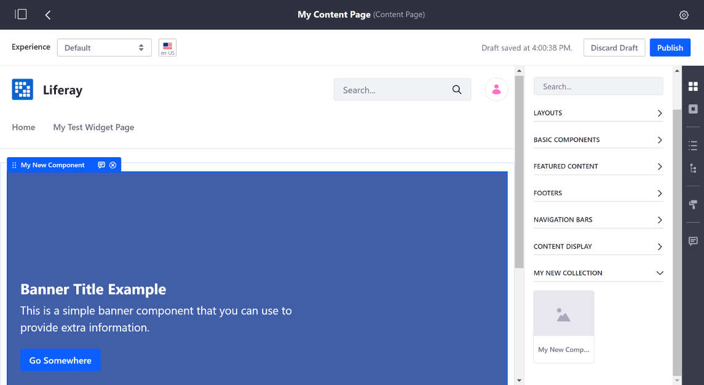

# Developing Page Fragments in the built-in Fragments Editor

The built-in [Page Fragments editor](./reference/page-fragment-editor-interface-reference.md) has all the tools you need to develop Page Fragments inside Liferay DXP. You'll create Page Fragments in *Collections*, which are ways to organize Fragments so users can find the functionality they need to build Pages. You can use Collections to differentiate between types of Page Fragments, the functionality provided, or Page Fragments used by different groups or departments.

Here you'll learn how to create a Collection and Fragments using the built-in Editor:

1. [Create a Fragment Collection](#create-a-fragment-collection)
1. [Add a Fragment to the Collection](#add-a-fragment-to-the-collection)

This example uses a Docker image with a fresh install of Liferay DXP.

## Create a Fragment Collection

First, you must create a Collection:

1. Run the command below to start the Docker container:

    ```bash
    docker run -it -p 8080:8080 liferay/portal:7.3.1-ga2
    ```

1. Select the Site you wish to build.
1. Open the Product Menu and go to Site &rarr; *Site Builder* &rarr; *Page Fragments*. From this page you can manage your Page Fragments and Collections. See [Managing Page Fragments](../../using-fragments/managing-page-fragments.md) for more information on the available actions for Page Fragments.
1. Click the () and enter a name and optional description for the Collection.


## Add a Fragment to the Collection

Now that the Collection is created, you can add a Fragment:

1. With the Collection selected, click the [] in the Collection to create a new Fragment [Component](../../creating-pages/content-pages-overview.md#basic-components). 

    ```note::
      Prior to Liferay DXP 7.3, a Fragment could either be a Section or a Component. In Liferay DXP 7.3+, all Page Fragments are Components.
    ```

1. Enter a name for the Fragment and click *Save*.

    

1. Add your Fragment's resources (HTML, CSS, JavaScript, and [configuration options](./making-a-page-fragment-configurable.md)). The example below adds a Card component with editable text:

    ```html
    <div class="marketing-card-fragment-01">
      <div class="card">
        <lfr-editable id="01-card-image" type="image">
          
        </lfr-editable>
        <div class="card-body">
          <lfr-editable id="02-card-title" type="rich-text">
            <h5 class="card-title">Editable Card title</h5>
          </lfr-editable>
          <lfr-editable id="03-card-text" type="rich-text">
            <p class="card-text">Here is some editable text.</p>
          </lfr-editable>
          <lfr-editable id="04-card-link" type="link">
            <a href="#" class="btn btn-primary">Editable link</a>
          </lfr-editable>
        </div>
      </div>
    </div>
    ```

    ```css
    .marketing-card-fragment-01 .card {
      max-width: 100%;
    }

    .marketing-card-fragment-01 .card img {
      background-color: #0000FF;
      height: 300px;
      object-fit: cover;
    }
    ```

    

    1. Click *Publish* to save your work and make it available to add to a [Content Page](../../creating-pages/understanding-pages.md#content-pages).

    

Great! You've successfully created a Fragment Collection and added a new Fragment to it.

```note::
  Since Liferay DXP 7.2 SP1+ and Liferay Portal CE 7.2 GA2+, you can create Page Fragments on the *Global* Site to make them available for all Sites. To expose this feature in the initial releases of these versions, you must create a ``.config`` file named ``com.liferay.fragment.web.internal.configuration.FragmentGlobalPanelAppConfiguration.config`` and add the ``enabled=B"true"`` property. Then copy it to your Liferay DXP instance's ``osgi/configs`` folder. Global Page Fragments are inherited by child Sites, so they can only be edited from the Global Site. Any resources the Global Page Fragment references (e.g., image) from the Global Site are copied to a Site that leverages the Page Fragment.
```

## Related Information

* [Developing Page Fragments with the Fragments Toolkit](./developing-page-fragments-with-the-fragments-toolkit.md)
* [Making a Page Fragment Configurable](./making-a-page-fragment-configurable.md)
