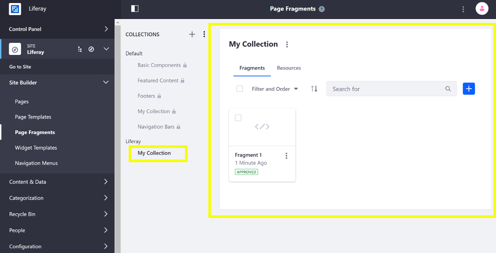
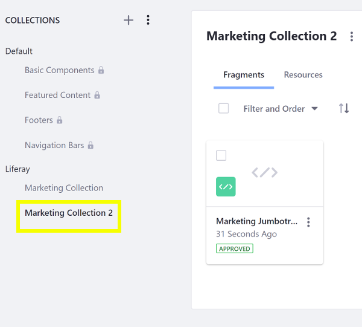

# Creating Page Fragments with the Fragments Toolkit

You can use the Fragments Toolkit to create Fragments and Collections from the Command Line. This example uses a Docker image with a fresh install of Liferay DXP.

Here, you'll learn how to create Page Fragments with the Fragments Toolkit:

1. [Deploy a Fragment Collection](#deploy-a-fragment-collection)
1. [Add a New Collection and Fragment](#add-a-new-collection-and-fragment)
1. [Deploy and Test](#deploy-and-test)

## Deploy a Fragment Collection

First, deploy an example to see what a Fragment Collection looks like:

1. Run the command below to start the Docker container:

    ```bash
    docker run -it -p 8080:8080 liferay/portal:7.3.1-ga2
    ```

1. Download and unzip the [Marketing Fragment Collection](https://github.com/liferay/liferay-learn/tree/master/docs/dxp/7.x/en/site-building/developer-guide/developing-page-fragments/developing-page-fragments-using-the-fragments-toolkit/liferay-x2y6.zip)

    ```bash
    curl https://github.com/liferay/liferay-learn/tree/master/docs/dxp/7.x/en/site-building/developer-guide/developing-page-fragments/developing-page-fragments-using-the-fragments-toolkit/liferay-x2y6.zip

    unzip liferay-x2y6.zip
    ```

1. Copy the Fragment Collection's ZIP to the Docker container. Alternatively, you can [import the Fragment manually](../../displaying-content/using-fragments/managing-page-fragments.md) instead.
    
    ```bash
    cd liferay-x2y6
    docker cp liferay-fragments.zip docker-container-name:/opt/liferay/deploy
    ```

1. Confirm the deployment to the Liferay Docker container console. The log message below should appear in the Docker console:

    ```bash
    INFO  [com.liferay.portal.kernel.deploy.auto.AutoDeployScanner][AutoDeployDir:263] Processing liferay-fragments.zip
    ```

1. Verify that the Fragment Collection is available. Open your browser to `https://localhost:8080`, and open the Product Menu and go to Site &rarr; *Site Builder* &rarr; *Page Fragments*. The Collection appears with the other Collections.

    
    
Great! You successfully deployed a zipped Fragment Collection created with the Fragments Toolkit.

## Collection Format Overview

The generated Fragment Collection has the project structure below. You can manually create this project structure with your own tools if you wish and compress it into a ZIP file.

* `collection.json`: a text file which describes your collection with the format `{"name":"collection name>","description":"collection description"}`.

* `language.properties`: the language keys defined for the collection.

    * `[fragment-name]/`: a folder containing all of the files for a Page Fragment.

        * `fragment.json`: a text file that describes a Page Fragment with this format:

          ```json
          {
              "cssPath": "styles.css",
              "configurationPath": "configuration.json",
              "htmlPath": "index.html",
              "jsPath": "main.js",
              "name": "fragment name",
              "type": "fragment type",
              "readyOnly": "false",
              "cacheable": "false"
           }
           ```

          Update the `*Path` properties in your `fragment.json` file if you change the CSS, JavaScript, or HTML file names.

        * `styles.css`: the CSS source for the Fragment

        * `index.html`: the HTML source for the Fragment

        * `configuration.json`: a JSON file that defines the Fragment's configuration. See [Making Fragments Configurable](./making-fragments-configurable.md) for more information.

        * `main.js`: the JavaScript source for the Fragment

        * `thumbnail.png`: the thumbnail that's displayed when the Fragment is in a list

    * `resources/`: a folder containing any additional images or other external files needed for the Fragment. See [Including Default Resources in Fragments](./including-default-resources-with-fragments.md) for more information.

## Add a New Collection and Fragment

Follow these steps to add a new Fragment Collection with a new Fragment to the compressed ZIP:

1. Install the Fragments Generator using the instructions in the project's [README](https://github.com/liferay/generator-liferay-fragments/blob/master/README.md).
1. Create a Collection for the Fragment(s) in the project with the `npm run add-collection` command and answer the prompts to provide a name and an optional description:

    ```bash
    cd marketing-fragments
    npm run add-collection
    
    > marketing-fragments@1.0.0 add-collection C:\Users\liferay\Desktop\projects\marketing-fragments
    > yo liferay-fragments:collection
    
    ? Collection name (required) Marketing Collection 2
    ? Collection description (optional)
       create src\marketing-collection-2\collection.json
    ```

1. Navigate to the Collection's folder and create a Fragment:

    ```bash
    npm run add-fragment
    ```
    
    The CLI starts the process:
    
    ```bash
    > my-fragments@1.0.0 add-fragment liferay-x2y6\marketing-fragments
    > yo liferay-fragments:fragment
    ```

1. Enter a name and select a Fragment type and Collection.

    ```bash
    ? Fragment name (required) Marketing Jumbotron
    ? Fragment type Component
    ```

    ```note::
      In versions prior to Liferay DXP 7.3, you can add a Section or a Component. In Liferay Portal 7.3+, all Page Fragments are Components.
    ```

1. Select the Collection you just created (`Marketing Collection 2`).

    ```bash
    ? Choose a collection (marketing-collection-2)
       create src\marketing-collection-2\marketing-jumbotron\index.html
       create src\marketing-collection-2\marketing-jumbotron\main.js
       create src\marketing-collection-2\marketing-jumbotron\styles.css
       create src\marketing-collection-2\marketing-jumbotron\fragment.json
       create src\marketing-collection-2\marketing-jumbotron\configuration.json
    ```

    ```note::
        The ``fragment.json`` defines the paths to the Fragment's CSS, HTML, and JavaScript. If you change any of these file names, update their path in the ``fragment.json`` to reflect the change.
    ```

1. Write the Fragment's HTML (index.html), CSS (styles.css), JavaScript (main.js), and [configuration options](./making-a-page-fragment-configurable.md) (configuration.json) if applicable. The example just uses HTML and Bootstrap utilities for styling:

    ```html
    <div class="marketing-jumbotron-fragment-01">
      <div class="jumbotron">
        <lfr-editable id="01-jumbotron-title" type="rich-text">
          <h1 class="display-4">Editable Jumbotron headline</h1>
        </lfr-editable>
        <lfr-editable id="02-jumbotron-call" type="rich-text">
          <p class="lead">Edit this text to call extra attention to featured content or information.</p>
        </lfr-editable>
        <hr class="my-4">
        <lfr-editable id="03-jumbotron-more-info" type="rich-text">
          <p>Edit this text to provide more information.</p>
        </lfr-editable>
        <lfr-editable id="04-jumbotron-link" type="link">
          <a class="btn btn-primary btn-lg" href="#" role="button">Editable link</a>
        </lfr-editable>
      </div>
    </div>
    ```

    ```tip::
      Give the main wrapper element for the Component in ``index.html`` a unique ID so it doesn't conflict with other Components on the page.
    ```

    You can also include resources in your Fragments. See [Including Default Resources in Fragments](./including-default-resources-in-fragments.md) for more information.

    ```note::
      The Fragment and configuration object are passed in as arguments in the JavaScript and are available as the parameters ``fragmentElement`` and ``configuration``.
    ```

## Deploy and Test

You can build and deploy the updated Fragments Zip as you did above:

1. Compress the Fragment Collections into a ZIP file and Press Enter to accept the defaults for the prompts to configure the ZIP for [auto-deployment](./auto-deploying-fragments.md):

    ```bash
    cd marketing-fragments
    npm run compress
    
    ? Add deployment descriptor? Yes
    ? Deployment descriptor company Web ID? liferay.com
    ? Deployment descriptor group key? Guest
    ```
    
    This automatically imports the Fragment Collection into your server when you copy it to your Liferay DXP instance.

1. Copy the Fragment Collection's ZIP to the Docker container. Alternatively, you can [import the Fragment manually](../../displaying-content/using-fragments/managing-page-fragments.md) instead.
    
    ```bash
    docker cp liferay-fragments.zip docker-container-name:/opt/liferay/deploy
    ```

1. Confirm the deployment to the Liferay Docker container console. The log message below should appear in the Docker console:

    ```bash
    INFO  [com.liferay.portal.kernel.deploy.auto.AutoDeployScanner][AutoDeployDir:263] Processing liferay-fragments.zip
    ```

1. Verify that the new Fragment Collection is available. Open your browser to `https://localhost:8080`, and open the Product Menu and go to Site &rarr; *Site Builder* &rarr; *Page Fragments*. The new Collection appears with the other Collections.

    
    
Great! Now you know how to use the Fragments Toolkit to create Collections and Fragments for Liferay DXP.

## Related Information

* [Creating a Contributed Fragment Collection](./creating-a-contributed-fragment-collection.md)
* [Developing Page Fragments with the Editor](./developing-page-fragments-with-the-editor.md)