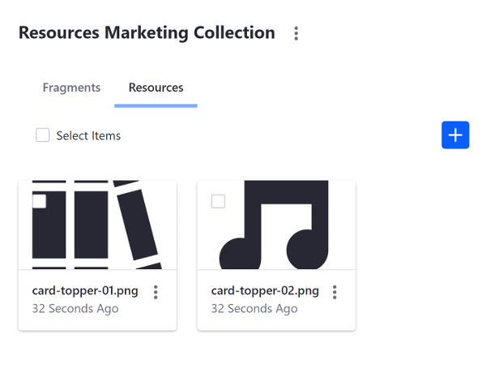

# Including Default Resources in Fragments

When creating Page Fragments, you can upload image resources (e.g. `.gif`, `.jpg`, `.jpeg`, or `.png`) with your Fragment Collection to make them available from the Collection, rather than relying on resources uploaded to other applications, like Documents and Media. When your Fragment Collection is exported, the images come with it, making the Collection easier to maintain. Here's how to include resources with your Fragment Collection:

1. [Import a Fragment Collection with Resources](#import-a-fragment-collection-with-resources)
1. [Include a New Resource](#include-a-new-resource)

This example uses a Docker image with a fresh install of Liferay DXP 7.3.

## Import a Fragment Collection with Resources

First, import an example to see how Fragment resources work:

1. Run the command below to start the Docker container:

    ```bash
    docker run -it -p 8080:8080 liferay/portal:7.3.2-ga3
    ```

1. Download and unzip the [example resources Fragment Collection](https://learn.liferay.com/dxp/7.x/en/site-building/developer-guide/developing-page-fragments/liferay-i6r3.zip):
		
    ```bash
    curl https://learn.liferay.com/dxp/7.x/en/site-building/developer-guide/developing-page-fragments/liferay-i6r3.zip

    unzip liferay-i6r3.zip
    cd liferay-i6r3
    ```

1. Import the Fragment Collection in the Docker container with the Fragments Toolkit. Alternatively, you can [import the Fragment manually](../../displaying-content/using-fragments/managing-page-fragments.md) instead.

    ```bash
    cd liferay-i6r3/fragment-resources-collection
    npm run import
    
    ? Liferay host & port http://localhost:8080
    ? Username test@liferay.com
    ? Password [hidden]
    
    Checking connection...
    Connection successful
    
    ? Company ID liferay.com
    ? Group ID Liferay
    ```

1. Verify that the Fragment Collection is available. Open your browser to `https://localhost:8080`, open the Product Menu, and go to Site &rarr; *Site Builder* &rarr; *Page Fragments*. The Collection appears with the other Collections and includes the resource in the *Resources* tab.

    

## Resource Format Overview

The image resource is included in the project's `/resources` folder:

* `Collection-project-folder`
  * `src/collection-name`
    * `collection.json`: a text file which describes your collection with the format `{"name":"collection name>","description":"collection description"}`.
    * `[fragment-name]/`: a folder containing all of the files for a Page Fragment.
    * `resources/`

```tip::
  Alternatively, you can upload the image through the *Resources* tab in the `Fragments Editor <./developing-page-fragments/developing-page-fragments-with-the-editor.md>`_.
```

The image is referenced in the HTML with the syntax `[resources:image-name.extension]`. The example has the configuration below:

```html

```

```note::
  The resource name is case-sensitive and must match the name and case exactly in the reference.
```

```tip::
  You can style the image resource in your CSS with the syntax ``img[src="[resources:image-name.extension]"]``.
```

## Include a New Resource

Now that you know how resources are included and referenced, you can include a new resource in the Fragment Collection.

1. Move the `card-topper-02.png` image from the `/liferay-i6r3/new-resource/` folder to the `/liferay-i6r3/fragment-resources/src/resources-marketing-collection/resources/` folder.
1. Update the `/liferay-i6r3/fragment-resources/src/resources-marketing-collection/resource-marketing-card/index.html` file to use the new image resource:

    ```html
    
    ```

1. Import the Fragment Collection in the Docker container as you did above:

    ```bash
    cd liferay-i6r3/fragment-resources-collection
    npm run import
    ```

1. Verify that the Fragment Collection resource is available. Open your browser to `https://localhost:8080`, and open the Product Menu and go to Site &rarr; *Site Builder* &rarr; *Page Fragments*. The new resource is included with the Collection.



Great! Now you know how to include image resources with your Fragment Collections.

## Related Information

* [Adding Configuration Options to Fragments](./adding-configuration-options-to-fragments.md)
* [Auto-deploying Fragments](./auto-deploying-fragments.md)
* [Developing Page Fragments with the Fragments Editor](./developing-page-fragments-with-the-editor.md)
