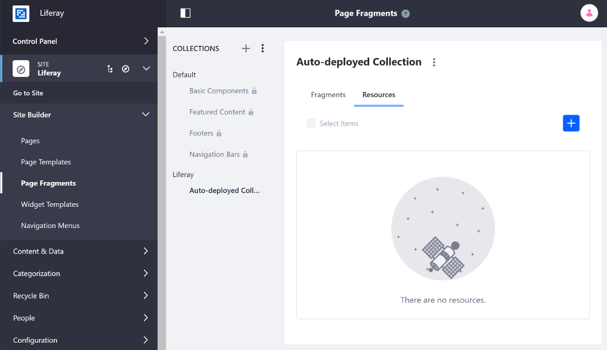

# Including Default Resources in Fragments

When creating Page Fragments, you can upload resources (e.g. images (`.gif`, `.jpg`, `.jpeg`, or `.png`)) to your Fragment Collection to make them available from the Collection, rather than relying on resources uploaded in other areas of your Site (e.g. Documents and Media). When your Collection is exported, the images are included with it. You can include resources with your Collection in just a couple steps:

1. Upload resources.
1. Reference the resources.

This example uses a Docker image with a fresh install of Liferay DXP.

> This example runs on Liferay DXP 7.3+

## Upload Resources

There are two ways to upload resources with your Collection, depending on the method you're using to develop the Page Fragments (external tools or the UI).

### Upload Resources through the UI

1. Open the Product Menu and go to Site &rarr; *Site Builder* &rarr; *Page Fragments*.
1. Click the *Resources* tab.
1. Click the () and select an image to upload.



### Include Resources with an External Collection

1. Create a `/resources` folder in the [Fragment Collection project](./developing-page-fragments-with-the-fragments-toolkit.md).

    * `Collection-project-folder`
      * `src/collection-name`
        * `collection.json`: a text file which describes your collection with the format `{"name":"collection name>","description":"collection description"}`.
        * `[fragment-name]/`: a folder containing all of the files for a Page Fragment.
        * `resources/`

1. Add the images you want to reference to the `/resources` folder.

## Reference the Resource

1. Open the Fragment [in the editor](./developing-page-fragments-with-the-editor.md) or open the [contributed Fragment Collection](./creating-a-contributed-fragment-collection.md) or [Fragment Toolkit project](./developing-page-fragments-with-the-fragments-toolkit.md).
1. Reference the image by using this syntax: `[resources:IMAGE_NAME]`. An HTML and CSS example are shown below:

    HTML example:

    ```html
    
    ```

    CSS example:

    ```css
    img[src="[resources:building.png]"] {
      height: 200px;
      width: auto;
    }
    ```

```note::
  The resource name is case-sensitive and must match the name and case exactly in the reference.
```

