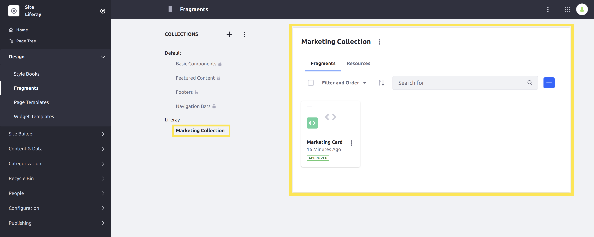
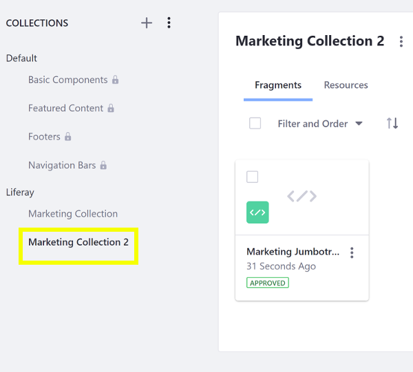

# Using the Fragments Toolkit

The Fragments Toolkit helps you develop and manage Fragments locally, using your favorite tools. Here you'll use the toolkit to import an example Fragment Collection and to create and import your own Fragment Collection.

## Setting Up the Toolkit

The toolkit requires this software:

* [NPM](https://www.npmjs.com/)
* [NodeJS](https://nodejs.org/)
* [Yeoman](https://yeoman.io/)
* [Yarn](https://classic.yarnpkg.com/)

Node installers such as [Node.js LTS](https://nodejs.org/en/download/) include NPM and Node.js.

Liferay's [setup_tutorial.sh](https://github.com/liferay/liferay-learn/blob/master/docs/_template/js/setup_tutorial.sh) script provides commands for setting up Yeoman, Yarn, and the toolkit and verifies successful setup. The script is available in our example JavaScript project ZIP files.

1. Download and unzip the example ZIP file.

    ```bash
    curl https://learn.liferay.com/dxp/7.x/en/site-building/developer-guide/developing-page-fragments/liferay-x2y6.zip -O
    ```

    ```bash
    unzip liferay-x2y6.zip
    ```

1. Set up the Fragments Toolkit.

    ```bash 
    cd liferay-x2y6.zip
    ``` 

    ```bash 
    ./setup_tutorial.sh
    ```

Resolve all unmet requirements reported by the script and rerun the script until it reports that your environment is ready.

## Create a Fragments Project 

The Fragments Toolkit's `yo liferay-fragments` command launches an interface for generating a Fragments Project.

```warning::
   Don't nest Fragments projects. Make sure to create new Fragments projects in their own location, outside of any existing Fragments projects.
```

If you're in the liferay-x2y6.zip project folder, exit it. For example,

```bash
cd ..
```

Here's how to generate a Fragments Project with sample data:

1. Launch the project generator by executing the `yo liferay-fragments` command:

    ```
     yo liferay-fragments 

        __    ____________________  _____  __
       / /   /  _/ ____/ ____/ __ \/   \ \/ /
      / /    / // /_  / __/ / /_/ / /| |\  /
     / /____/ // __/ / /___/ _, _/ ___ |/ /
    /_____/___/_/   /_____/_/ |_/_/  |_/_/
    ```

1. Accept the default project name by clicking enter.

    ```
    ? Project name (Sample Liferay Fragments)
    ```

1. Add sample content by entering `Yes`.

    ```
    ? Add sample content? Yes
    ```
The generator creates your project in a folder called `sample-liferay-fragments`, derived from your project name `Sample Liferay Fragments`.

```bash
Creating directory
   force .yo-rc.json
  create src/.gitkeep
  create .editorconfig
  create .gitignore
  create liferay-npm-bundler.config.js
  create package.json
  create README.md
Adding sample content...
Warning: some of these fragments are not compatible all
portal versions, please check the generator documentation before using them:
https://www.npmjs.com/package/generator-liferay-fragments#creating-new-fragments
Running yarn...
Done!
You're ready to create fragments.
  create src/sample-collection/collection.json
  create src/sample-collection/sample-fragment/index.html
  create src/sample-collection/sample-fragment/main.js
  create src/sample-collection/sample-fragment/styles.css
  create src/sample-collection/sample-fragment/fragment.json
  create src/sample-collection/sample-fragment/configuration.json
  create src/sample-collection/sample-fragment-with-new-editables/index.html
  create src/sample-collection/sample-fragment-with-new-editables/main.js
  create src/sample-collection/sample-fragment-with-new-editables/styles.css
  create src/sample-collection/sample-fragment-with-new-editables/fragment.json
  create src/sample-collection/sample-fragment-with-new-editables/configuration.json
  create src/sample-collection/sample-fragment-with-react/index.html
  create src/sample-collection/sample-fragment-with-react/main.js
  create src/sample-collection/sample-fragment-with-react/styles.css
  create src/sample-collection/sample-fragment-with-react/fragment.json
  create src/sample-collection/sample-fragment-with-react/configuration.json
```

## Import the Sample Collection

Import the sample Fragment Collection to see what it looks like:

1. Run the command below to start the Docker container:

    ```bash
    docker run -it -p 8080:8080 [$LIFERAY_LEARN_DXP_DOCKER_IMAGE$]
    ```

1. Import the Fragment Collection to your Liferay instance using the `yarn run import` command below. Alternatively, you can [import the Fragment Collection manually](../../displaying-content/using-fragments/managing-page-fragments.md).

    ```bash
    yarn run import
    yarn run v1.22.10
    warning package.json: No license field
    $ yo liferay-fragments:import
    ? Liferay host & port http://localhost:8080
    ? Username test@liferay.com
    ? Password [hidden]
    Checking connection...
    Connection successful

    ? Company ID liferay.com
    ? Group ID Liferay DXP
    Building project...
    Importing project...
    Project imported
        force .yo-rc.json
        force ../../.yo-rc-global.json
    Done in 21.43s.
    ```

1. Verify that the Fragment Collection is available. Point your browser to `https://localhost:8080`, and under the Site Menu on the left side of the screen, go to *Design* &rarr; *Fragments*. The Collection appears in the Collection list.

    

    ```note::
       For Liferay DXP 7.1 and 7.2, instead navigate to *Site* → *Site Builder* → *Page Fragments* under the Product Menu to get to the *Fragments* page.
    ```

1. Select a Fragment to view it in the Fragments Editor. 

    

Great! You successfully deployed a Fragment Collection.

## Collection Format Overview

Fragment Collections use this project structure:

* `collection.json`: a text file that describes the Collection.

    ```json 
    {
        "description": "Optional description",
        "name": "Collection name"
    }
    ```

* `language.properties` (optional): language keys defined for the Collection.

* `[fragment-name]/`: a folder containing all of the files for a Fragment.

    * `configuration.json`(optional): a JSON file that defines the Fragment's configuration. See [Adding Configuration Options to Fragments](./adding-configuration-options-to-fragments.md) for more information.

    * `fragment.json`: a text file that describes the Fragment.

        ```json
        {
            "cssPath": "styles.css",
            "configurationPath": "configuration.json",
            "htmlPath": "index.html",
            "jsPath": "main.js",
            "name": "Fragment name",
            "type": "[component|react]"
        }
        ```

      Update the `*Path` properties with the names of your CSS, configuration, HTML, and JavaScript files.

    * `index.html`: the HTML source for the Fragment.

    * `main.js`: the JavaScript source for the Fragment.

    * `styles.css`: the CSS source for the Fragment.

* `resources/` (optional): a folder containing any additional images or files the Fragments need. See [Including Default Resources in Fragments](./including-default-resources-with-fragments.md) for more information.

The Fragments Toolkit facilitates creating Fragment Collections.
 
## Add a New Collection and Fragment

Create a Fragment Collection in your existing project with the `yarn run add-collection` command and answer the prompts with your Collection's name and an optional description:

    ```bash
    yarn run add-collection

    > yo liferay-fragments:collection

    ? Collection name (required) My Collection
    ? Collection description (optional) This is my new Fragment Collection.
       create src/my-collection/collection.json
    ```

    Resulting `collection.json` file:

    ```json
    {
        "description": "This is my new Fragment Collection.",
        "name": "My Collection"
    }
    ```

## Add a New Fragment

The `add-fragment` command generates a Fragment per your input. The command line interface (CLI) differs between Fragments Toolkit versions.

1. Run the `add-fragment` command.

    ```bash
    yarn run add-fragment
    ```

    The CLI starts the process:

    ```bash

    > yo liferay-fragments:fragment
    ```

1. Name your Fragment.

    ```bash
    ? Fragment name (required) My Jumbotron
    ```

1. Choose whether to use React or another JavaScript framework. React requires Liferay 7.3+. For this tutorial, please decline using React.

    ```bash
    ? Use React (or other JS framework)? No
    ```

1. Use the new editable element syntax for Liferay 7.3+. 

    ```bash
    ? Use new data-lfr editable syntax? Yes
    ```

    ```note::
       If you accepted using React in your fragment, the toolkit assumes you're on Liferay 7.3+ and configures the new editable element syntax.
    ```

    ```note::
       Please see `Fragment-Specific Tags <../reference/fragments/fragment-specific-tags-reference.md>`_ for more information on Liferay's editable data syntax.
    ```

1. Select the Collection you just created (`My Collection`).

    ```bash
    ? Choose a collection (my-collection)
       create src/my-collection/my-jumbotron/index.html
       create src/my-collection/my-jumbotron/main.js
       create src/my-collection/my-jumbotron/styles.css
       create src/my-collection/my-jumbotron/fragment.json
       create src/my-collection/my-jumbotron/configuration.json
    ```

    ```note::
        The ``fragment.json`` defines the paths to the Fragment's CSS, HTML, and JavaScript. If you change any of these file names, update their paths in the ``fragment.json``.
    ```

1. Write the Fragment's HTML (`index.html`), CSS (`styles.css`), JavaScript (`main.js`), and any [configuration options](./adding-configuration-options-to-fragments.md) (`configuration.json`).

Here's the generated Fragment HTML that uses the new `data-lfr` editable syntax:

```html
<div class="my-jumbotron">
    <h1 data-lfr-editable-id="title" data-lfr-editable-type="text">
        My Jumbotron
    </h1>
</div>
```

You can build off of the above HTML and use [Clay](https://clayui.com/)'s [Bootstrap](https://getbootstrap.com/)-based components to create Fragment HTML like this:

```html
<div class="component-my-jumbotron">
    <div class="jumbotron">
        <h1
            class="display-4"
            data-lfr-editable-id="01-title"
            data-lfr-editable-type="rich-text"
        >
            Editable Jumbotron Headline
        </h1>

        <p
            class="lead"
            data-lfr-editable-id="02-lead"
            data-lfr-editable-type="rich-text"
        >
            Edit this text to call extra attention to featured content or information.
        </p>

        <hr />

        <p
            data-lfr-editable-id="03-text"
            data-lfr-editable-type="rich-text"
        >
            Edit this text to provide more information.
        </p>

        <a
            class="btn btn-primary btn-lg"
            data-lfr-editable-id="04-label"
            data-lfr-editable-type="link"
            href="#"
        >
            Editable Link
        </a>
    </div>
</div>
```

```note::
   If you are using Liferay 7.2 or below, remove the ``data-lfr-editable-[id|type]`` attributes and wrap the content elements in ``lfr-editable`` elements as described in `Fragment-Specific Tags <../reference/fragments/fragment-specific-tags-reference.md>`_.
```

The first `div` element's `class="component-my-jumbotron"` attribute attempts to uniquely identify this Fragment on a page. 

```tip::
  In your Fragment's HTML file, use the main wrapper element (the ``<div>`` in the example above) to uniquely identify the Fragment so it doesn't conflict with other components on a page.
```

Next the `<div class="jumbotron"/>` element wraps the content, applying [Bootstrap](https://getbootstrap.com/)'s jumbotron component. This component makes the content stand out. Here are the content elements:

* `<h1 class="display-4" ...>Editable Jumbotron ...` creates the Fragment's heading. It uses [Bootstrap](https://getbootstrap.com/)'s `display-4` size style. The `data-lfr-editable-` attributes make the heading text [editable](../reference/fragments/fragment-specific-tags-reference.md). The `data-lfr-editable-id="03-text"` attribute identifies the element and the `data-lfr-editable-type="rich-text"` attribute declares the content type.
* `<p class="lead" ...>Edit this text ...` is the lead body text distinguished by Clay's [`lead`](https://clayui.com/docs/css/content/typography.html#css-lead) style component. The `data-lfr-editable-` attributes make the paragraph editable.
* The `<hr/>` and next `<p ...` elements produce a horizontal rule and another editable paragraph, respectively.
* `<a class="btn btn-primary btn-lg" ...` specifies a modifiable link. The `btn-primary` class styles it as a main button and `btn-lg` makes it large. The `href="#"` attribute takes the user to the top of the page when the link is clicked. The `data-lfr-editable-type="link"` attribute makes the link [editable](../reference/fragments/fragment-specific-tags-reference.md).

You can also include resources in your Fragments. See [Including Default Resources in Fragments](./including-default-resources-with-fragments.md) for more information.

```note::
  The Fragment and configuration object are passed in as arguments in JavaScript and are available as ``fragmentElement`` and ``configuration`` parameters, respectively.
```

## Import and Test

You can import your new Fragment as you did the original example Fragment:

1. Run the import command and provide your credentials:

    ```bash
    yarn run import
    ```

1. Verify that the new Fragment Collection is available. Point your browser to `https://localhost:8080`, and under the Site Menu on the left side of the screen, go to *Design* &rarr; *Fragments*. The Collection appears in the Collection list.


Great! Now you know how to use the Fragments Toolkit to create and manage Fragments. See the [Fragments Toolkit Command Reference](../reference/fragments/fragments-toolkit-command-reference.md) for more toolkit command information.

## Related Information

* [Creating a Contributed Fragment Collection](./creating-a-contributed-fragment-collection.md)
* [Using the Fragments Editor](./using-the-fragments-editor.md)
* [Fragments Toolkit Command Reference](../reference/fragments/fragments-toolkit-command-reference.md)