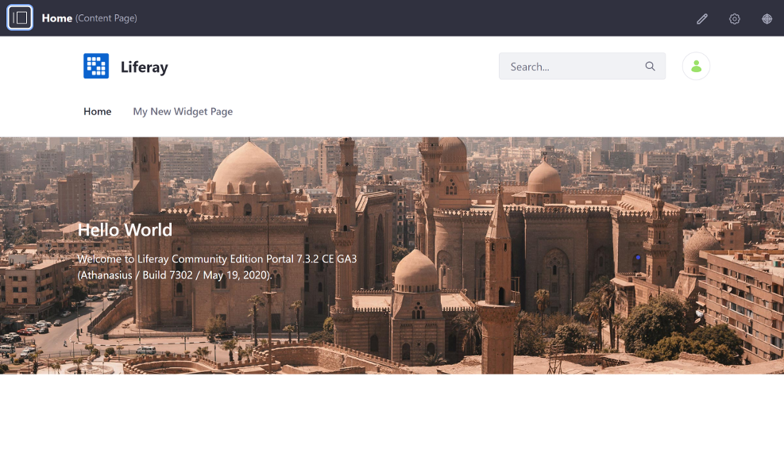
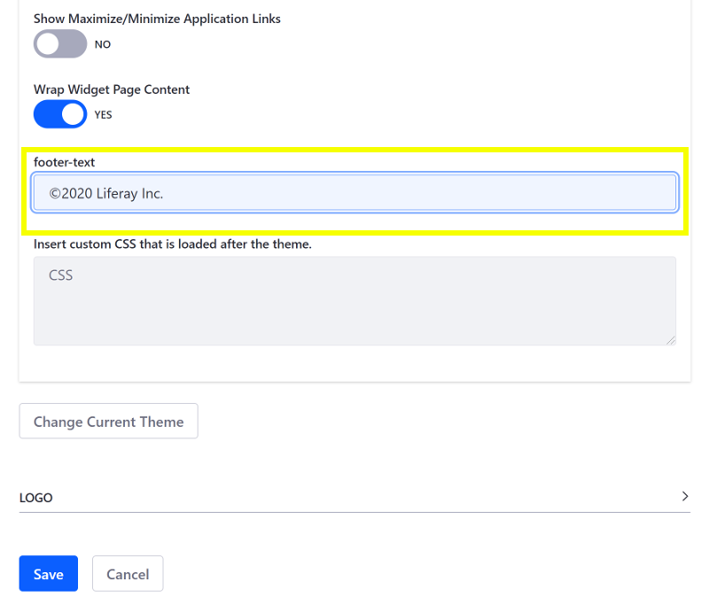
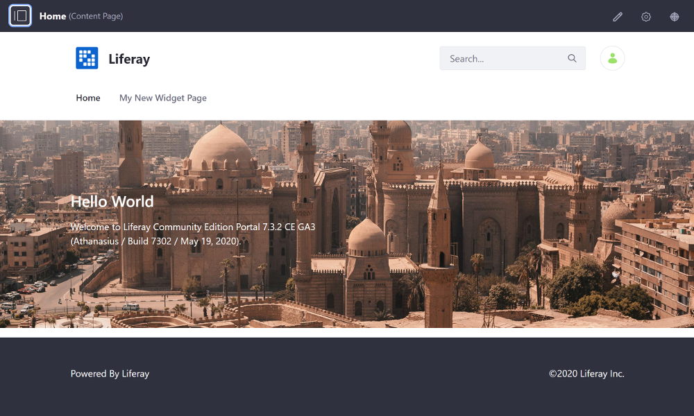

# Adding Theme Settings

Theme Settings define configurable options (such as whether elements are visible) that can be changed without requiring the Theme to be manually updated and redeployed. They can be set from inside Liferay DXP, or they can be static (set when the Theme is created) and hold a value that you can reference. You can create a Theme Setting in just a few steps:

1. [Deploy a Theme with Configurable Settings](#deploy-a-theme-with-configurable-settings)
1. [Add a New Theme Setting](#add-a-new-theme-setting)
1. [Deploy and Test](#deploy-and-test)

This example uses a Docker image with a fresh install of Liferay DXP 7.3.

## Deploy a Theme with Configurable Settings

First, install an existing Theme with Theme Settings to see how they work:

1. Run the command below to start the Docker container:

    ```bash
    docker run -it -p 8080:8080 liferay/portal:7.3.2-ga3
    ```

1. Download and unzip the [Marketing Theme with Theme Settings](https://learn.liferay.com/dxp/7.x/en/site-building/developer-guide/developing-themes/adding-configurable-theme-settings/liferay-t6s3.zip):

    ```bash
    curl https://learn.liferay.com/dxp/7.x/en/site-building/developer-guide/developing-themes/adding-configurable-theme-settings/liferay-t6s3.zip
    ```

    ```bash
    unzip liferay-t6s3.zip
    ```

1. From the module root, build and deploy the Marketing Theme:

    ```bash
    cd liferay-t6s3
    ```

    ```bash
    ./gradlew deploy -Ddeploy.docker.container.id=$(docker ps -lq)
    ```

    ```note::
       If testing on Windows, you may need to build the module first with ``.\gradlew build`` and then manually copy the JAR to Docker with ``docker cp t6s3-impl\marketing-theme\dist\marketing-theme.war [docker-container-name]:/opt/liferay/osgi/modules`` directly if deployment fails.
    ```

1. Confirm the deployment to the Liferay Docker container console:

    ```bash
    INFO  [fileinstall-/opt/liferay/osgi/modules][BundleStartStopLogger:39] STARTED marketing-theme_1.0.0 [2294]
    ```

1. Verify that the Theme is available. Open your browser to `https://localhost:8080`, and open the Product Menu and go to *Site Builder* &rarr; *Pages*. Click the () next to Public Pages.

1. Scroll down and click the *Change Current Theme* button, and select the Marketing Theme thumbnail next to the Classic Theme.

1. Click *Save* to apply the changes, and go back to the Home Page to see what the Marketing Theme looks like with the default look and feel.

    ```note::
       You can also configure Theme Settings for an individual `Content Page <../../../creating-pages/building-and-managing-content-pages/content-pages-overview.md#look-and-feel>`_ or `Widget Page <../../../creating-pages/page-settings/configuring-page-sets.md#look-and-feel>`_ to override the default configuration.
    ```

1. Go back to the Public Pages configuration, toggle the *Show Footer* setting to *No*, and click *Save* to apply the changes.

1. Go back to the Home Page once again to verify that the Footer is removed.

    

Great! You successfully deployed a Theme and configured a Theme Setting.

## Theme Setting Breakdown

Theme Settings are defined in the Theme's `liferay-look-and-feel.xml` file:

```xml
<look-and-feel>
  <compatibility>
    <version>7.2.0+</version>
  </compatibility>
  <theme id="your-theme-name" name="Your Theme Name">
    <template-extension>ftl</template-extension>
    <settings>
      <setting configurable="false" key="color-palette" value="primary,success,danger,warning,info,dark,gray-dark,secondary,light,lighter,white"/>
      <setting configurable="true" key="show-footer" type="checkbox" value="true"/>
      ...
    </settings>
    <portlet-decorator>
      portlet decorators...
    </portlet-decorator>
  </theme>
</look-and-feel>
```

The Theme Setting's value (retrieved by its `key`) is assigned to a FreeMarker variable in `/src/templates/init_custom.ftl` so it can be referenced in the Theme:

```markup
<#assign
	show_footer = getterUtil.getBoolean(themeDisplay.getThemeSetting("show-footer"))
	...
/>
```

The variable is used in the Theme's `portal_normal.ftl` template to determine whether to show the Theme's Footer based on the Theme Setting's value:

```markup
<#if show_footer>
  <footer id="footer" role="contentinfo">
    <div class="container">
      <div class="row">
        <div class="col-md-12 text-center text-md-left">
          <@liferay.language key="powered-by" />

          <a class="text-white" href="http://www.liferay.com" rel="external">Liferay</a>
        </div>
      </div>
    </div>
  </footer>
</#if>
```

## Add a New Theme Setting

1. Open the Theme's `WEB-INF/liferay-look-and-feel.xml` file, and update it to include the `footer-text` setting shown below:

    ```xml
    <look-and-feel>
    	<compatibility>
    		<version>7.3.0+</version>
    	</compatibility>
    	<theme id="marketing-theme" name="Marketing Theme">
    		<template-extension>ftl</template-extension>
        <settings>
          <setting configurable="false" key="color-palette" value="primary,success,danger,warning,info,dark,gray-dark,secondary,light,lighter,white"/>
          <setting configurable="true" key="show-footer" type="checkbox" value="true"/>
          <setting configurable="true" key="show-footer" type="checkbox" value="true"/>
          ...
          <setting configurable="true" key="footer-text" type="text" value="©2020 My Company" />
        </settings>
        <portlet-decorator>
          portlet decorators...
    		</portlet-decorator>
    	</theme>
    </look-and-feel>
    ```

1. Assign the setting's value to a FreeMarker variable in `/src/templates/init_custom.ftl`:

    ```markup
    <#assign
    	...
      footer_text = getterUtil.getString(themeDisplay.getThemeSetting("footer-text"))
    />
    ```

1. Update the Theme's `/src/templates/portal_normal.ftl` template to use the setting's value:

    ```markup
    <#if show_footer>
      <footer id="footer" role="contentinfo">
        <div class="container">
          <div class="row">
            <div class="col-md-6 text-center text-md-left">
              <@liferay.language key="powered-by" />

              <a class="text-white" href="http://www.liferay.com" rel="external">Liferay</a>
            </div>
            <div class="col-md-6 text-center text-md-right">
              <p>${footer_text}</p>
            </div>
          </div>
        </div>
      </footer>
    </#if>
    ```

1. Rebuild and redeploy the updated Theme:

    ```bash
    cd liferay-t6s3
    ```

    ```bash
    .\gradlew deploy -Ddeploy.docker.container.id=$(docker ps -lq)
    ```

    ```note::
       If testing on Windows, you may need to build the module first with ``.\gradlew build`` and then manually copy the JAR to Docker with ``docker cp t6s3-impl\marketing-theme\dist\marketing-theme.war docker-container-name:/opt/liferay/osgi/modules`` directly if deployment fails.
    ```

1. Open your browser to `https://localhost:8080`, open the Product Menu, and go to *Site Builder* &rarr; *Pages*. Click the gear icon.

1. Scroll down to the *Show Footer* setting, toggle it to *Yes*, and enter a value for the *footer-text* Theme Setting.

    

1. Click *Save* to apply the changes and go back to the Home Page to see your text in the right side of the Footer.

    

Great! Now you know how to add Theme Settings to your Theme.

## Modifying Theme Settings with JavaScript

You can modify Theme settings with JavaScript to provide a more custom experience. The example below from `liferay-look-and-feel.xml` changes the Theme Setting's `type` to `color`, to provide a color picker for the user:

```xml
<setting configurable="true" key="user-color"
type="text" value="#993300"  
>
<![CDATA[  
     AUI().ready('node',function(A) {
          A.one("#[@NAMESPACE@]user-color").setAttribute("type", "color");    
          A.one("#[@NAMESPACE@]user-color").setAttribute("style", "height: 35px; width: 200px");    
      });
]]>
</setting>
```

Try it out and see how it works!

## Related Information

* [Developing a Theme](../developing-a-theme.md)
* [Creating a Thumbnail Preview](./creating-a-thumbnail-preview.md)
* [Creating Color Schemes](./creating-color-schemes.md)
