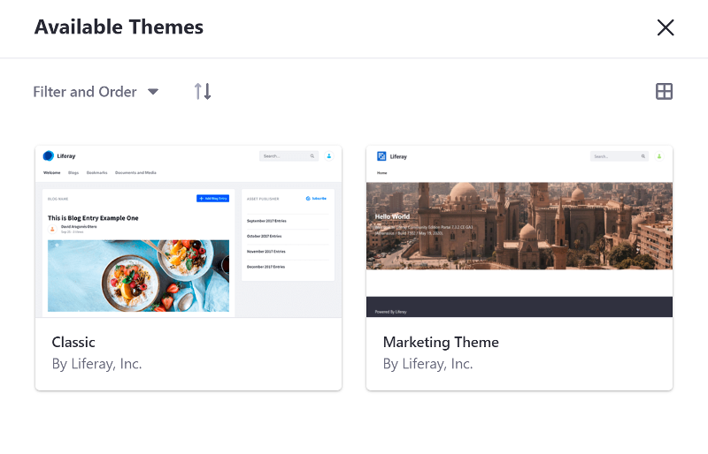
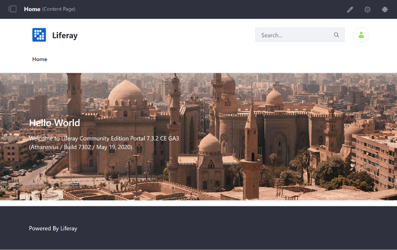
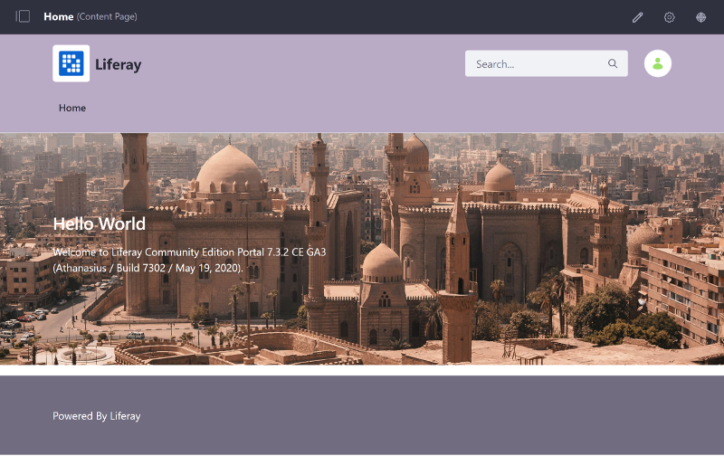
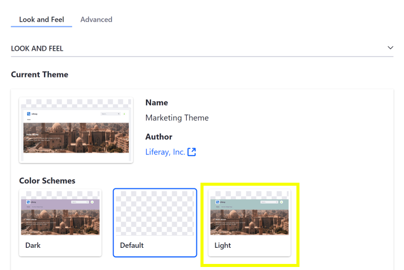
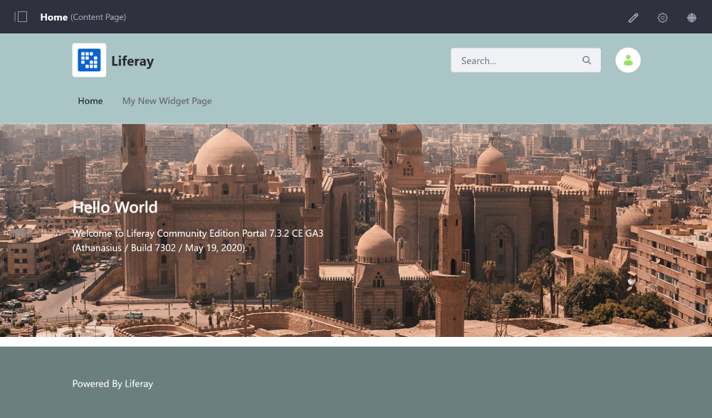

# Creating Color Schemes

Color schemes give your Theme additional color palettes, while maintaining the same design and feel to it. You can create a Color Scheme in just a few steps:

1. [Deploy a Theme with a Color Scheme](#deploy-a-theme-with-a-color-scheme)
1. [Add a New Color Scheme](#add-a-new-color-scheme)
1. [Deploy and Test](#deploy-and-test)

This example uses a Docker image with a fresh install of Liferay DXP 7.3.

## Deploy a Theme with a Color Scheme

First, install an existing Theme with a Color Scheme to see what it looks like:

1. Run the command below to start the Docker container:

    ```bash
    docker run -it -p 8080:8080 liferay/portal:7.3.4-ga5
    ```

1. Download and unzip the [Dark Color Scheme Theme](https://learn.liferay.com/dxp/7.x/en/site-building/developer-guide/developing-themes/creating-a-color-scheme-for-your-theme/liferay-d4t8.zip):

    ```bash
    curl https://learn.liferay.com/dxp/7.x/en/site-building/developer-guide/developing-themes/creating-a-color-scheme-for-your-theme/liferay-d4t8.zip
    ```

    ```
    unzip liferay-d4t8.zip
    ```

1. From the module root, build and deploy the Dark Color Scheme Theme:

    ```bash
    cd liferay-d4t8
    ```

    ```bash
    .\gradlew deploy -Ddeploy.docker.container.id=$(docker ps -lq)
    ```

    ```note::
      If testing on Windows, you may need to build the module first with ``.\gradlew build`` and then manually copy the JAR to Docker with ``docker cp d4t8-impl\marketing-theme\dist\marketing-theme.war docker-container-name:/opt/liferay/osgi/modules`` directly if deployment fails.
    ```

1. Confirm the deployment to the Liferay Docker container console. The log message below should appear in the Docker console:

    ```bash
    INFO  [fileinstall-/opt/liferay/osgi/modules][BundleStartStopLogger:39] STARTED marketing-theme_1.0.0 [2294]
    ```

1. Verify that the Theme is available. Open your browser to `https://localhost:8080`, open the Product Menu, and go to *Site Builder* &rarr; *Pages*. Click the () next to Public Pages.

1. Scroll down and click the *Change Current Theme* button, and select the Marketing Theme thumbnail next to the Classic Theme.

    

1. Click *Save* to apply the changes and go back to the home page to see what the Marketing Theme looks like with the default Color Scheme applied.

    

1. Go back to the Public Pages configuration, select the *Dark* Color Scheme, and click *Save* to apply it.

1. Go back to the home page once again to see what the Dark Color Scheme looks like.

    

Great! You successfully deployed a Theme and applied a Color Scheme.

## Color Scheme Breakdown

The Color Scheme is defined in the `/src/WEB-INF/liferay-look-and-feel.xml` file:

```xml
<?xml version="1.0" encoding="UTF-8" standalone="yes"?>
<look-and-feel>
  <compatibility>
    <version>7.3.0+</version>
  </compatibility>
  <theme id="marketing-theme" name="Marketing Theme">
    <template-extension>ftl</template-extension>
    <color-scheme id="01" name="Default">
        <default-cs>true</default-cs>
        <css-class>default</css-class>
        <color-scheme-images-path>
            ${images-path}/color_schemes/${css-class}
        </color-scheme-images-path>
    </color-scheme>
    <color-scheme id="02" name="Dark">
      <css-class>dark</css-class>
    </color-scheme>
    ...
  </theme>
</look-and-feel>
```

The Color Scheme is defined by these elements in the `liferay-look-and-feel.xml`:

`<color-scheme id="01" name="Name">Name</color-scheme>`: Defines the Color Scheme's name as it appears in the Look and Feel configuration's UI

`<default-cs>true<default-cs>`: Nested element that marks the default selected Color Scheme when the Theme is applied

`<color-scheme-images-path>`: Defines the path to the folder containing the Color Scheme thumbnail images. This must only be specified for one Color Scheme. The Color Scheme's [thumbnail preview](./creating-a-thumbnail-preview.md) is included in a folder that **matches** the Color Scheme's CSS class name (`/src/images/color_schemes/dark/thumbnail.png`).

`<css-class>dark</css-class>`: The Color Scheme's CSS class. The `default` CSS class defines the original look and feel.

```note::
  IDs, names, and CSS classes must be unique for each Color Scheme.
```

See the [liferay-look-and-feel DTD](https://docs.liferay.com/portal/7.3-latest/definitions/liferay-look-and-feel_7_3_0.dtd.html#color-scheme) for an explanation of each of the elements used in the XML and the [required XML schema order](https://docs.liferay.com/portal/7.3-latest/definitions/liferay-look-and-feel_7_3_0.dtd.html#theme).

```note::
  Color schemes are sorted alphabetically by ``name`` rather than ``id``. For example, a Color Scheme named ``Clouds`` and ``id`` ``02`` would be selected by default over a Color Scheme named ``Day`` with ``id`` ``01``. The ``<default-cs>`` element overrides this behavior and sets the Color Scheme that is selected by default when the Theme is chosen.
```

The Color Scheme's CSS is placed in a CSS file named after the Color Scheme (`_dark.scss`) in the `/src/css/color_schemes/` folder. The default Color Scheme's styles are included in `_custom.scss`. The Color Scheme class is added to the Theme's `<body>` element when the Color Scheme is applied. So, styles for the Dark Color Scheme are nested inside the `body.dark{...}` container in `_dark.scss`:

    ```css
    body.dark{
      .navbar.navbar-classic {
        background-color: #B9AAC5;
      }  
      .navbar-light .navbar-nav .nav-link:hover, 
      .navbar-light .navbar-nav .nav-underline .tab a:hover, 
      .nav-underline .tab .navbar-light .navbar-nav a:hover, 
      .navbar-light .navbar-nav .nav-link:focus, 
      .navbar-light .navbar-nav .nav-underline .tab a:focus, 
      .nav-underline .tab .navbar-light .navbar-nav a:focus {
        color: #FFF;
      }
      #footer {
        background-color: #716C7F;
      }
    }
    ```

The Dark Color Scheme's CSS file is imported at the top the Theme's `_custom.scss` file:

    ```css
    @import "color_schemes/dark";
    ```

Next you'll modify the project to include another Color Scheme.

## Add a New Color Scheme

1. Open the Theme's `WEB-INF/liferay-look-and-feel.xml` file and add the Light Color Scheme block below the dark color scheme block:

    ```xml
    <theme id="marketing-theme" name="Marketing Theme">
      ...
      <color-scheme id="02" name="Dark">
        <css-class>dark</css-class>
      </color-scheme>
      <color-scheme id="03" name="Light">
        <css-class>light</css-class>
      </color-scheme>
      ...
    </theme>
     ```

1. Create a `_light.scss` CSS file in the `/src/css/color_schemes/` folder for the Light Color Scheme with this code: 

    ```css
    body.light{
      .navbar.navbar-classic {
        background-color: #AAC5C5;
      }  
      .navbar-light .navbar-nav .nav-link:hover, 
      .navbar-light .navbar-nav .nav-underline .tab a:hover, 
      .nav-underline .tab .navbar-light .navbar-nav a:hover, 
      .navbar-light .navbar-nav .nav-link:focus, 
      .navbar-light .navbar-nav .nav-underline .tab a:focus, 
      .nav-underline .tab .navbar-light .navbar-nav a:focus {
        color: #FFF;
      }
      #footer {
        background-color: #6C7F7F;
      }
    }
    ```

1. Import the Light Color Scheme's `.scss` file into the Theme's `_custom.scss` file:

    ```css
    @import 'color_schemes/dark';
    @import 'color_schemes/light';
    ```

1. Add a `/src/images/color_schemes/light/` folder, and move the [ `thumbnail.png` file](./creating-a-thumbnail-preview.md) from the `/d4t8-impl/thumbnail/` folder to it.

1. From the module root, build and deploy the Marketing Theme:

    ```bash
    cd liferay-d4t8
    ```

    ```bash
    .\gradlew deploy -Ddeploy.docker.container.id=$(docker ps -lq)
    ```

    ```note::
      If testing on Windows, you may need to build the module first with ``.\gradlew build`` and then manually copy the JAR to Docker with ``docker cp d4t8-impl\marketing-theme\dist\marketing-theme.war docker-container-name:/opt/liferay/osgi/modules`` directly if deployment fails.
    ```

1. In Liferay DXP, open the Product Menu and go to *Site Builder* &rarr; *Pages*. Click the () next to Public Pages, and you'll see that the Light Color Scheme is available.

    

1. Select the Light Color Scheme and click *Save* to apply the changes.
1. Go back to the Home Page to see what the Marketing Theme looks like with the Light Color Scheme applied.

    

Great! Now you know how to create Color Schemes for your Theme.

## Related Information

* [Creating a Thumbnail Preview](./creating-a-thumbnail-preview.md)
* [Developing a Theme](../developing-a-theme.md)
